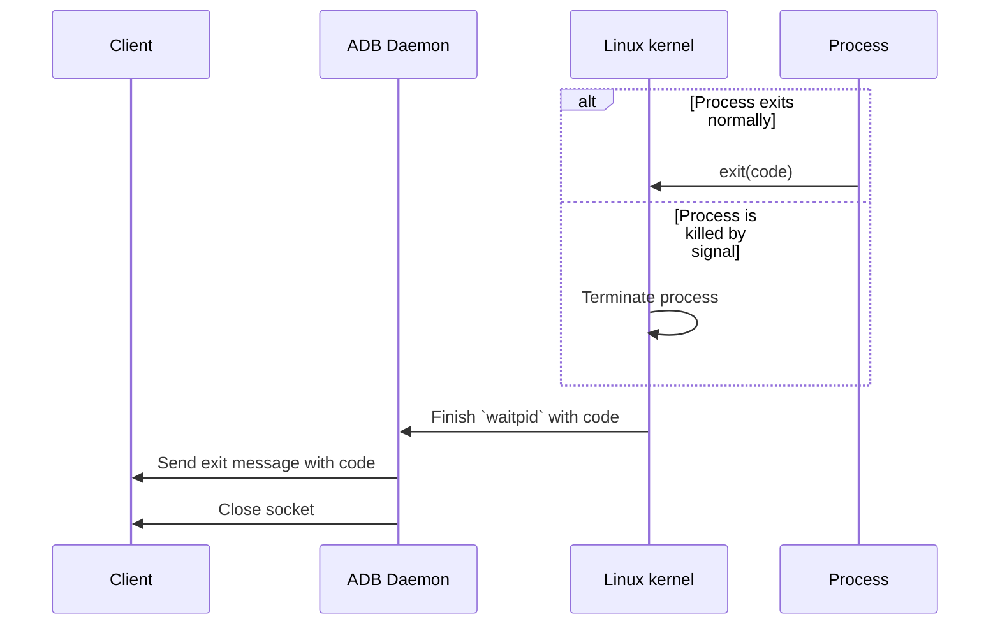
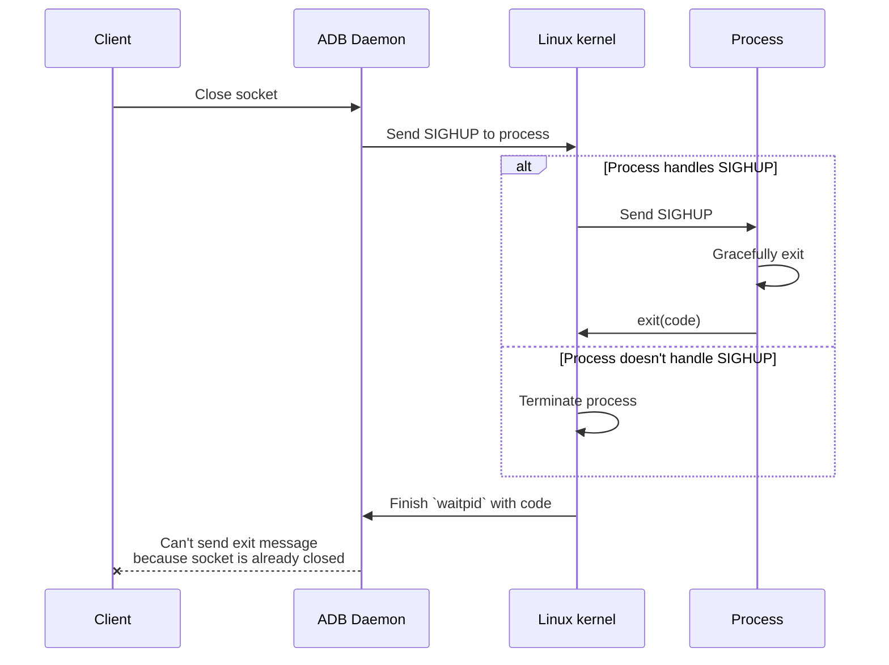

# Shell protocol

```ts showLineNumbers
export declare class AdbShellProtocolSubprocessService {
  spawn(
    command: string | string[],
    signal?: AbortSignal
  ): Promise<AdbShellProtocolProcess>;

  pty(options?: {
    command?: string | string[] | undefined;
    terminalType?: string;
  }): Promise<AdbShellProtocolPtyProcess>;
}
```

An instance of `AdbShellProtocolSubprocessService` is available at `adb.subprocess.shellProtocol`.

If the device doesn't support shell protocol, `adb.subprocess.shellProtocol` will be `undefined`.

## `spawn`

Start a process in raw mode.

```ts showLineNumbers
import type { MaybePromiseLike } from "@yume-chan/async";
import type {
  MaybeConsumable,
  ReadableStream,
  WritableStream,
} from "@yume-chan/stream-extra";

export interface AdbShellProtocolProcess {
  get stdin(): WritableStream<MaybeConsumable<Uint8Array>>;
  get output(): ReadableStream<Uint8Array>;
  get exited(): Promise<void>;

  kill(): MaybePromiseLike<void>;
}

export declare class AdbShellProtocolSubprocessService {
  spawn(
    command: string | string[],
    signal?: AbortSignal
  ): Promise<AdbShellProtocolProcess>;
}
```

### `command`

The `command` parameter can either be a single string, or an array of strings

```ts transpile
import type { Adb } from "@yume-chan/adb";
import { TextDecoderStream } from "@yume-chan/stream-extra";

declare const adb: Adb;

await adb.subprocess.shellProtocol!.spawn("ls -al /");
// same as
await adb.subprocess.shellProtocol!.spawn(["ls", "-al", "/"]);
```

#### Escaping arguments

Because the command is executed by a shell, and different shells have different escaping rules, we can't escape the command automatically.

If the command is an array, whitespace characters in an element will split the argument into two:

```ts transpile
adb.subprocess.shellProtocol!.spawn(["mv", "a b", "c d"]);
// is actually
adb.subprocess.shellProtocol!.spawn(["mv", "a", "b", "c", "d"]);
```

A `escapeArg` method is provided which follows basic sh rules. It uses single quotes to wrap the argument, meaning that it will also prevent shell expansion:

```ts transpile
import { escapeArg } from "@yume-chan/adb";

adb.subprocess.shellProtocol!.spawn(["mv", escapeArg("a b"), escapeArg("c d")]);
// evaluates to
adb.subprocess.shellProtocol!.spawn("mv 'a b' 'c d'");
```

### `signal`

A optional `AbortSignal` to kill the process.

When the process is killed by `signal`:

- [`stdin`](#stdin) will be closed, writing to it will throw an error.
- [`stdout` and `stderr`](#stdout-and-stderr) will be closed after all buffered data is consumed.
- [`exited`](#exited) will be rejected with `signal.reason`

```ts transpile
import type { Adb } from "@yume-chan/adb";
import { TextDecoderStream } from "@yume-chan/stream-extra";

declare const adb: Adb;

const abortController = new AbortController();
setTimeout(() => abortController.abort(), 1000);

const process = await adb.subprocess.shellProtocol!.spawn(
  "logcat",
  abortController.signal
);
```

### `stdin`

Writes to the process's stdin.

```ts transpile
import type { Adb } from "@yume-chan/adb";
import { encodeUtf8 } from "@yume-chan/adb";
import { TextDecoderStream } from "@yume-chan/stream-extra";

declare const adb: Adb;

// `cat` will output whatever is written to its `stdin`
const process = await adb.subprocess.shellProtocol!.spawn("cat");
const writer = process.stdin.getWriter();
await writer.write(encodeUtf8("Hello World!"));
await writer.close();

for await (const chunk of process.stdout.pipeThrough(new TextDecoderStream())) {
  console.log(chunk); // "Hello World!"
}
```

#### Closing `stdin`

Shell protocol can propagate the end of `stdin` stream to the child process, causing `read(STDIN_FILENO)` to return EOF (`0`).

Some programs (like `cat`) might rely on this behavior, they will hang if `stdin` stream is not closed.

### `stdout` and `stderr`

Read from the process's `stdout` and `stderr`. The streams will end when the process exits.

```ts transpile
import type { Adb } from "@yume-chan/adb";
import { TextDecoderStream } from "@yume-chan/stream-extra";

declare const adb: Adb;

const process = await adb.subprocess.shellProtocol!.spawn("ls -al /");
await Promise.all([
  process.stdout.pipeThrough(new TextDecoderStream()).pipeTo(
    new WritableStream({
      write(chunk) {
        console.log("stdout", chunk);
      },
    })
  ),
  process.stderr.pipeThrough(new TextDecoderStream()).pipeTo(
    new WritableStream({
      write(chunk) {
        console.log("stderr", chunk);
      },
    })
  ),
]);
```

:::danger[READ ALL STREAMS!]

ADB is a multiplexing protocol (multiple logic streams are transmitted over one connection), so blocking one stream will block all other streams.

You must continuously read from all incoming streams (either by piping them to `WritableStream`s, using `for await` loop, or calling `reader.read()` in a loop) to prevent this from happening.

If the remaining data is not needed, `stream.cancel()` (or `reader.cancel()` if using a reader) can be called to discard them.

:::

### `exited`

A `Promise` that resolves with the process's exit code.

* If the process exits normally using `exit(code)`, the promise resolves to `code & 0x7f`.
* If the process is killed by a signal, the promise resolves to `128 + signal number`. (For example, `SIGKILL` is signal number `9`, so the exit code will be `128 + 9 = 137`)
* If the [`signal`](#signal) option aborts the process, the promise is rejected with `signal.reason`.
* If the process is killed by [`kill()`](#kill), the promise is rejected with a "Socket ended without exit message" error.

```ts transpile
import type { Adb } from "@yume-chan/adb";
import { TextDecoderStream } from "@yume-chan/stream-extra";

declare const adb: Adb;

const process = await adb.subprocess.shellProtocol!.spawn("sleep 1");
const exitCode: number = await process.exited; // Resolves after 1 second
```

### `kill`

Forcefully kill the process.

The remaining data in [`stdout`](#stdout-and-stderr) and [`stderr`](#stdout-and-stderr) (if any) can still be read after calling this method, the streams will be closed after all buffered data is consumed.

#### `exited` promise behavior

Normally, when the process exits, ADB daemon sends an exit message with the exit code, then close the socket.



Calling `kill` closes the socket, which triggers ADB daemon to send a `SIGHUP` to the process. Because the socket has been closed before the exit code can be received, the [`exited`](#exited) `Promise` will be rejected with a "Socket ended without exit message" error. This is a limitation of ADB shell protocol.



```ts transpile
import type { Adb } from "@yume-chan/adb";
import { TextDecoderStream } from "@yume-chan/stream-extra";

declare const adb: Adb;

const process = await adb.subprocess.shellProtocol!.spawn("logcat");
setTimeout(() => process.kill(), 1000);

void process.exited.catch((e) => {
  console.log((e as Error).message); // "Socket ended without exit message"
});

await Promise.all([
  process.stdout.pipeThrough(new TextDecoderStream()).pipeTo(
    new WritableStream({
      write(chunk) {
        console.log("stdout", chunk);
      },
    }),
  ),
  process.stderr.pipeThrough(new TextDecoderStream()).pipeTo(
    new WritableStream({
      write(chunk) {
        console.log("stderr", chunk);
      },
    }),
  ),
]);
```

## `spawn.wait`

The result of `spawn` is a mixin between `Promise<AdbShellProtocolProcess>` and a `Wait` helper.

It provides a simple way to wait for the process to exit, and read its output.

```ts showLineNumbers
export interface WaitOptions {
  stdin?: ReadableStream<MaybeConsumable<Uint8Array>> | undefined;
}

interface WaitResult {
  stdout: Uint8Array;
  stderr: Uint8Array;
  exitCode: number;
}

export interface Wait {
  wait(options?: WaitOptions): Promise<WaitResult>;
}
```

Basic usage:

```ts transpile
import type { Adb } from "@yume-chan/adb";

declare const adb: Adb;

const {
  exitCode /* : number */,
  stdout /* : Uint8Array */,
  stderr /* : Uint8Array */,
} = await adb.subprocess.shellProtocol!.spawn("ls -al /").wait();
```

Optionally, you can provide a `stdin` stream to write to the process's stdin.

```ts transpile
import type { Adb, encodeUtf8 } from "@yume-chan/adb";
import { ReadableStream } from "@yume-chan/stream-extra";

declare const adb: Adb;

const {
  exitCode /* : number */,
  stdout /* : Uint8Array */,
  stderr /* : Uint8Array */,
} = await adb.subprocess.shellProtocol!.spawn("cat").wait({
  stdin: new ReadableStream<Uint8Array>({
    start(controller) {
      controller.enqueue(encodeUtf8("Hello World!"));
      controller.close();
    },
  }),
});
```

## `spawn.wait.toString`

The result of `spawn.wait` is also a mixin between `Promise<WaitResult>` and a `WaitToString` helper.

It does the same thing as `wait`, but decodes the output to UTF-8 strings.

```ts transpile
import type { Adb } from "@yume-chan/adb";

declare const adb: Adb;

const {
  exitCode /* : number */,
  stdout /* : string */,
  stderr /* : string */,
} = await adb.subprocess.shellProtocol!.spawn("ls -al /").wait().toString();
```

## `pty`

Start a process in PTY mode.

```ts showLineNumbers
export declare class AdbShellProtocolPtyProcess {
  get input(): WritableStream<MaybeConsumable<Uint8Array<ArrayBufferLike>>>;
  get output(): ReadableStream<Uint8Array<ArrayBufferLike>>;
  get exited(): Promise<number>;

  resize(rows: number, cols: number): Promise<void>;
  sigint(): Promise<void>;
  kill(): MaybePromiseLike<void>;
}

export declare class AdbNoneProtocolSubprocessService {
  pty(options?: {
    command?: string | string[] | undefined;
    terminalType?: string;
  }): Promise<AdbShellProtocolPtyProcess>;
}
```

`input`, `stdout`, `stderr`, `exited` and `kill` is basically same as raw mode's [`stdin`](#stdin), [`stdout`, `stderr`](#stdout-and-stderr), [`exited`](#exited) and [`kill`](#kill).

### `command`

If `command` parameter is `undefined`, the default shell will be started.

### `terminalType`

Sets the `TERM` environment variable in the PTY process.

### `resize`

Sets the size of the PTY.

When using [xterm.js](https://xtermjs.org/), the `terminal.onResize` event can be used to update the size of the PTY.

```ts transpile
import type { Terminal } from "xterm.js";

declare const pty: AdbShellProtocolPtyProcess;
declare const terminal: Terminal;

terminal.onResize((size) => {
  void pty.resize(size.rows, size.cols);
});
// Sets initial size
await pty.resize(terminal.rows, terminal.cols);
```

### `sigint`

A shortcut method to write `0x03` to the PTY input, to send a `SIGINT` to the foreground process.
