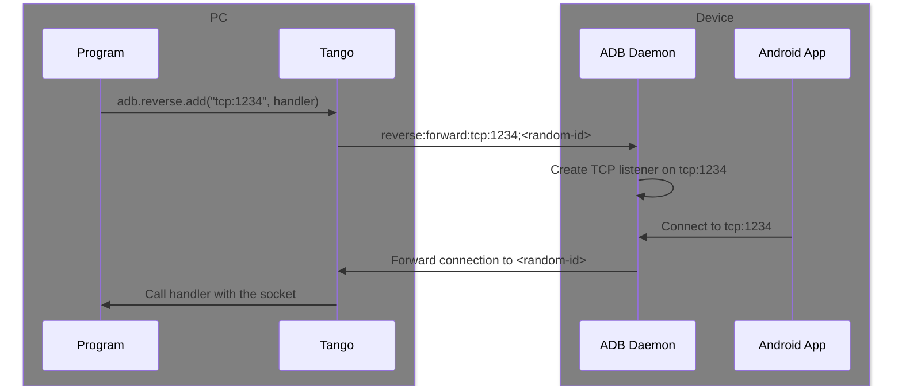
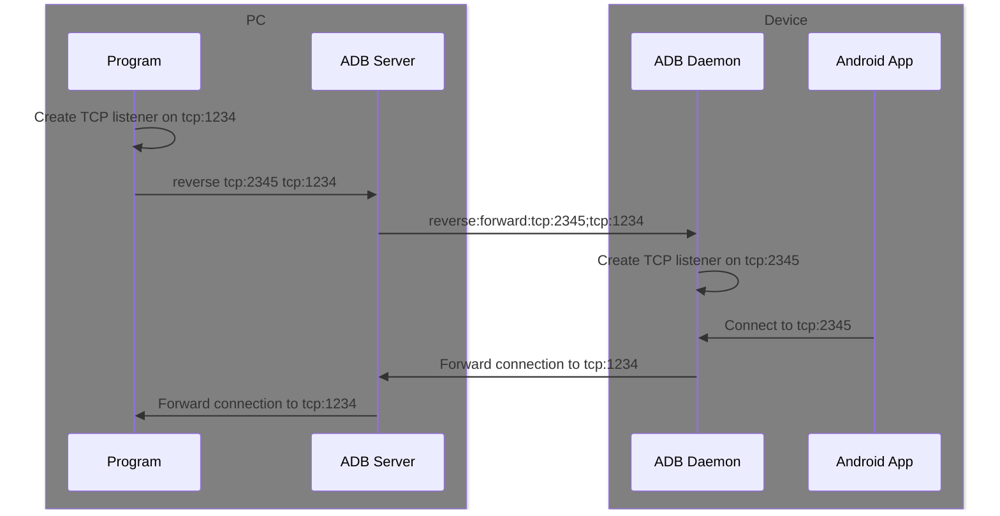
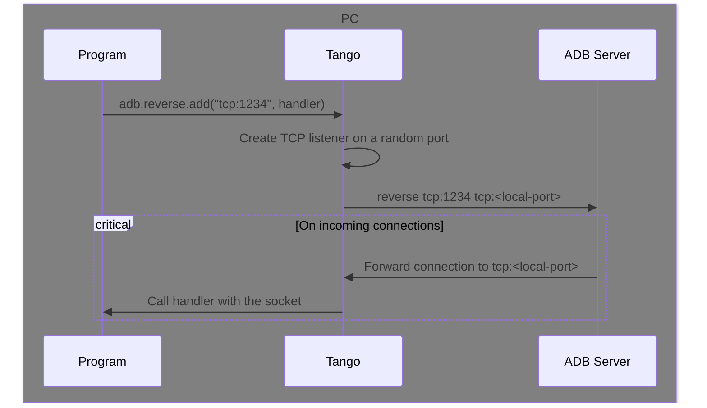

# add

{/*
cspell: ignore localabstract
cspell: ignore localfilesystem
cspell: ignore vsock
*/}

There are many difficulties in implementing reverse port forwarding in a platform-agnostic way:

* Different transports handle the incoming connections differently
* The method to connect to a socket address varies between runtime environments

To solve this, Tango abstracts the host part to a handler function and let the Transport object handle the low-level details.

We believe this API also provides a better developer experience:

* You don't need to create a socket listener yourself
* You can add and handle reverse tunnels at the same place.

```ts
type AdbIncomingSocketHandler = (socket: AdbSocket) => ValueOrPromise<void>;

declare class AdbReverseCommand {
  add(
    deviceAddress: string,
    handler: AdbIncomingSocketHandler,
    localAddress?: string
  ): Promise<string>;
}
```

## `deviceAddress`

The socket address to listen on the device.

The format is `<type>:<address>`. ADB Daemon can listen on various types of addresses:

- `tcp:<port>`: TCP `localhost:<port>` on device
- `local:<path>`: Unix local domain socket on device
- `localabstract:<name>`: Unix abstract namespace socket on device
- `localfilesystem:<path>`: Unix filesystem namespace socket on device
- `vsock:<CID>:<port>`: vsock on the given CID and port (for virtual machines)

If `deviceAddress` is `tcp:0`, ADB Daemon will choose an available port on the device. On Android 8 and above, the chosen port will be returned. Otherwise, the return value will be the `deviceAddress` parameter itself.

If a reverse tunnel already exists with the same `deviceAddress`, the operation will fail silently. Use [`list`](./list.mdx) to check for existing tunnels and [`remove`](./remove.mdx) to remove them if necessary.

## `handler`

A handler function to process the incoming connections. It is called for each incoming connection.

It takes an `AdbSocket` object as its only argument. The handler should only initialize the connection (for example starting piping the data from the `readable` stream) and return immediately. The `AdbSocket` object is valid even after the handler returns, until the socket is closed by either side.

See the [Socket](../socket.mdx) page for how to use the `AdbSocket` object.

The Transport will wait for the handler to return, before sending a socket open success response to ADB Daemon.

If the handler throws an error, the Transport will suppress the error, and send a socket open failed response to the device. ADB Daemon will then close the connection.

:::danger[READ ALL STREAMS!]

ADB is a multiplexing protocol (multiple logic streams are transferred over one connection), so blocking one stream will block all other streams.

You must continuously read from all incoming streams (either by piping them to `WritableStream`s or calling `reader.read()` in a loop) to prevent this from happening.

If the remaining data is not needed, `stream.cancel()` (or `reader.cancel()` if using a reader) can be called to discard them.

:::

## `localAddress`

The socket address to forward the connection to on the host. The format is same as `deviceAddress`, but the meaning and supported types of addresses vary between Operating Systems, runtime environments, and the ADB Transport used.

See [Daemon Transport](#localaddress-1) and [Server Transport](#localaddress-2) sections below for details.

Usually it is not necessary to specify `localAddress`, the transport will choose a suitable address automatically.

## Example

This example creates an echo server on TCP port 1234 on the device.

```ts transpile
import { encodeUtf8 } from "@yume-chan/adb";
import { DecodeUtf8Stream } from "@yume-chan/stream-extra";

const address = await adb.reverse.add("tcp:1234", (socket) => {
  const writer = socket.writable.getWriter();
  // Don't await the promise, otherwise the transport will block
  socket.readable
    .pipeTo(
      new WriteableStream({
        async write(chunk) {
          await writer.write(chunk);
        },
      })
    )
    .then(
      () => {
        // The socket is closed
      },
      (error) => {
        // An error occurred
      }
    );
});
```

:::info[Equivalent ADB command]

There is no equivalent ADB command.

:::

## Daemon Transport

When using the [Daemon Transport](../../tango/daemon/index.mdx), reverse port forwarding is handled by the transport itself.



### `localAddress`

Because Daemon Transport doesn't actually listen on `localAddress`, it can be any string that uniquely identifies the handler. It is used to match the incoming connection to the handler.

If not specified, a random string will be generated.

### Forward to other programs

Because Daemon Transport is platform-agnostic, it doesn't implement connecting to a local socket address, thus not supporting adding reverse port forwardings for existing programs listening on a socket address.

To simulate the behavior of `adb forward`, you can add a reverse port forwarding using a handler function, and then connect to the local socket address in the handler.

## Server Transport

When using the [Server Transport](../../tango/server/index.mdx), reverse port forwarding is handled by ADB Server.



### `localAddress`

Because ADB Server can only forward the connection to a socket address, Server Transport will listen on `localAddress` to redirect incoming connections to the handler function.



Thus, when specified, `localAddress` must be a valid socket address on the host. The format is `<type>:<address>`. Server Transport can listen on following types of addresses:

- `tcp:<port>`: TCP `[::]:<port>` on host, it listens on all network interfaces
- `tcp:<host>:<port>`: TCP `<host>:<port>` on host, it listens on the specified host address
- `unix:<path>`: Unix domain socket on host (or named pipe on Windows)

If not specified, the transport will choose an available TCP port on the host and listen on all network interfaces.

### `addExternal`

To replicate the behavior of `adb reverse` command, where the host program already listens on a socket address and wants to expose it to the device, the `addExternal` method can be used.

```ts
declare class AdbReverseCommand {
  addExternal(deviceAddress: string, localAddress: string): Promise<string>;
}
```

#### `localAddress`

When adding an external reverse tunnel, more types of `localAddress` are supported:

- `tcp:<port>`: TCP `localhost:<port>` on host
- `tcp:<host>:<port>`: TCP `<port>` on `<host>`, where `<host>` can be an IP address or a hostname
- `local:<path>`: Unix domain socket on host (not supported on Windows)
- `localabstract:<name>`: Unix abstract namespace socket on host (not supported on Windows)
- `localfilesystem:<path>`: Unix filesystem namespace socket on host (not supported on Windows)

#### Example

```ts transpile
const port = await adb.reverse.addExternal("tcp:0", "tcp:localhost:1234");
console.log(port); // tcp:38324
```

:::info[Equivalent ADB command]

```sh
adb reverse tcp:0 tcp:localhost:1234
```

:::
