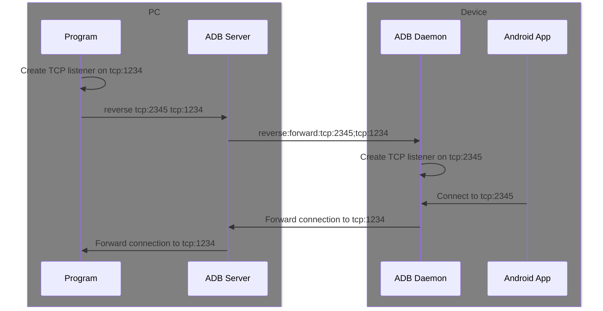

import Version from "./version-span";

# Connect to server

Scrcpy uses multiple [Unix domain sockets](https://www.man7.org/linux/man-pages/man7/unix.7.html) to transmit video, audio, and control messages between client and server.

While programs on the Android device itself can connect to the Scrcpy server using [`socket`](https://www.man7.org/linux/man-pages/man2/socket.2.html) (for C and others) or [`LocalSocket`](https://developer.android.com/reference/android/net/LocalSocket) (for Java), the client is usually running on a PC, with the Android device connected to the PC through ADB, so ADB tunnels are used, to forward connections between TCP sockets on PC and Unix domain sockets on the Android device.

:::info

Scrcpy official documentation also has a section about this: https://github.com/Genymobile/scrcpy/blob/master/doc/develop.md#connection

:::

## Socket address

Scrcpy uses Unix domain sockets, their address are represented in ADB using the `localabstract:` schema.

Before Scrcpy 2.0, the socket address is always `localabstract:scrcpy`.

Since Scrcpy 2.0, to make running multiple Scrcpy instances easier, each instance can be specified to use different addresses using the `scid` option.

`scid` option is a positive number, converted to hexadecimal, and padded to 8 characters with `0`s at start:

```ts transpile
export function getSocketName(scid: number | undefined): string {
  if (!scid || scid <= 0) {
    return "localabstract:scrcpy";
  } else {
    return "localabstract:scrcpy_" + scid.toString(16).padStart(8, "0");
  }
}
```

## Sockets

Scrcpy transmits video, audio, and control messages in individual sockets. The default order is:

 1. Video<Version since="2.1">, unless disabled by [`video: false`](./options/v2.1/video.mdx) option</Version>
 2. <Version since="v2.0">Audio, unless disabled by [`audio: false`](./options/v2.0/audio.mdx) option</Version>
 3. Control<Version since="v1.22">, unless disabled by [`control: false`](./options/v1.15/control.mdx) option</Version>

If a socket is disabled by its corresponding option, the socket will be skipped (while keeping the order of other sockets). If you don't need some of them, you can disable them by setting the corresponding option to `false` to save bandwidth.

:::info

`control: false` in versions before v1.22 will not disable the control socket, but all messages will be ignored.

:::

:::danger[READ ALL STREAMS!]

Despite through multiple layers of redirection, these sockets are precise emulations of the Unix domain sockets on the Android device. If data in the streams is not consumed, after the internal buffer is full, the process will (very likely) hang when trying to write more data to them.

You must continuously read from all incoming streams (either by piping them to `WritableStream`s, using `for await` loop, or calling `reader.read()` in a loop) to prevent this from happening.

If the remaining data is not needed, `stream.cancel()` (or `reader.cancel()` if using a reader) can be called to discard them.

:::

These sockets can be transmitted between PC and Android devices using ADB reverse tunnels or ADB forward tunnels:

## Reverse tunnel



With reverse tunnels, programs on Android device can connect to a listening address on PC. So the client (running on PC) listens, and the server connects to it.

This is the default mode used by Scrcpy.

### Pros

Because the client can listen on the socket address before the server starts, the server can connect to it immediately.

### Cons

Reverse tunnel is not supported in some situations, including [ADB over Wi-Fi on Android 8 and below](../api/adb/reverse/index.mdx#errors), or with a [custom transport](../tango/custom-transport/transport.mdx#reverse-tunnel).

In such cases, you can use the [forward tunnel](#forward-tunnel) mode instead.

### With Google ADB

To setup the reverse tunnel manually with Google ADB, follow the steps below:

1. Listen on a TCP port locally
2. Run `adb reverse add` command to let Google ADB listen on the Unix domain socket address on device, and forward the connection to your TCP listener
3. Start server using `adb shell app_process` command (described in previous page)
4. Wait for incoming TCP connections. The number depends on the server options.

See [server transport](../api/adb/reverse/add.mdx#server-transport) for more details.

### With Tango

Tango encapsulates the reverse tunnel feature into a callback-based API:

1. Call [`reverse.add`](../api/adb/reverse/add.mdx) method to create a reverse tunnel.
2. Start server using [`subprocess.spawn`](../api/adb/subprocess/index.mdx) method.
3. Wait for the correct amount of incoming connections.

## Forward tunnel

This mode can be used as a fallback when reverse tunnel is not supported. In forward tunnel mode, the server listens on the Unix domain socket address, and the client creates multiple connections to it.

### Dummy byte

When using ADB forward tunnels, ADB server listens on the PC, so when client connects to the local socket address, it will always succeed.

To signal a successful connection, the server sends an extra `0x00` byte at the beginning of the first established [socket](#sockets) (usually, the video socket). You need to ignore this byte, before sending the stream to other APIs to process.

```ts transpile
import type { Adb } from "@yume-chan/adb";
import type { Consumable, ReadableWritablePair } from "@yume-chan/stream-extra";
import { BufferedReadableStream } from "@yume-chan/stream-extra";

export async function connect(
  adb: Adb,
  address: string,
  sendDummyByte: boolean,
): Promise<ReadableWritablePair<Uint8Array, Consumable<Uint8Array>>> {
  const stream = await adb.createSocket(address);
  if (sendDummyByte) {
    // Can't guarantee the stream will preserve message boundaries,
    // so buffer the stream
    const buffered = new BufferedReadableStream(stream.readable);
    // Skip the dummy byte
    // Google ADB forward tunnel listens on a socket on the computer,
    // when a client connects to that socket, Google ADB will forward
    // the connection to the socket on the device.
    // However, connecting to that socket will always succeed immediately,
    // which doesn't mean that Google ADB has connected to
    // the socket on the device.
    // Thus Scrcpy server sends a dummy byte to the socket, to let the client
    // know that the connection is truly established.
    await buffered.readExactly(1);
    return {
      readable: buffered.release(),
      writable: stream.writable,
    };
  }
  return stream;
}
```

Because only the first socket contains the dummy byte, it needs to be stored in a variable:

```ts transpile
declare const adb: Adb;
const address = "localabstract:scrcpy";
declare const options: Record<string, unknown>;

let sendDummyByte = options.sendDummyByte !== false;
if (options.video !== false) {
  const videoSocket = await connect(adb, address, sendDummyByte);
  sendDummyByte = false;
}
if (options.audio !== false) {
  const audioSocket = await connect(adb, address, sendDummyByte);
  sendDummyByte = false;
}
if (options.control !== false) {
  const controlSocket = await connect(adb, address, sendDummyByte);
  sendDummyByte = false;
}
```

This behavior can be turned off using `sendDummyByte: false` option. For example, in [daemon transport](../tango/daemon/index.mdx) mode, it connects to ADB daemon directly, so no dummy byte is needed to detect connection success.

### Pros

Forward tunnel is always supported.

### Cons

Because the server needs some time to start and listen on the socket address, the client may not connect to it immediately. Usually, the client needs to continuously retry the connection until it succeeds.

### With Google ADB

Here are the steps to setup a forward tunnel and connect to it using Google ADB:

3. Start server using `adb shell app_process` command (described in previous page)
1. Run `adb forward add` command, to let Google ADB listen on a local TCP port, and forward the connections to the Unix domain socket address on device.
1. Connect to the TCP port.
1. Retry the connection until the correct amount of sockets are created.

Because local TCP sockets are handled by operating system and Google ADB server, the connection will always success, but it doesn't mean the connection has been forwarded to the remote address on device.

If the server is still starting, the connection will be closed without any data.

### With Tango

In Tango, the [`createSocket`](../api/adb/socket.mdx#forward-tunnel) method can create sockets to the Unix domain socket address on device directly.

If the server has not been started and listen on the socket address, `createSocket` will throw an error.

You need to retry the connection until the correct amount of sockets are created. Continuing from the code example in [dummy byte](#dummy-byte) section above:

```ts transpile
import type { Adb } from "@yume-chan/adb";
import { delay } from "@yume-chan/async";
import type { Consumable, ReadableWritablePair } from "@yume-chan/stream-extra";

export async function connectWithRetry(
  adb: Adb,
  address: string,
  sendDummyByte: boolean,
): Promise<ReadableWritablePair<Uint8Array, Consumable<Uint8Array>>> {
  for (let i = 0; i < 100; i += 1) {
    try {
      return await connect(adb, address, sendDummyByte);
    } catch {
      // Maybe the server is still starting
      await delay(100);
    }
  }
  throw new Error(`Can't connect to server after 100 retries`);
}
```

And replace `connect` calls with `connectWithRetry`:

```ts transpile
declare const adb: Adb;
const address = "localabstract:scrcpy";
declare const options: Record<string, unknown>;

let sendDummyByte = options.sendDummyByte !== false;
if (options.video !== false) {
  const videoSocket = await connectWithRetry(adb, address, sendDummyByte);
  sendDummyByte = false;
}
if (options.audio !== false) {
  const audioSocket = await connectWithRetry(adb, address, sendDummyByte);
  sendDummyByte = false;
}
if (options.control !== false) {
  const controlSocket = await connectWithRetry(adb, address, sendDummyByte);
  sendDummyByte = false;
}
```

## With `@yume-chan/adb-scrcpy`

If no `tunnelForward` option is specified, `AdbScrcpyClient.start` method will try to use reverse tunnels by default. It sets up the reverse tunnel and waits for the correct amount of connections automatically.

However, if [`reverse.add`](../api/adb/reverse/add.mdx) throws an [`AdbReverseNotSupportedError`](../api/adb/reverse/index.mdx#errors), `AdbScrcpyClient` will automatically modify the options to use forward tunnel instead.

If your custom transport doesn't support reverse tunnels, it's recommended to throw an `AdbReverseNotSupportedError` to trigger this automatic fallback behavior:

```ts transpile
import { AdbReverseNotSupportedError } from "@yume-chan/adb";

export class YourTransport implements AdbTransport {
  /// other methods

  addReverseTunnel() {
    throw new AdbReverseNotSupportedError();
  }

  removeReverseTunnel() {
    throw new AdbReverseNotSupportedError();
  }

  clearReverseTunnels() {
    throw new AdbReverseNotSupportedError();
  }
}
```

In all situations, the `tunnelForward` option can be specified to always use forward tunnels. For more details about this option, see the [tunnelForward option](./options/v1.15/tunnel-forward.mdx) page:

```ts transpile
import { AdbScrcpyOptions3_0 } from "@yume-chan/adb-scrcpy";

const options = new AdbScrcpyOptions3_0({
  tunnelForward: true,
});
```
