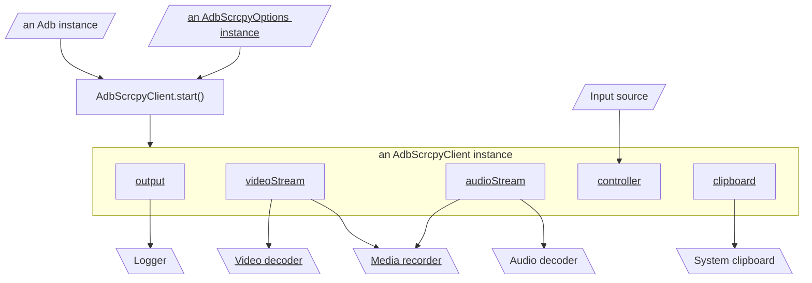

# Start server

import Version from "./version-span";

The server is a `jar` file, so it's not directly executable. On Android, `app_process` is the program to start the system server, all the apps, and standalone Java applications:

:::info[Equivalent ADB command]

```bash
adb shell CLASSPATH=/data/local/tmp/scrcpy-server.jar app_process / com.genymobile.scrcpy.Server 2.1
```

:::

## With `@yume-chan/scrcpy`

`@yume-chan/scrcpy` only provides APIs to serialize and deserialize Scrcpy protocol messages. It can't start the server directly.

The `ScrcpyOptions#serialize` method generates the command line arguments for the specified options:

```ts transpile
import { ScrcpyOptions2_1 } from "@yume-chan/scrcpy";

const options = ScrcpyOptions2_1({
  // options
});

const commandLineArguments: string[] = options.serialize();
```

Then you need to use varies method on the options class to parse the outputs.

## With `@yume-chan/adb-scrcpy`

Use `AdbScrcpyClient.start()` method with an option class to start the server.

```ts showLineNumbers
import type { AdbScrcpyOptions } from "@yume-chan/adb-scrcpy";
import type { ScrcpyOptions1_15 } from "@yume-chan/scrcpy";

declare class AdbScrcpyClient {
  static async start<
    TOptions extends AdbScrcpyOptions<
      Pick<ScrcpyOptions1_15.Init, "tunnelForward">
    >,
  >(
    adb: Adb,
    path: string,
    options: TOptions
  ): Promise<AdbScrcpyClient<TOptions>>;
}
```

| Parameter | Required/Default value | Description                                  |
| --------- | ---------------------- | -------------------------------------------- |
| `adb`     | Required               | An `Adb` instance to run ADB commands.       |
| `path`    | Required               | The path on device where the server file is. |
| `options` | Required               | The options to start the server.             |

It automatically sets up port forwarding, launches the server, and connects to it.

### Overview



:::note

Click underlined nodes to open their relevant documentations.

:::

### Examples

#### Using the default server path

```ts transpile
import type { Adb } from "@yume-chan/adb";
import { AdbScrcpyClient, AdbScrcpyOptions2_1 } from "@yume-chan/adb-scrcpy";
import { DefaultServerPath } from "@yume-chan/scrcpy";

declare const adb: Adb;

const client: AdbScrcpyClient = await AdbScrcpyClient.start(
  adb,
  DefaultServerPath,
  new AdbScrcpyOptions2_1({
    // options
  })
);
```

#### Using custom server path

```ts transpile
import type { Adb } from "@yume-chan/adb";
import { AdbScrcpyClient, AdbScrcpyOptions2_1 } from "@yume-chan/adb-scrcpy";

declare const adb: Adb;

const client: AdbScrcpyClient = await AdbScrcpyClient.start(
  adb,
  "/data/local/tmp/scrcpy-server.jar",
  new AdbScrcpyOptions2_1({
    // options
  })
);
```

### Error handling

If the server process exits before the connection is established, the client will throw an `AdbScrcpyExitedError`.

```ts showLineNumbers
export class AdbScrcpyExitedError extends Error {
  output: readonly string[];
}
```

The `output` field contains the output of the server process.

```ts transpile
import type { Adb } from "@yume-chan/adb";
import {
  AdbScrcpyClient,
  AdbScrcpyOptions2_1,
  AdbScrcpyExitedError,
} from "@yume-chan/adb-scrcpy";
import { DefaultServerPath } from "@yume-chan/scrcpy";

declare const adb: Adb;

try {
  const client: AdbScrcpyClient = await AdbScrcpyClient.start(
    adb,
    DefaultServerPath,
    new AdbScrcpyOptions2_1({})
  );
} catch (e) {
  if (e instanceof AdbScrcpyExitedError) {
    console.error(e.output);
  } else {
    console.error(e);
  }
}
```

### Server output

After the `start` process succeeds, the `output` field of the `AdbScrcpyClient` object contains the output of the server process.

```ts transpile
import type { AdbScrcpyClient } from "@yume-chan/adb-scrcpy";
import { WritableStream } from "@yume-chan/stream-extra";

declare const client: AdbScrcpyClient;

// Print output of Scrcpy server
void client.output.pipeTo(
  new WritableStream<string>({
    write(chunk) {
      console.log(chunk);
    },
  })
);
```

:::info

`pipeTo` returns a `Promise` that resolves when the stream ends.

Don't `await` this `Promise` here, as it will block the code below from executing.

However, you can save the `Promise` to a variable and later use `Promise.all` to wait for all concurrent tasks to complete.

:::

:::danger[`stdout` must be used!]

Despite through multiple layers of redirection, `output` is a precise emulation of the process's `stdout` and `stderr` streams. If data in `output` is not consumed, after the internal buffer is full, the process will (very likely) hang when trying to write more data to `stdout` or `stderr`.

You must continuously read from it (either by piping them to `WritableStream`s, using `for await` loop, or calling `reader.read()` in a loop) to prevent this from happening.

If the remaining data is not needed, `stream.cancel()` (or `reader.cancel()` if using a reader) can be called to discard them.

:::

### Video stream

`videoStream` field contains the `AdbScrcpyVideoStream` object<Version since="v2.1">, or `undefined` if [`video: false`](./options/video.mdx) option is specified.</Version>

```ts transpile
import type { AdbScrcpyClient } from "@yume-chan/adb-scrcpy";
import { WritableStream } from "@yume-chan/stream-extra";

declare const client: AdbScrcpyClient;

if (client.videoStream) {
  const { metadata: videoMetadata, stream: videoPacketStream } =
    await client.videoStream;

  console.log(videoMetadata.codec);

  void videoPacketStream.pipeTo(
    new WritableStream({
      write(chunk) {
        console.log(chunk.type);
      },
    })
  );
}
```

:::note[Next step]

[Handle video stream](./video/index.mdx)

:::

### Audio stream

Since v2.0, if `audio: false` option is not specified, the `audioStream` field represents the audio forwarding stream.

The audio stream can have three states:

- `disabled`: Audio forwarding not supported by device
- `errored`: Other error when initializing audio forwarding
- `success`: Audio forwarding initialized successfully. The `stream` field contains audio packets in the specified codec.

When audio forwarding failed to start (either `disabled` or `errored`), other sockets (video and control) still work.

```ts transpile
import type { AdbScrcpyClient } from "@yume-chan/adb-scrcpy";
import type { ScrcpyMediaStreamPacket } from "@yume-chan/scrcpy";
import type { ReadableStream } from "@yume-chan/stream-extra";
import { WritableStream } from "@yume-chan/stream-extra";

declare const client: AdbScrcpyClient;

if (client.audioStream) {
  const metadata = await client.audioStream;
  switch (metadata.type) {
    case "disabled":
      break;
    case "errored":
      break;
    case "success":
      const audioPacketStream: ReadableStream<ScrcpyMediaStreamPacket> =
        metadata.stream;
      void audioPacketStream
        .pipeTo(
          new WritableStream<ScrcpyMediaStreamPacket>({
            write(packet) {
              console.log(packet);
            },
          })
        )
        .catch((e) => console.error(e));
      break;
  }
}
```

### Controller

Controller is used to send [control messages](./control/index.mdx) to server<Version since="v2.1">, or `undefined` if [`control: false`](./options/control.mdx) option is specified.</Version>

```ts transpile
import type { AdbScrcpyClient } from "@yume-chan/adb-scrcpy";
import type { ScrcpyControlMessageWriter } from "@yume-chan/scrcpy";

declare const client: AdbScrcpyClient;

const controller: ScrcpyControlMessageWriter | undefined = client.controller;

if (controller) {
  await controller.setScreenPowerMode(AndroidScreenPowerMode.Off);
}
```

### Clipboard stream

If [`control: false`](./options/control.mdx) option is not specified<Version since="v2.1"> and [`clipboardAutosync: false`](./options/clipboard-autosync.mdx) option is also not specified</Version>, Scrcpy server will monitor device clipboard and send the change to client.

When clipboard syncing is enabled, the `clipboard` field will be a `ReadableStream<string>` that contains the clipboard content.

```ts transpile
import type { ReadableStream } from "@yume-chan/stream-extra";

const clipboard: ReadableStream<string> | undefined = client.clipboard;

if (clipboard) {
  void clipboard
    ?.pipeTo(
      new WritableStream<string>({
        write(chunk) {
          // Handle device clipboard change
          console.log(chunk);
        },
      })
    )
    .catch((e) => console.error(e));
}
```

Scrcpy only supports text type in clipboard.

### Stop the server

The `stop` method can be used to stop the server:

```ts transpile
await client.close();
```

## With Tango

[AdbNoneProtocolSubprocessService#spawn](../api/adb/subprocess/none-protocol.mdx#spawn) can be used to start a process on device:

```ts transpile
import type { Adb } from "@yume-chan/adb";
import { TextDecoderStream } from "@yume-chan/stream-extra";

declare const adb: Adb;

const process = await adb.subprocess.noneProtocol.spawn(
  "CLASSPATH=/data/local/tmp/scrcpy-server.jar app_process / com.genymobile.scrcpy.Server 2.1"
);

// Print output of Scrcpy server
await process.output.pipeThrough(new TextDecoderStream()).pipeTo(
  new WritableStream<string>({
    write(chunk) {
      console.log(chunk);
    },
  })
);
```

Then you need to [connect to Scrcpy server](./connect-server.mdx) yourself.
