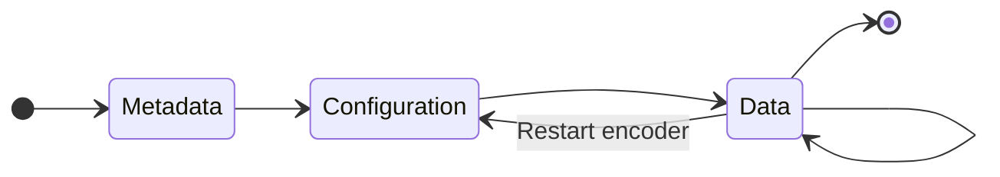

---

---

import Version from "../version-span";

# Handle video stream

The video socket from Scrcpy server contains the encoded video frames. Normally, it contains a leading metadata, and multiple configuration and data (video frame) packets, but the exact format depends on the Scrcpy server version and the specified option values.



## Format

This table show how versions and options affect the video stream format.

- ✅ means the field is always present
- ⛔ means the field is not present
- An option name means the field is present if the option is `true`

| Value                                                 | v1.15 ~ v1.21   | 1.22             | v1.23 ~ v1.25    | v2.0 and later                      |
| ----------------------------------------------------- | --------------- | ---------------- | ---------------- | ----------------------------------- |
| Metadata                                              | ✅              | `sendDeviceMeta` | `sendDeviceMeta` | `sendDeviceMeta` or `sendCodecMeta` |
| <span style={{marginRight:'2em'}}/>Device name        | ✅              | `sendDeviceMeta` | `sendDeviceMeta` | `sendDeviceMeta`                    |
| <span style={{marginRight:'2em'}}/>Initial video size | ✅              | `sendDeviceMeta` | `sendDeviceMeta` | `sendCodecMeta`                     |
| <span style={{marginRight:'2em'}}/>Video codec        | ⛔              | ⛔               | ⛔               | `sendCodecMeta`                     |
| Configuration                                         | `sendFrameMeta` | `sendFrameMeta`  | `sendFrameMeta`  | `sendFrameMeta`                     |
| Data Packet Header                                    | `sendFrameMeta` | `sendFrameMeta`  | `sendFrameMeta`  | `sendFrameMeta`                     |
| <span style={{marginRight:'2em'}}/> PTS               | `sendFrameMeta` | `sendFrameMeta`  | `sendFrameMeta`  | `sendFrameMeta`                     |
| <span style={{marginRight:'2em'}}/> Keyframe Mark     | ⛔              | ⛔               | `sendFrameMeta`  | `sendFrameMeta`                     |

## Raw mode

As the above table shows, since v1.22, if `sendDeviceMeta` and `sendFrameMeta` options are `false`<Version since="v2.0">, and `sendCodecMeta` option is also `false`</Version>, all fields will be omitted.

This is called the raw mode. In this mode, the video socket only contains codec-specific, encoded video data.

Raw mode is more difficult to process, because it requires the client to parse the codec-specific format directly.

Tango has partial support for raw mode, all omitted fields will be `undefined`, and [built-in video decoders](#decode-and-render-in-browsers) don't work with raw mode video streams.

Advanced decoders, like ffmpeg, can decode raw video streams. If you only need to pipe the video stream to ffmpeg, raw mode can save some processing time.

## Video stream metadata

If the server [version and options requirements](#format) are met, the server will first send some metadata about the device and the video stream:

```ts
interface ScrcpyVideoStreamMetadata {
  deviceName?: string | undefined;
  width?: number | undefined;
  height?: number | undefined;
  codec: ScrcpyVideoCodecId;
}
```

- `deviceName`: The device's model name.
- `width`/`height`: Size of the first video frame.
- `codec`: The codec of the video stream.

### Size changes

The metadata will only be sent once. When device screen size changes (for example, when device orientation changes, or a foldable device unfolds), the server will restart the video encoder, but it won't send a new metadata with the new size.

To track the video resolution, parsing the video stream is required. [built-in video decoders](#decode-and-render-in-browsers) have a [`sizeChanged`](./tiny-h264.mdx#handle-size-changes) event, and [`AdbScrcpyClient`](../start-server.mdx#with-yume-chanadb-scrcpy) also contains [size information](#video-size).

### With `@yume-chan/scrcpy`

If you already have a `ReadableStream<Uint8Array>` that reads from the video socket, the `parseVideoStreamMetadata` method from the corresponding `ScrcpyOptionsX_YY` class can be used to parse the metadata. This method will return the metadata, and a new stream that contains the remaining stream.

```ts transpile
import { ScrcpyOptions2_1, ScrcpyVideoStreamPacket } from "@yume-chan/scrcpy";

const options = new ScrcpyOptions2_1({
  // use the same version and options when starting the server
});

const videoSocket: ReadableStream<Uint8Array>; // get the stream yourself

// Parse video socket metadata
const { metadata: videoMetadata, stream: videoStream } =
  await options.parseVideoStreamMetadata(videoSocket);
```

#### `codec`

If metadata is not present, or doesn't contain codec information, the `codec` field will <Version until="v1.25">always be `ScrcpyVideoCodecId.H264` because it's the only supported codec</Version><Version since="v2.0">be the same as the `videoCodec` option</Version>.

#### Raw mode

If the whole metadata is not present, all fields except `codec` will be `undefined`. The `stream` field returned will be the same object as the argument.

### With `@yume-chan/adb-scrcpy`

See [`AdbScrcpyClient.prototype.videoStream` property](#with-yume-chanadb-scrcpy-1) below. It uses `parseVideoStreamMetadata` internally to parse the metadata, and it also parses the video stream into packets.

The [`codec`](#codec) and [raw mode](#raw-mode-1) behavior mentioned above also apply.

## Video packets

If the server [version and options requirements](#format) are met, the server will encapsulate each encoded video frame with extra information. Tango parses them into two types of packets:

```ts
interface ScrcpyMediaStreamConfigurationPacket {
  type: "configuration";
  data: Uint8Array;
}

interface ScrcpyMediaStreamDataPacket {
  type: "data";
  keyframe?: boolean;
  pts?: bigint;
  data: Uint8Array;
}

type ScrcpyMediaStreamPacket =
  | ScrcpyMediaStreamConfigurationPacket
  | ScrcpyMediaStreamDataPacket;
```

### Configuration packet

When video streaming starts, or when the server re-creates new video encoders due to configuration changes, a configuration packet will generated and sent.

The first configuration packet will be send immediately after [metadata](#video-stream-metadata) (or at the beginning of video stream if metadata was disabled), and when each time the screen size or orientation changes.

The format of configuration packets depend on the codec:

#### H.264 and H.265

For H.26x codecs, the configuration packets include the following data:

- H.264: Sequence Parameter Set (SPS) and Picture Parameter Set (PPS), in [Annex B format](./record.mdx#h264).
- H.265: Video Parameter Set (VPS), Sequence Parameter Set (SPS), and Picture Parameter Set (PPS), in [Annex B format](./record.mdx#h265).

These information are essential for proper decoding of the video, so they will still be sent through the video stream even when configuration packets are disabled. Enabling configuration packets only adds a mark to them, so the client can more easily find and handle them.

When client receives a configuration packet, it should create a new video decoder with the data, to decode the following data packets.

:::info

The two [built-in decoders](#decode-and-render-in-browsers) will handle configuration packets and re-create video decoders for you.

You only need to pipe the whole video stream into them.

:::

#### AV1

For AV1, the configuration packet contains the first 3 bytes of `AV1CodecConfigurationRecord` (https://aomediacodec.github.io/av1-isobmff/#av1codecconfigurationbox). The remaining configuration OBUs are in the next data packet.

These 3 bytes are required when [saving the stream to video files](./record.mdx), although they can also be inferred from the configuration OBUs.

### Data packet

Each data packet represents exactly one encoded frame, and if [version and options requirements](#format) are met, some extra information:

- `keyframe`: `true` if the current packet is a keyframe. Many decoders can decode the video stream without knowing if each frame is a keyframe or not, but some decoders require this information.
- `pts`: Presentation timestamp in nanoseconds. When rendering the video in real-time, generally you want to present the decoded frames as they arrive to minimize the latency, but this information can be used to remove processing time deviations when [recording](./record.mdx).
- `data`: Contains exactly one encoded frame. For H.264 and H.265, in [Annex B format](./record.mdx#h264).

### With `@yume-chan/scrcpy`

The `createMediaStreamTransformer` method creates a `TransformStream` that parses the video stream into packets.

`parseVideoStreamMetadata` and `createMediaStreamTransformer` are separate methods, because `createMediaStreamTransformer` can also be used to parse the audio stream.

```ts transpile
const videoPacketStream: ReadableStream<ScrcpyMediaStreamPacket> =
  videoStream.pipeThrough(options.createMediaStreamTransformer());

videoPacketStream
  .pipeTo(
    new WritableStream({
      write(packet: ScrcpyMediaStreamPacket) {
        switch (packet.type) {
          case "configuration":
            // Handle configuration packet
            console.log(packet.data);
            break;
          case "data":
            // Handle data packet
            console.log(packet.keyframe, packet.pts, packet.data);
            break;
        }
      },
    })
  )
  .catch((e) => {
    console.error(e);
  });
```

Similar to [`options.clipboard`](../start-server.mdx#clipboard-stream), don't `await` the `pipeTo`. The returned `Promise` only resolves when `videoSocket` ends, but waiting here and not handling other streams will block `videoSocket`, causing a deadlock.

#### Raw mode

If data packet header is not present, the `keyframe` and `pts` fields will be `undefined`.

The `data` field contains the data in one `read` call, because there is no packet boundaries, it might contain partial or multiple frames.

### With `@yume-chan/adb-scrcpy`

When `video` option is not `false`, `AdbScrcpyClient.videoStream` is a `Promise` that resolves to an `AdbScrcpyVideoStream`.

```ts
import type { Event } from "@yume-chan/event";

interface AdbScrcpyVideoStream {
  metadata: ScrcpyVideoStreamMetadata;
  stream: ReadableStream<ScrcpyMediaStreamPacket>;
  width: number;
  height: number;
  sizeChanged: Event<{ width: number; height: number }>;
}
```

It uses [`parseVideoStreamMetadata`](#with-yume-chanscrcpy) and [`createMediaStreamTransformer`](#with-yume-chanscrcpy-1) internally, so the return value is a combination of those two methods.

```ts transpile
import type { ScrcpyMediaStreamPacket } from "@yume-chan/scrcpy";
import type { AdbScrcpyClient } from "@yume-chan/adb-scrcpy";

declare const client: AdbScrcpyClient;

if (client.videoStream) {
  const { metadata: videoMetadata, stream: videoPacketStream } =
    await client.videoStream;

  videoPacketStream
    .pipeTo(
      new WritableStream({
        write(packet: ScrcpyMediaStreamPacket) {
          switch (packet.type) {
            case "configuration":
              // Handle configuration packet
              console.log(packet.data);
              break;
            case "data":
              // Handle data packet
              console.log(packet.keyframe, packet.pts, packet.data);
              break;
          }
        },
      })
    )
    .catch((e) => {
      console.error(e);
    });
}
```

#### Video size

`AdbScrcpyVideoStream` also parses the video stream to get the up-to-date video size.

```ts
import type { AdbScrcpyClient } from "@yume-chan/adb-scrcpy";

declare const client: AdbScrcpyClient;

if (client.videoStream) {
  // Get video size at calling time
  // If video stream has not started yet, the size will be `0`
  console.log(client.videoStream.width, client.videoStream.height);

  const dispose = client.videoStream.sizeChanged(({ width, height }) => {
    // Get notified when the video size changes
    console.log(width, height);
  });

  // Remove event listener
  setTimeout(dispose, 1000);
}
```

## Decode and render in browsers

We provide two packages to decode and render the video stream in Web browsers:

- [TinyH264 decoder](./tiny-h264.mdx)
- [WebCodecs decoder](./web-codecs.mdx)

To use them, the `sendFrameMeta` options must be `true` (the default value) to enable [configuration packets](#configuration-packet).

## Decode and render outside browsers

Decoding and playing video outside the browser is out of this library's scope. It will depend on the runtime environment, UI framework, and media library you use.

However, we have an example of using `ffplay` (from ffmpeg) to play the video stream (without audio) at https://github.com/tango-adb/scrcpy-ffplay.
