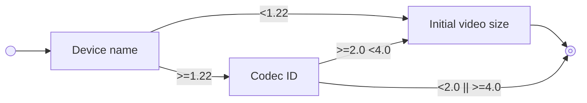
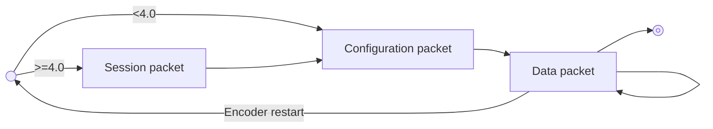

---
---

import Version from "../version-span";

# Handle video stream

The video socket from Scrcpy server contains the encoded video frames. Normally, it contains a leading metadata, and multiple configuration, session, and data (video frame) packets, but the exact format depends on the Scrcpy server version and the specified option values.

## Format

### Metadata

Metadata is sent at the start of the video stream. The availability of each field depends on the Scrcpy server version and the specified option values.


```mermaid
flowchart LR
    Start@{ shape: sm-circ, label: "Start" } --> DN[Device name]

    DN -- <1.22 --> VS[Initial video size]
    DN -- >=1.22 --> CI[Codec ID]

    CI -- >=2.0 <4.0 --> VS --> Stop@{ shape: framed-circle, label: "stop" }
    CI -- <2.0 || >=4.0 --> Stop
```

| Element | Size | Type | Description | Related Option |
| ------ | ---- | ---- | ----------- | ------ |
| Device name | 64 bytes | Null-terminated string | The device's model name | <Version since="v1.22">[`sendDeviceMeta`](../options/v1.22/send-device-meta.mdx)</Version> |
| Codec ID | 4 bytes | Enum | The codec ID | <Version since="v2.0" until="v3.3.4">[`sendCodecMeta`](../options/v2.0/send-codec-meta.mdx)</Version><br/><Version since="v4.0">[`sendStreamMeta`](../options/v4.0/send-stream-meta.mdx)</Version> |
| Initial video size | 4 bytes | 2 bytes width<br/>2 bytes height | Width and height of the video | <Version since="v1.22" until="v1.25">[`sendDeviceMeta`](../options/v1.22/send-device-meta.mdx)</Version><br/><Version since="v2.0">[`sendCodecMeta`](../options/v2.0/send-codec-meta.mdx)</Version> |

### Packets

Various packets are sent after the metadata. The packet format depends on the Scrcpy server version and the specified option values.


```mermaid
flowchart LR
    Start@{ shape: sm-circ, label: "Start" } -- >=4.0 --> SP[Session packet]
    Start -- <4.0 --> CP[Configuration packet]

    SP --> CP --> DP[Data packet]

    DP --> DP
    DP -- Encoder restart --> Start
    DP --> Stop@{ shape: framed-circle, label: "stop" }
```

| Element | Size | Description | Related Option |
| ------- | ---- | ----------- | -------------- |
| Session packet | 12 bytes | Resize reason and new video size | <Version since="v4.0">[`sendStreamMeta`](../options/v4.0/send-stream-meta.mdx)</Version> |
| Configuration packet | 8 bytes header<br/>Variable data | Codec-specific configuration data | [`sendFrameMeta`](../options/v1.15/send-frame-meta.mdx) |
| Data packet | 8 bytes header<br/>Variable data | Encoded video frame, with keyframe flag and presentation timestamp | [`sendFrameMeta`](../options/v1.15/send-frame-meta.mdx) |

### Raw mode

As the above table shows, since v1.22, if `sendDeviceMeta` and `sendFrameMeta` options are `false`<Version since="v2.0" until="v3.3.4">, and `sendCodecMeta` option is also `false`</Version><Version since="v4.0">, and `sendStreamMeta` option is also `false`</Version>, all elements will be disabled.

This is also called raw mode. In this mode, the video socket only contains codec-specific, encoded video data.

Raw mode is more difficult to process, because it requires the client to parse the codec-specific format directly.

Tango has partial support for raw mode, all omitted fields will be `undefined`, and [built-in video decoders](#decode-and-render-in-browsers) don't work with raw video streams.

Advanced decoders, like ffmpeg, can decode raw video streams. If you only need to pipe the video stream to ffmpeg, raw mode can save some bandwidth and processing time.

## Metadata

No matter which version of Scrcpy server and options are used, Tango parses the video stream metadata into a `ScrcpyVideoStreamMetadata` object:

```ts
interface ScrcpyVideoStreamMetadata {
  deviceName?: string | undefined;
  width?: number | undefined;
  height?: number | undefined;
  codec: ScrcpyVideoCodecId;
}
```

- `deviceName`: The device's model name.
- `width`/`height`: Size of the first video frame.
- `codec`: The codec of the video stream.

As displayed in above diagrams, each field except `codec` might be `undefined` if the server version or options don't include them. The `codec` field will fallback to the <Version until="v1.25">default codec `ScrcpyVideoCodecId.H264`</Version><Version since="v2.0">value of the `videoCodec` option</Version>.

### Size changes

The metadata is only sent once.

<Version until="v3.3.4">When device screen size changes (for example, when device orientation changes, or a foldable device unfolds), the server restarts the video encoder, but does NOT send another metadata with the new size. To track video resolution, parsing the video stream is required. [built-in video decoders](#decode-and-render-in-browsers) have a [`sizeChanged`](./decoder/handle-size.mdx) event, and [`AdbScrcpyClient`](../start-server.mdx#with-yume-chanadb-scrcpy) also contains [size information](#video-size).</Version>

<br/><br/>

<Version since="v4.0">When encoder restarts on screen size changes, the server sends a [session packet](#session-packet) with the new size. Consumers can inspect the packet to get the new video size. `sizeChanged` event on video decoders and `AdbScrcpyClient.videoStream` will also be updated accordingly.</Version>

### With `@yume-chan/scrcpy`

If you already have a `ReadableStream<Uint8Array>` that reads from the video socket, `ScrcpyOptionsX_YY.prototype.parseVideoStreamMetadata` method can be used to parse the metadata.

This method returns the parsed metadata, and the remaining stream after the metadata, so you can continue to read the video stream.

```ts transpile
import { ScrcpyOptions2_1, ScrcpyVideoStreamPacket } from "@yume-chan/scrcpy";

const options = new ScrcpyOptions2_1({
  // use the same version and options when starting the server
});

const videoSocket: ReadableStream<Uint8Array>; // get the stream yourself

// Parse video socket metadata
const { metadata: videoMetadata, stream: videoStream } =
  await options.parseVideoStreamMetadata(videoSocket);
```

### With `@yume-chan/adb-scrcpy`

See [`AdbScrcpyClient.prototype.videoStream` property](#with-yume-chanadb-scrcpy-1) below. It internally uses [`parseVideoStreamMetadata`](#with-yume-chanscrcpy) to parse the metadata, and [`createMediaStreamTransformer`](#with-yume-chanscrcpy-1) to parse the video stream into packets.

## Video packets

If the server [version and options requirements](#format) are met, the server will encapsulate each encoded video frame with extra information. Tango parses them into different types of packets:

```ts
interface ScrcpyMediaStreamConfigurationPacket {
  type: "configuration";
  data: Uint8Array;
}

interface ScrcpyMediaStreamDataPacket {
  type: "data";
  keyframe?: boolean;
  pts?: bigint;
  data: Uint8Array;
}

interface ScrcpyVideoStreamSessionPacket {
  type: "session";
  isClientResize: boolean;
  width: number;
  height: number;
}

type ScrcpyAudioStreamPacket =
  ScrcpyMediaStreamConfigurationPacket | ScrcpyMediaStreamDataPacket;

type ScrcpyVideoStreamPacket =
  ScrcpyAudioStreamPacket | ScrcpyVideoStreamSessionPacket;
```

### Session packet

A session packet is sent after the [metadata](#metadata), and when the video encoder restarts (due to screen rotation, [`resetVideo`](../control/reset-video.mdx) control message, or [`resizeDisplay`](../control/resize-display.mdx) control message with [`flexDisplay`](../options/v4.0/flex-display.mdx)).

```ts
interface ScrcpyVideoStreamSessionPacket {
  type: "session";
  isClientResize: boolean;
  width: number;
  height: number;
}
```

- `isClientResize`: Whether the resize was initiated by the client using [`resizeDisplay`](../control/resize-display.mdx) control message.
- `width`: The new display width.
- `height`: The new display height.

`AdbScrcpyClient.videoStream` will also be updated with the new size, and the `sizeChanged` event will be emitted.

### Configuration packet

If the choosen video codec has configuration data, a configuration packet will be sent before the first encoded video frame, and each time the encoder restarts.

The format of configuration packets depend on the codec. More information can be found at https://developer.android.com/reference/android/media/MediaCodec#CSD

#### H.264 and H.265

For H.26x codecs, the configuration packets include the following data:

- H.264: Sequence Parameter Set (SPS) and Picture Parameter Set (PPS), in [Annex B format](./record.mdx#avcchevc-vs-annex-b-for-h264h265-codecs).
- H.265: Video Parameter Set (VPS), Sequence Parameter Set (SPS), and Picture Parameter Set (PPS), in [Annex B format](./record.mdx#avcchevc-vs-annex-b-for-h264h265-codecs).

These information are essential for proper decoding of the video, so they will still be sent through the video stream even when configuration packets are disabled. Enabling configuration packets only adds a mark to them, so the client can more easily find and handle them.

When client receives a configuration packet, it should create a new video decoder with the data, to decode the following data packets.

:::info

The two [built-in decoders](#decode-and-render-in-browsers) will handle configuration packets and re-create video decoders for you.

You only need to pipe the whole video stream into them.

:::

#### AV1

For AV1, the configuration packet contains the first 3 bytes of `AV1CodecConfigurationRecord` (https://aomediacodec.github.io/av1-isobmff/#av1codecconfigurationbox). The remaining configuration OBUs are in the next data packet.

These 3 bytes are required when [saving the stream to video files](./record.mdx), although they can also be inferred from the configuration OBUs.

#### VP8

VP8 does not have configuration data, so no configuration packet will be sent.

#### VP9

A VP9 CodecPrivate Data.

### Data packet

Each data packet represents exactly one encoded frame, and if [version and options requirements](#format) are met, some extra information:

- `keyframe`: `true` if the current packet is a keyframe. Many decoders can decode the video stream without knowing if each frame is a keyframe or not, but some decoders require this information.
- `pts`: Presentation timestamp in nanoseconds. When rendering the video in real-time, generally you want to present the decoded frames as they arrive to minimize the latency, but this information can be used to remove processing time deviations when [recording](./record.mdx).
- `data`: Contains exactly one encoded frame. For H.264 and H.265, in [Annex B format](./record.mdx#avcchevc-vs-annex-b-for-h264h265-codecs).

### With `@yume-chan/scrcpy`

The `ScrcpyOptionsX_YY.prototype.createMediaStreamTransformer` method creates a `TransformStream` that parses the video stream into packets.

`parseVideoStreamMetadata` and `createMediaStreamTransformer` are separate methods, because `createMediaStreamTransformer` is also used to parse the audio stream.

```ts transpile
const videoPacketStream: ReadableStream<ScrcpyVideoStreamPacket> =
  videoStream.pipeThrough(options.createMediaStreamTransformer());

videoPacketStream
  .pipeTo(
    new WritableStream({
      write(packet: ScrcpyVideoStreamPacket) {
        switch (packet.type) {
          case "session":
            // Handle session packet
            console.log(packet.width, packet.height);
            break;
          case "configuration":
            // Handle configuration packet
            console.log(packet.data);
            break;
          case "data":
            // Handle data packet
            console.log(packet.keyframe, packet.pts, packet.data);
            break;
        }
      },
    }),
  )
  .catch((e) => {
    console.error(e);
  });
```

Similar to [`options.clipboard`](../start-server.mdx#clipboard-stream), don't `await` the `pipeTo`. The returned `Promise` only resolves when `videoSocket` ends, but waiting here and not handling other streams will block `videoSocket`, causing a deadlock.

#### Raw mode

If data packet header is not present, the `keyframe` and `pts` fields will be `undefined`.

The `data` field contains the data in one `read` call, because there is no packet boundaries, it might contain partial or multiple frames.

### With `@yume-chan/adb-scrcpy`

When `video` option is not `false`, `AdbScrcpyClient.videoStream` is a `Promise` that resolves to an `AdbScrcpyVideoStream`.

```ts
import type { Event } from "@yume-chan/event";

interface AdbScrcpyVideoStream {
  metadata: ScrcpyVideoStreamMetadata;
  stream: ReadableStream<ScrcpyVideoStreamPacket>;
  width: number;
  height: number;
  sizeChanged: Event<{ width: number; height: number }>;
}
```

It uses [`parseVideoStreamMetadata`](#with-yume-chanscrcpy) and [`createMediaStreamTransformer`](#with-yume-chanscrcpy-1) internally, so the return value is a combination of those two methods.

```ts transpile
import type { ScrcpyVideoStreamPacket } from "@yume-chan/scrcpy";
import type { AdbScrcpyClient } from "@yume-chan/adb-scrcpy";

declare const client: AdbScrcpyClient;

if (client.videoStream) {
  const { metadata: videoMetadata, stream: videoPacketStream } =
    await client.videoStream;

  videoPacketStream
    .pipeTo(
      new WritableStream({
        write(packet: ScrcpyVideoStreamPacket) {
          switch (packet.type) {
            case "session":
              // Handle session packet
              console.log(packet.width, packet.height);
              break;
            case "configuration":
              // Handle configuration packet
              console.log(packet.data);
              break;
            case "data":
              // Handle data packet
              console.log(packet.keyframe, packet.pts, packet.data);
              break;
          }
        },
      }),
    )
    .catch((e) => {
      console.error(e);
    });
}
```

#### Video size

`AdbScrcpyVideoStream` also parses the video stream to get the up-to-date video size.

```ts
import type { AdbScrcpyClient } from "@yume-chan/adb-scrcpy";

declare const client: AdbScrcpyClient;

if (client.videoStream) {
  // Get video size at calling time
  // If video stream has not started yet, the size will be `0`
  console.log(client.videoStream.width, client.videoStream.height);

  const dispose = client.videoStream.sizeChanged(({ width, height }) => {
    // Get notified when the video size changes
    console.log(width, height);
  });

  // Remove event listener
  setTimeout(dispose, 1000);
}
```

## Decode and render in browsers

We provide two packages to decode and render the video stream in Web browsers:

- [H264BSD decoder](./tiny-h264.mdx)
- [WebCodecs decoder](./webcodecs/index.mdx)

Both decoders implement the common [`ScrcpyVideoDecoder` interface](./decoder/index.mdx) for piping video streams, handling size changes, pausing, and monitoring rendering metrics.

To use them, the `sendFrameMeta` options must be `true` (the default value) to enable [configuration packets](#configuration-packet).

## Decode and render outside browsers

Decoding and playing video outside the browser is out of this library's scope. It will depend on the runtime environment, UI framework, and media library you use.

However, we have an example of using `ffplay` (from ffmpeg) to play the video stream (without audio) at https://github.com/tango-adb/scrcpy-ffplay.
