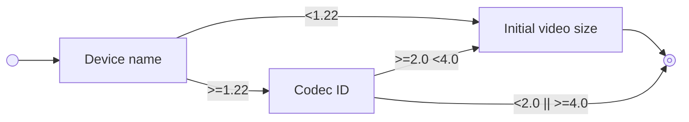
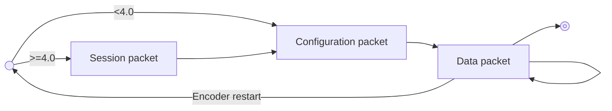

---
---

import Version from "../version-span";

# Handle video stream

The video socket from Scrcpy server contains the encoded video frames. Tango provides two levels of APIs:

- **High-level** (via `@yume-chan/adb-scrcpy`): Parses the stream automatically and integrates with the client lifecycle. You get the parsed metadata, a stream of typed packets, and automatic video size tracking. Start here if you're unsure which to use.
- **Low-level** (via `@yume-chan/scrcpy`): Parse the raw byte stream directly with full control over the packet format. Useful when you already have a `ReadableStream<Uint8Array>` and want to parse it yourself.

## High-level usage

### With `@yume-chan/adb-scrcpy`

<Version since="v2.1">When the [`video`](../options/v2.1/video.mdx) option is not `false`, </Version>`AdbScrcpyClient.videoStream` is a `Promise` that resolves to an `AdbScrcpyVideoStream`:

```ts
import type { Event } from "@yume-chan/event";

// import type { ScrcpyVideoSizeChangedEvent } from "@yume-chan/scrcpy";
interface ScrcpyVideoSizeChangedEvent {
  width: number;
  height: number;
  isClientResize?: boolean | undefined;
}

interface AdbScrcpyVideoStream {
  readonly metadata: ScrcpyVideoStreamMetadata;
  readonly stream: ReadableStream<ScrcpyVideoStreamPacket>;
  readonly width: number;
  readonly height: number;
  readonly sizeChanged: Event<ScrcpyVideoSizeChangedEvent>;
}
```

#### Metadata

```ts
// import type { ScrcpyVideoStreamMetadata } from "@yume-chan/scrcpy";
interface ScrcpyVideoStreamMetadata {
  deviceName?: string | undefined;
  width?: number | undefined;
  height?: number | undefined;
  codec: ScrcpyVideoCodecId;
}
```

**When is each field available?**

- `deviceName`: Always present<Version until="v1.22"> (no option to disable)</Version><Version since="v1.22">, unless [`sendDeviceMeta`](../options/v1.22/send-device-meta.mdx) is `false`</Version>.
- `width` and `height`: The initial video resolution. <Version until="v1.22">Always present (no option to disable)</Version><Version since="v1.22" until="v1.25">Present unless [`sendDeviceMeta`](../options/v1.22/send-device-meta.mdx) is `false`</Version><Version since="v2.0" until="v3.3.4">Present unless [`sendCodecMeta`](../options/v2.0/send-codec-meta.mdx) is `false`</Version><Version since="v4.0">Not included in metadata — sent as a [session packet](#session-packet) instead</Version>.
- `codec`: Always available — Tango determines it from the stream or falls back to the <Version until="v1.25">default `ScrcpyVideoCodecId.H264`</Version><Version since="v2.0">`videoCodec` option value</Version>.

See the [Low-level metadata format table](#format) for the exact byte layout of each element.

**Why is there both a static `metadata` and a live `stream`?**

The metadata is only sent once at connection start. `AdbScrcpyVideoStream` stores it as a static snapshot — the `width` and `height` in `metadata` reflect only the initial video size. When the screen rotates or the encoder restarts, the new size arrives as [stream packets](#stream-packets), not as updated metadata. That's why `AdbScrcpyVideoStream` has separate `metadata` (static, initial values) and `stream` (continuous, dynamic) properties. See [Video size](#video-size) for how the live size is tracked.

```ts transpile
import type { AdbScrcpyClient } from "@yume-chan/adb-scrcpy";

declare const client: AdbScrcpyClient;

if (client.videoStream) {
  const videoStream = await client.videoStream;
  const { deviceName, width, height, codec } = videoStream.metadata;
  console.log(deviceName, width, height, codec);
}
```

#### Stream

`AdbScrcpyVideoStream.stream` is a [`ReadableStream<ScrcpyVideoStreamPacket>`](#packet-types) produced by parsing the video socket with `createMediaStreamTransformer`. See [Low-level stream packets](#stream-packets) for details on packet types and format.

```ts transpile
import type { ScrcpyVideoStreamPacket } from "@yume-chan/scrcpy";
import type { AdbScrcpyClient } from "@yume-chan/adb-scrcpy";

declare const client: AdbScrcpyClient;

if (client.videoStream) {
  const videoStream = await client.videoStream;

  videoStream.stream
    .pipeTo(
      new WritableStream({
        write(packet: ScrcpyVideoStreamPacket) {
          switch (packet.type) {
            case "session":
              console.log(packet.width, packet.height);
              break;
            case "configuration":
              console.log(packet.data);
              break;
            case "data":
              console.log(packet.keyframe, packet.pts, packet.data);
              break;
          }
        },
      }),
    )
    .catch((e) => {
      console.error(e);
    });
}
```

:::tip[How to handle each packet type]

- **Session** (`type: "session"`): Informs about video size changes. If you're using `AdbScrcpyVideoStream`'s `width` and `height` properties (see [Video size](#video-size)), you can ignore these packets — the class tracks them internally.
- **Configuration** (`type: "configuration"`): Codec initialization data (e.g., SPS/PPS for H.264). A video decoder needs this before it can decode data packets. The [built-in decoders](#decode-and-render-in-browsers) handle this automatically — just pipe the whole stream into them.
- **Data** (`type: "data"`): One encoded video frame. Send these to a video decoder for rendering, or write them to a file for [recording](./record.mdx).

:::

:::danger

Don't `await` the `Promise` returned by `pipeTo`. The `pipeTo` promise only resolves when the source stream ends (the scrcpy server disconnects). Awaiting it before consuming other required streams (e.g., audio or clipboard) blocks those streams from being consumed, causing a deadlock — the server waits for all streams to be read, but your code is stuck waiting for one to end.

Similar to [`options.clipboard`](../start-server.mdx#clipboard-stream), you should store the returned promise in a variable and handle it asynchronously (e.g., using `.catch()` for errors) rather than awaiting it.

:::

#### Video size

<Version since="v4.0">When session packets are enabled, `AdbScrcpyVideoStream` will track the up-to-date video size by inspecting the session packets. Otherwise,</Version> it parses the video stream to extract the video size.

The `width` and `height` properties are the current video size, and the `sizeChanged` event is fired when the video size changes. <Version since="v4.0">The `isClientResize` property indicates whether the resize was initiated by the client using [`resizeDisplay`](../control/resize-display.mdx) control message.</Version>

```ts transpile
import type { AdbScrcpyClient } from "@yume-chan/adb-scrcpy";

declare const client: AdbScrcpyClient;

if (client.videoStream) {
  const videoStream = await client.videoStream;
  console.log(videoStream.width, videoStream.height);

  const dispose = videoStream.sizeChanged(({ width, height, isClientResize }) => {
    console.log(width, height, isClientResize);
  });

  setTimeout(dispose, 1000);
}
```

### Decode and render in browsers

We provide two packages to decode and render the video stream in Web browsers:

- [H264BSD decoder](./tiny-h264.mdx)
- [WebCodecs decoder](./webcodecs/index.mdx)

Both decoders implement the common [`ScrcpyVideoDecoder` interface](./decoder/index.mdx) for piping video streams, handling size changes, pausing, and monitoring rendering metrics.

To use them, the `sendFrameMeta` option must be `true` (the default value) to enable [configuration packets](#configuration-packet).

### Decode and render outside browsers

Decoding and playing video outside the browser is out of this library's scope. It will depend on the runtime environment, UI framework, and media library you use.

However, we have an example of using `ffplay` (from ffmpeg) to play the video stream (without audio) at https://github.com/tango-adb/scrcpy-ffplay.

## Low-level usage

If you already have a `ReadableStream<Uint8Array>` that reads from the video socket, `@yume-chan/scrcpy` provides methods to parse it.

### Metadata

Metadata is sent at the start of the video stream. The availability of each field depends on the Scrcpy server version and the specified option values.

#### Format


```mermaid
flowchart LR
    Start@{ shape: sm-circ, label: "Start" } --> DN[Device name]

    DN -- <1.22 --> VS[Initial video size]
    DN -- >=1.22 --> CI[Codec ID]

    CI -- >=2.0 <4.0 --> VS --> Stop@{ shape: framed-circle, label: "stop" }
    CI -- <2.0 || >=4.0 --> Stop
```

| Element | Size | Type | Description | Related Option |
| ------ | ---- | ---- | ----------- | ------ |
| Device name | 64 bytes | Null-terminated string | The device's model name | <Version since="v1.22">[`sendDeviceMeta`](../options/v1.22/send-device-meta.mdx)</Version> |
| Codec ID | 4 bytes | Enum | The codec ID | <Version since="v2.0" until="v3.3.4">[`sendCodecMeta`](../options/v2.0/send-codec-meta.mdx)</Version><br/><Version since="v4.0">[`sendStreamMeta`](../options/v4.0/send-stream-meta.mdx)</Version> |
| Initial video size | 4 bytes | 2 bytes width<br/>2 bytes height | Width and height of the video | <Version since="v1.22" until="v1.25">[`sendDeviceMeta`](../options/v1.22/send-device-meta.mdx)</Version><br/><Version since="v2.0">[`sendCodecMeta`](../options/v2.0/send-codec-meta.mdx)</Version> |

#### Size changes

The metadata is only sent once.

<Version until="v3.3.4">When device screen size changes (for example, when device orientation changes, or a foldable device unfolds), the server restarts the video encoder, but does NOT send another metadata with the new size. To track video resolution, parsing the video stream is required. [Built-in video decoders](#decode-and-render-in-browsers) have a `sizeChanged` event, and `AdbScrcpyClient` also contains [size information](#video-size).</Version>

<br/><br/>

<Version since="v4.0">When encoder restarts on screen size changes, the server sends a [session packet](#session-packet) with the new size. Consumers can inspect the packet to get the new video size. The `sizeChanged` event on video decoders and `AdbScrcpyClient.videoStream` will also be updated accordingly.</Version>

#### Parsing metadata

`ScrcpyOptionsX_YY.prototype.parseVideoStreamMetadata` parses the metadata from a raw video stream:

```ts transpile
import { ScrcpyOptions2_1 } from "@yume-chan/scrcpy";

const options = new ScrcpyOptions2_1({
  // use the same version and options when starting the server
});

const videoSocket: ReadableStream<Uint8Array>; // get the stream yourself

const { metadata: videoMetadata, stream: videoStream } =
  await options.parseVideoStreamMetadata(videoSocket);
```

The method returns the parsed metadata, and the remaining stream after the metadata, so you can continue reading the video stream.

### Stream packets

Various packets are sent after the metadata. The packet format depends on the Scrcpy server version and the specified option values.

#### Format


```mermaid
flowchart LR
    Start@{ shape: sm-circ, label: "Start" } -- >=4.0 --> SP[Session packet]
    Start -- <4.0 --> CP[Configuration packet]

    SP --> CP --> DP[Data packet]

    DP --> DP
    DP -- Encoder restart --> Start
    DP --> Stop@{ shape: framed-circle, label: "stop" }
```

| Element | Size | Description | Related Option |
| ------- | ---- | ----------- | -------------- |
| Session packet | 12 bytes | Resize reason and new video size | <Version since="v4.0">[`sendStreamMeta`](../options/v4.0/send-stream-meta.mdx)</Version> |
| Configuration packet | 8 bytes header<br/>Variable data | Codec-specific configuration data | [`sendFrameMeta`](../options/v1.15/send-frame-meta.mdx) |
| Data packet | 8 bytes header<br/>Variable data | Encoded video frame, with keyframe flag and presentation timestamp | [`sendFrameMeta`](../options/v1.15/send-frame-meta.mdx) |

#### Packet types

Tango parses them into different packet types:

```ts
interface ScrcpyMediaStreamConfigurationPacket {
  type: "configuration";
  data: Uint8Array;
}

interface ScrcpyMediaStreamDataPacket {
  type: "data";
  keyframe?: boolean;
  pts?: bigint;
  data: Uint8Array;
}

interface ScrcpyVideoStreamSessionPacket {
  type: "session";
  isClientResize: boolean;
  width: number;
  height: number;
}

type ScrcpyAudioStreamPacket =
  ScrcpyMediaStreamConfigurationPacket | ScrcpyMediaStreamDataPacket;

type ScrcpyVideoStreamPacket =
  ScrcpyAudioStreamPacket | ScrcpyVideoStreamSessionPacket;
```

#### Session packet

A session packet is sent after the metadata, and when the video encoder restarts (due to screen rotation, [`resetVideo`](../control/reset-video.mdx) control message, or [`resizeDisplay`](../control/resize-display.mdx) control message with [`flexDisplay`](../options/v4.0/flex-display.mdx) option).

```ts
interface ScrcpyVideoStreamSessionPacket {
  type: "session";
  isClientResize: boolean;
  width: number;
  height: number;
}
```

- `isClientResize`: Whether the resize was initiated by the client using [`resizeDisplay`](../control/resize-display.mdx) control message.
- `width`/`height`: The new video size.

#### Configuration packet

If the chosen video codec has configuration data, a configuration packet will be sent before the first encoded video frame, and each time the encoder restarts.

The format of configuration packets depends on the codec. More information can be found at https://developer.android.com/reference/android/media/MediaCodec#CSD

**H.264 and H.265:** For H.26x codecs, the configuration packets include:
- H.264: Sequence Parameter Set (SPS) and Picture Parameter Set (PPS), in [Annex B format](./record.mdx#avcchevc-vs-annex-b-for-h264h265-codecs).
- H.265: Video Parameter Set (VPS), Sequence Parameter Set (SPS), and Picture Parameter Set (PPS), in [Annex B format](./record.mdx#avcchevc-vs-annex-b-for-h264h265-codecs).

These are essential for proper decoding, so they will still be sent through the video stream even when configuration packets are disabled. Enabling configuration packets only adds a mark to them, so the client can more easily find and handle them.

When a client receives a configuration packet, it should create a new video decoder with the data.

:::info

The two [built-in decoders](#decode-and-render-in-browsers) handle configuration packets and re-create video decoders for you.

You only need to pipe the whole video stream into them.

:::

**AV1:** The configuration packet contains the first 3 bytes of `AV1CodecConfigurationRecord` (https://aomediacodec.github.io/av1-isobmff/#av1codecconfigurationbox). The remaining configuration OBUs are in the next data packet.

These 3 bytes are required when [saving the stream to video files](./record.mdx), although they can also be inferred from the configuration OBUs.

**VP8:** VP8 does not have configuration data, so no configuration packet will be sent.

**VP9:** A VP9 CodecPrivate Data.

#### Data packet

Each data packet represents exactly one encoded frame, with extra information when the related options are enabled:

- `keyframe`: `true` if the current packet is a keyframe. Many decoders can decode the video stream without knowing if each frame is a keyframe, but some decoders require this information.
- `pts`: Presentation timestamp in nanoseconds. When rendering the video in real-time, generally you want to present the decoded frames as they arrive to minimize latency, but this information can be used to remove processing time deviations when [recording](./record.mdx).
- `data`: Contains exactly one encoded frame. For H.264 and H.265, in [Annex B format](./record.mdx#avcchevc-vs-annex-b-for-h264h265-codecs).

#### Parsing packets

`ScrcpyOptionsX_YY.prototype.createMediaStreamTransformer` creates a `TransformStream` that parses the video stream into packets.

`parseVideoStreamMetadata` and `createMediaStreamTransformer` are separate methods, because `createMediaStreamTransformer` is also used to parse the audio stream.

```ts transpile
import type { ScrcpyVideoStreamPacket } from "@yume-chan/scrcpy";

declare const options: ScrcpyOptions2_1;
declare const videoStream: ReadableStream<Uint8Array>;

const videoPacketStream: ReadableStream<ScrcpyVideoStreamPacket> =
  videoStream.pipeThrough(options.createMediaStreamTransformer());

videoPacketStream
  .pipeTo(
    new WritableStream({
      write(packet: ScrcpyVideoStreamPacket) {
        switch (packet.type) {
          case "session":
            console.log(packet.width, packet.height);
            break;
          case "configuration":
            console.log(packet.data);
            break;
          case "data":
            console.log(packet.keyframe, packet.pts, packet.data);
            break;
        }
      },
    }),
  )
  .catch((e) => {
    console.error(e);
  });
```

### Raw mode

As the [metadata format table](#format) shows, since v1.22, if `sendDeviceMeta` and `sendFrameMeta` options are `false`<Version since="v2.0" until="v3.3.4">, and `sendCodecMeta` option is also `false`</Version><Version since="v4.0">, and `sendStreamMeta` option is also `false`</Version>, all elements will be disabled.

This is also called raw mode. In this mode, the video socket only contains codec-specific, encoded video data.

Raw mode is more difficult to process because it requires the client to parse the codec-specific format directly.

Tango has partial support for raw mode: all omitted fields will be `undefined`, and built-in video decoders don't work with raw video streams.

Advanced decoders, like ffmpeg, can decode raw video streams. If you only need to pipe the video stream to ffmpeg, raw mode can save some bandwidth and processing time.

When data packet headers are not present, the `keyframe` and `pts` fields will be `undefined`. The `data` field contains the bytes from one `read` call; since there are no packet boundaries, it might contain partial or multiple frames.
