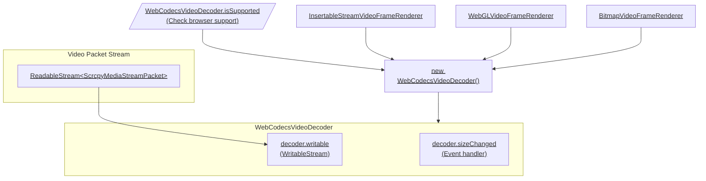

# Decoder

import CanIUse from "../../../can-i-use";

Decodes and renders H.264, H.265 and AV1 streams in Web browsers using [WebCodecs API](https://developer.mozilla.org/en-US/docs/Web/API/WebCodecs_API), the new Web standard for hardware-accelerated video encoding and decoding.

It's fast, uses less hardware resources, and supports more profiles and levels.

```sh npm2yarn
npm install @yume-chan/scrcpy-decoder-webcodecs
```

## Overview

The WebCodecs decoder is more powerful and flexible than TinyH264 decoder, but also slightly more difficult to use. Here's a flowchart showing the overall steps to create and use WebCodecs decoders:



:::note

Click underlined nodes to open their relevant documentations.

:::

## Browser support

<CanIUse feature="webcodecs" />

:::info[Secure Context Required]

WebCodecs API requires a [Secure Context](https://developer.mozilla.org/en-US/docs/Web/Security/Secure_Contexts). Basically it means the page must be served over HTTPS or `localhost`.

- If you have a domain name, you can easily get a free SSL certificate from [Let's Encrypt](https://letsencrypt.org/).
- If you only have an IP address, you can create a self-signed certificate and trust it in every device that will access your server (or ignore the warning every time).
- For Chromium-based browser, you can also add your origin to `chrome://flags/#unsafely-treat-insecure-origin-as-secure`.

:::

Because WebCodecs API is still relatively new, you should check if it is supported before using it.

`WebCodecsVideoDecoder.isSupported` property returns whether the browser supports basic WebCodecs API:

```ts
export declare class WebCodecsVideoDecoder {
  static get isSupported(): boolean;
}
```

```ts transpile
import { WebCodecsVideoDecoder } from "@yume-chan/scrcpy-decoder-webcodecs";

console.log(WebCodecsVideoDecoder.isSupported);
```

Internally, it checks whether `VideoDecoder` is defined on the global object.

```ts transpile
class WebCodecsVideoDecoder {
  static get isSupported() {
    return typeof globalThis.VideoDecoder !== "undefined";
  }
}
```

If WebCodecs API is not supported, you can fallback to the [TinyH264 decoder](../tiny-h264.mdx), but be aware only H.264 main profile level 4 is supported, and the performance is much worse.

## Codec support

Scrcpy v2.0 added the [`videoCodec`](../../options/v2.0/video-codec.mdx) option, to specify the video codec to use by the server. H.265 and AV1 codecs can provide better video quality at the same bitrate compared to H.264.

WebCodecs spec supports H.264, H.265 and AV1, but runtime support requires a joint effort from browsers, operating systems, graphics cards and drivers. H.264 should be supported by all browsers that support WebCodecs API, but support for other newer codecs may vary.

[`VideoDecoder.isConfigSupported`](https://developer.mozilla.org/en-US/docs/Web/API/VideoDecoder/isConfigSupported_static) static method can be used to check if a given codec is supported. It takes a codec parameter string, for example `"hev1.1.60.L153.B0.0.0.0.0.0"` for H.265 and `"av01.0.05M.08"` for AV1.

```ts transpile
const result = await VideoDecoder.isConfigSupported({
  codec: "hev1.1.60.L153.B0.0.0.0.0.0",
});
const isHevcSupported = result.supported === true;
```

### Microsoft Edge on Windows

By default, Chromium browsers uses FFMpeg internally for WebCodecs API. However, Microsoft Edge, when running on Windows, uses Media Foundation decoders instead.

Decoding H.265 requires the [**HEVC Video Extensions**](https://www.microsoft.com/store/productId/9NMZLZ57R3T7) ($0.99) or **HEVC Video Extensions from Device Manufacturer** (free but not available anymore) app from Microsoft Store.

Decoding AV1 requires the [**AV1 Video Extension**](https://www.microsoft.com/store/productId/9MVZQVXJBQ9V) (free) app from Microsoft Store.

### Firefox

Firefox 133 supports playing H.265 videos, but does not support decoding H.265 streams using WebCodecs API yet.

### Stream format

For H.264 and H.265, WebCodecs's `VideoDecoder` supports both [Annex B and AVC formats](../record.mdx#h264), through [different parameters](https://www.w3.org/TR/webcodecs-avc-codec-registration).

Scrcpy server produces an Annex B formatted stream, and `WebCodecsVideoDecoder` will feed it directly into `VideoDecoder`. There is no need to convert the stream to AVC format, except for [muxing it into a video file](../record.mdx).
