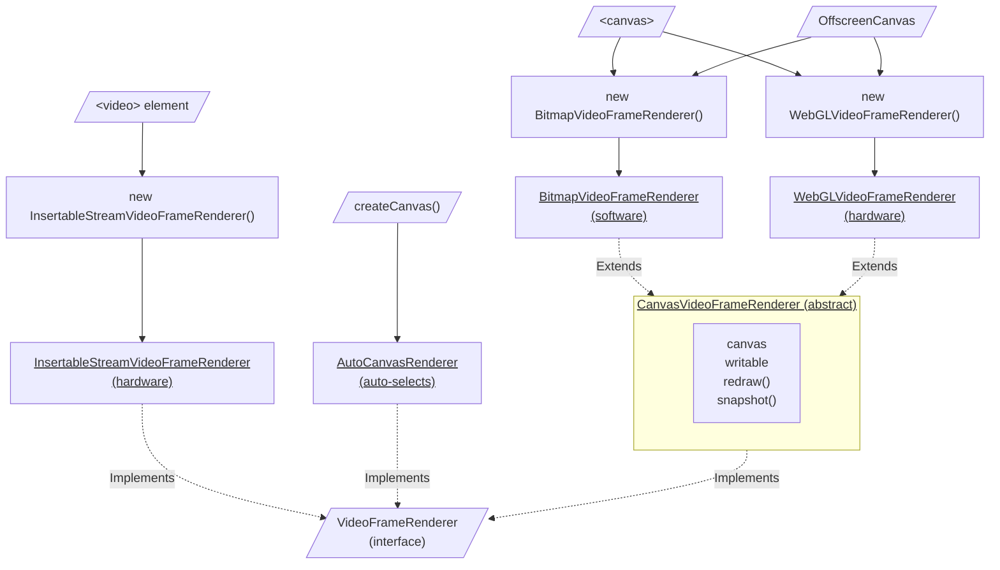
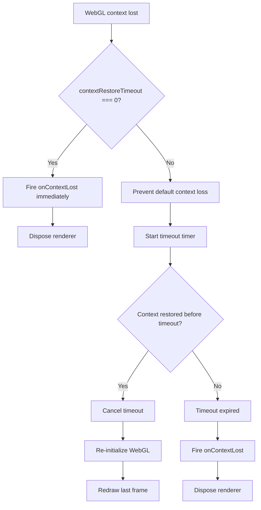
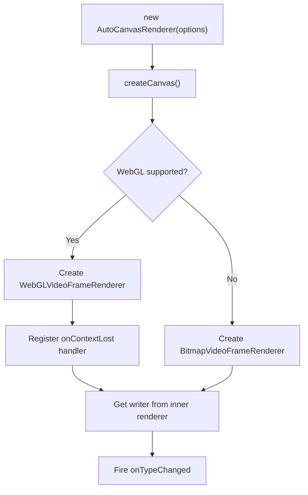
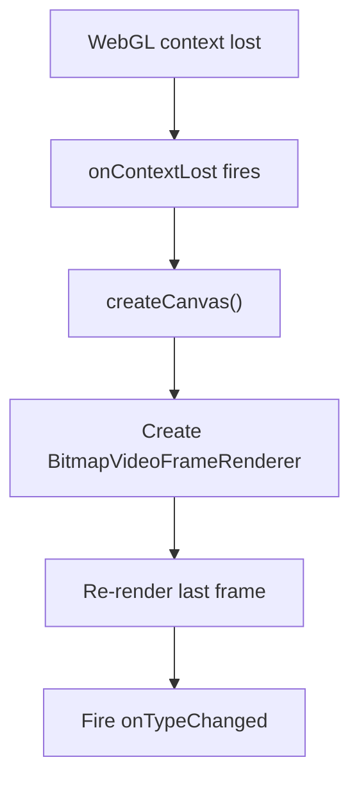

# Renderers

WebCodecs API decodes video frames into `VideoFrame` objects. There are multiple methods to render those `VideoFrame` objects onto the page. This package provides four concrete `VideoFrameRenderer` implementations plus one abstract base class:

## Overview

:::info

These renderers are not tied to our `WebCodecsVideoDecoder`, they can also be used separately to render any `VideoFrame` objects from WebCodecs API.

:::



:::note

Click underlined nodes to jump to their documentation sections below.

:::

- `InsertableStreamVideoFrameRenderer`: Renders to a `<video>` element using [Insertable Streams API](https://developer.mozilla.org/en-US/docs/Web/API/Insertable_Streams_for_MediaStreamTrack_API).
- `CanvasVideoFrameRenderer`: Abstract base class for canvas-based renderers that handles common functionality like canvas resizing, display size updates using ResizeObserver, frame redrawing, and snapshots. It supports three canvas sizing modes: `"video"` (matches video resolution), `"display"` (matches display size), and `"external"` (uses existing canvas size). (Abstract base class)
    - `WebGLVideoFrameRenderer`: Renders to a `<canvas>` or `OffscreenCanvas` using WebGL. It only works with hardware accelerated WebGL, because without hardware acceleration, the performance is even worse than the bitmap renderer below.
    - `BitmapVideoFrameRenderer`: Renders to a `<canvas>` or `OffscreenCanvas` using bitmap renderer.
- `AutoCanvasRenderer`: Convenience class that automatically selects the best available canvas-based renderer based on hardware support (WebGL if available, otherwise Bitmap). It handles WebGL context loss by automatically falling back to `BitmapVideoFrameRenderer`.

:::info

`VideoFrame`s can also be rendered using 2D canvas. However, because it's slower than bitmap renderer, and bitmap renderer is already available on all devices, we didn't think it's necessary to implement it.

:::

## VideoFrameRenderer

`VideoFrameRenderer` is the base interface that all video frame renderers implement. It defines the contract for receiving and rendering `VideoFrame` objects, along with optional methods for capturing snapshots and disposing of resources.

### Definition

```ts
export interface VideoFrameRenderer {
    readonly type: ScrcpyVideoDecoder.RendererType;
    readonly onTypeChanged?: Event<ScrcpyVideoDecoder.RendererType>;

    readonly writable: WritableStream<VideoFrame>;

    snapshot?(options?: ImageEncodeOptions): Promise<Blob | undefined>;

    dispose?(): MaybePromiseLike<undefined>;
}
```

### Characteristics

- `type`: Indicates the rendering method - `"software"` for software-based rendering (CPU intensive) or `"hardware"` for hardware-accelerated rendering (GPU assisted)
- `onTypeChanged?`: Optional event that fires when the rendering type changes (e.g., when `AutoCanvasRenderer` falls back from hardware to software due to context loss)
- `writable`: A `WritableStream<VideoFrame>` that accepts video frames for rendering
- `snapshot?`: Optional method to capture a snapshot of the current frame as a Blob (supported by canvas-based renderers)
- `dispose?`: Optional method to clean up resources when the renderer is no longer needed

### `onTypeChanged` event

The `onTypeChanged` event is defined on the `VideoFrameRenderer` interface, but it is only implemented by renderers whose type can change at runtime. Currently, only `AutoCanvasRenderer` implements this event, because it is the only renderer that can switch between hardware and software rendering (e.g., when WebGL context is lost and cannot be restored).

Renderers with a fixed type (`BitmapVideoFrameRenderer`, `WebGLVideoFrameRenderer`, `InsertableStreamVideoFrameRenderer`) do not fire this event.

```ts
import type { VideoFrameRenderer } from "@yume-chan/scrcpy-decoder-webcodecs";

declare const renderer: VideoFrameRenderer;

// `onTypeChanged` is optional on the interface
if (renderer.onTypeChanged) {
    renderer.onTypeChanged((type) => {
        console.log(`Renderer type changed to: ${type}`);
        // For AutoCanvasRenderer, the canvas element might have changed
        // when the renderer switches between WebGL and Bitmap
        if (renderer.canvas instanceof HTMLCanvasElement) {
            document.body.appendChild(renderer.canvas);
        }
    });
}
```

## CanvasVideoFrameRenderer

The `CanvasVideoFrameRenderer` is an abstract base class that provides common functionality for canvas-based video frame renderers.

#### Definition

```ts
export abstract class CanvasVideoFrameRenderer<
    TOptions extends CanvasVideoFrameRenderer.Options = CanvasVideoFrameRenderer.Options,
> implements VideoFrameRenderer {
    abstract get type(): ScrcpyVideoDecoder.RendererType;

    /**
     * The canvas element used for rendering.
     *
     * When running in the main thread, this will be a HTMLCanvasElement.
     * When running in a Worker context (like Web Workers), this will be an OffscreenCanvas.
     */
    get canvas(): HTMLCanvasElement | OffscreenCanvas;
    get options(): Readonly<TOptions> | undefined;
    get lastFrame(): VideoFrame | undefined;
    get writable(): WritableStream<VideoFrame>;

    constructor(
        draw: (frame: VideoFrame) => MaybePromiseLike<undefined>,
        options?: TOptions,
    );

    redraw(): Promise<void>;
    snapshot(options?: ImageEncodeOptions): Promise<Blob | undefined>;
    dispose(): undefined;
}

 export namespace CanvasVideoFrameRenderer {
     export interface Options {
         canvas?: HTMLCanvasElement | OffscreenCanvas;

         /**
          * Whether to update the canvas size (rendering resolution) automatically.
          *
          * * `"video"` (default): update the canvas size to match the video resolution
          * * `"display"` (only for `HTMLCanvasElement`):
          *    update the canvas size to match the display size.
          *    The display size can be set using `canvas.style.width/height`,
          *    and must be in correct aspect ratio.
          * * `"external"`: use the canvas size as it is.
          *    The size must be manually set using `canvas.width/height`,
          *    and must be in correct aspect ratio.
          */
         canvasSize?: "video" | "display" | "external";
     }
 }
 ```

### `canvasSize` option

The `canvasSize` option in `CanvasVideoFrameRenderer` controls how the canvas dimensions are managed and significantly affects performance and visual quality:

#### `"video"` (Default)

This is the naive approach where the canvas intrinsic size always equals the video resolution. This means the renderer always draws every pixel of the video frame, even if the canvas's CSS size is smaller than the video resolution. The browser then scales the entire canvas down, which is inefficient and can lead to visual artifacts.

#### `"display"`

Uses a `ResizeObserver` to react to the canvas CSS size and only draws the same amount of physical pixels that the canvas occupies on the display. This approach saves drawing time by avoiding rendering of pixels that would be scaled down anyway, and avoids browser scaling artifacts by matching the canvas intrinsic size to its display size. **Note:** This option only works in the main thread with `HTMLCanvasElement`, not with `OffscreenCanvas` in Web Workers.

#### `"external"`

Gives the user full control of the canvas size. This allows for custom scaling behaviors or fixed resolutions independent of video or display dimensions.

#### Recommendation

The `"display"` option is generally the best choice when running in the main thread with an HTML canvas, because it optimizes performance by rendering only the pixels needed for the current display size, while avoiding browser scaling artifacts. However, since it doesn't work with `OffscreenCanvas` in Web Workers, `"video"` remains the default for broader compatibility.

 ### BitmapVideoFrameRenderer

`BitmapVideoFrameRenderer` is a concrete implementation of `CanvasVideoFrameRenderer` that uses the ImageBitmap rendering context for software-based rendering. It creates an `ImageBitmap` from each incoming `VideoFrame` and transfers it to the canvas using `transferFromImageBitmap`.

#### Definition
```ts
export class BitmapVideoFrameRenderer extends CanvasVideoFrameRenderer {
    override get type(): "software";
    constructor(options?: CanvasVideoFrameRenderer.Options);
}

```

#### Characteristics

- Type: `"software"` (indicates software-based rendering)
- Uses `ImageBitmapRenderingContext` for rendering
- More CPU-intensive but widely supported across browsers
- Better performance than 2D canvas rendering

#### Example
```ts
// 1. Create canvas automatically
const bitmapRenderer1 = new BitmapVideoFrameRenderer();
// Access the automatically created canvas
// In main thread: canvas is HTMLCanvasElement, can be added to DOM
// In worker: canvas is OffscreenCanvas, use transferToImageBitmap to send frames to main thread
if (bitmapRenderer1.canvas instanceof HTMLCanvasElement) {
    // Main thread context
    document.body.appendChild(bitmapRenderer1.canvas);
} else {
    // Worker context - use transferToImageBitmap to send frames to main thread
    // See "Web Workers" for detailed example
}

// 2. Use an external HTML canvas element
const canvasElement = document.getElementById('myCanvas');
const bitmapRenderer2 = new BitmapVideoFrameRenderer({ canvas: canvasElement });

// 3. Use an external OffscreenCanvas
const offscreenCanvas = new OffscreenCanvas(1920, 1080);
const bitmapRenderer3 = new BitmapVideoFrameRenderer({ canvas: offscreenCanvas });

```

### WebGLVideoFrameRenderer

`WebGLVideoFrameRenderer` is a hardware-accelerated implementation that uses WebGL shaders for rendering video frames. It provides superior performance on supported devices but requires hardware acceleration.

#### Definition
```ts
export class WebGLVideoFrameRenderer extends CanvasVideoFrameRenderer<WebGLVideoFrameRenderer.Options> {
    static get isSupported(): boolean;
    override get type(): "hardware";
    get onContextLost(): Event<void>;
    constructor(options?: WebGLVideoFrameRenderer.Options);
    snapshot(options?: ImageEncodeOptions): Promise<Blob | undefined>;
    dispose(): undefined;
}

export namespace WebGLVideoFrameRenderer {
    export interface Options extends CanvasVideoFrameRenderer.Options {
        /**
         * Whether to allow capturing the canvas content using APIs
         * like `readPixels` and `toDataURL`.
         *
         * Enabling this option may reduce performance.
         */
        enableCapture?: boolean;

        /**
         * The timeout in milliseconds to wait for context restoration
         * before firing `onContextLost`.
         *
         * When set to 0, also disables automatic context restoration,
         * `onContextLost` will be fired immediately when the context is lost.
         *
         * Default is 3000.
         */
        contextRestoreTimeout?: number;
    }
}

```

#### Characteristics

- Type: `"hardware"` (indicates hardware-accelerated rendering)
- Requires hardware support for WebGL (returns `false` for `isSupported` if not available)
- Uses custom vertex and fragment shaders for rendering
- Implements bicubic filtering for better image quality when scaling
- Supports optional canvas capture with the `enableCapture` option (may reduce performance)
- Handles WebGL context loss and restoration automatically
- Fires `onContextLost` when the context cannot be restored within the timeout period (default: 3000ms)
- The `contextRestoreTimeout` option controls how long to wait for context restoration before giving up (set to `0` to fire `onContextLost` immediately)

#### Context loss handling


When the WebGL context is lost, the renderer first checks if `contextRestoreTimeout` is set to `0`. If so, it fires `onContextLost` immediately and disposes itself, giving the caller full control over recovery.

Otherwise, it prevents the browser's default context loss behavior and starts a timer. If the context is restored before the timer expires, the renderer re-initializes its WebGL state and redraws the last frame automatically. If the timeout expires without restoration, `onContextLost` is fired and the renderer is disposed.

#### Example
```ts
// 1. Check compatibility before creating renderer
if (WebGLVideoFrameRenderer.isSupported) {
    const webglRenderer1 = new WebGLVideoFrameRenderer();
    // Access the automatically created canvas
    // In main thread: canvas is HTMLCanvasElement, can be added to DOM
    // In worker: canvas is OffscreenCanvas, use transferToImageBitmap to send frames to main thread
    if (webglRenderer1.canvas instanceof HTMLCanvasElement) {
        // Main thread context
        document.body.appendChild(webglRenderer1.canvas);
    } else {
        // Worker context - use transferToImageBitmap to send frames to main thread
        // See "Web Workers" for detailed example
    }
} else {
    console.warn("WebGL is not supported, consider using BitmapVideoFrameRenderer instead");
}

// 2. Use an external HTML canvas element with capture enabled
const canvasElement = document.getElementById('myCanvas');
if (WebGLVideoFrameRenderer.isSupported) {
    const webglRenderer2 = new WebGLVideoFrameRenderer({
        canvas: canvasElement,
        enableCapture: true
    });
} else {
    console.warn("WebGL is not supported, consider using BitmapVideoFrameRenderer instead");
}

// 3. Use an external OffscreenCanvas
const offscreenCanvas = new OffscreenCanvas(1920, 1080);
if (WebGLVideoFrameRenderer.isSupported) {
    const webglRenderer3 = new WebGLVideoFrameRenderer({ canvas: offscreenCanvas });
} else {
    console.warn("WebGL is not supported, consider using BitmapVideoFrameRenderer instead");
}

```

## AutoCanvasRenderer

`AutoCanvasRenderer` is a convenience class that automatically selects the best available canvas-based renderer based on hardware support. It will use `WebGLVideoFrameRenderer` if WebGL hardware acceleration is available, otherwise it falls back to `BitmapVideoFrameRenderer`. When WebGL context is lost and cannot be restored, it automatically falls back to `BitmapVideoFrameRenderer` and re-renders the last frame.

#### Definition
```ts
export class AutoCanvasRenderer implements VideoFrameRenderer {
    get type(): ScrcpyVideoDecoder.RendererType;
    get onTypeChanged(): Event<ScrcpyVideoDecoder.RendererType>;
    get canvas(): HTMLCanvasElement | OffscreenCanvas;
    get writable(): WritableStream<VideoFrame>;

    constructor(options?: AutoCanvasRenderer.Options);

    snapshot(options?: ImageEncodeOptions): Promise<Blob | undefined>;
    dispose(): undefined;
}

export namespace AutoCanvasRenderer {
    export interface Options extends Omit<
        WebGLVideoFrameRenderer.Options,
        "canvas"
    > {
        createCanvas?: () => HTMLCanvasElement | OffscreenCanvas;
    }
}

```

#### Characteristics

- Automatically detects hardware support and chooses the optimal renderer
- Uses hardware-accelerated `WebGLVideoFrameRenderer` when available
- Falls back to software-based `BitmapVideoFrameRenderer` when WebGL is not supported
- Automatically falls back from WebGL to Bitmap when WebGL context is lost and cannot be restored within the timeout period
- Fires `onTypeChanged` when the renderer type changes (e.g., fallback from hardware to software)
- The `canvas` property might change when the renderer switches between WebGL and Bitmap. Specify a `createCanvas` option, or listen to the `onTypeChanged` event to handle the canvas change
- Inherits all options from `WebGLVideoFrameRenderer` (except `canvas`, which is managed internally)

#### How it works

##### Initialization


On construction, `AutoCanvasRenderer` creates a canvas using the `createCanvas` factory (or a default one), then checks if `WebGLVideoFrameRenderer.isSupported` is `true`. If so, it creates a `WebGLVideoFrameRenderer` with that canvas and registers a `onContextLost` handler. Otherwise, it creates a `BitmapVideoFrameRenderer` directly.

##### Context loss fallback


When WebGL context is lost and cannot be restored (see [Context loss handling](#context-loss-handling)), the `onContextLost` handler creates a new `BitmapVideoFrameRenderer` with a fresh canvas and re-renders the last frame on it.

#### Example
```ts
// 1. Basic usage - creates the best available renderer automatically
const autoRenderer = new AutoCanvasRenderer();

// Check which renderer is being used
console.log(`Renderer type: ${autoRenderer.type}`); // "hardware" or "software"

// Listen for renderer type changes (e.g., when WebGL context is lost)
// The event will also fire when a new event listener is added, to notify the current renderer type
autoRenderer.onTypeChanged((type) => {
    console.log(`Renderer type changed to: ${type}`);
    // The canvas might have changed, re-append it to the DOM
    document.body.appendChild(autoRenderer.canvas);
});

```

### `createCanvas` option

The `createCanvas` option in `AutoCanvasRenderer.Options` allows specifying a custom factory function for creating the canvas element. If not provided, a default canvas is created using `createCanvas()` from `@yume-chan/scrcpy-decoder-shared`.

The factory function **must create and return a new `<canvas>` element each time it is called**. This is because `AutoCanvasRenderer` calls the factory each time it creates or replaces the inner renderer - both on initial construction and when falling back from WebGL to Bitmap after context loss. A different rendering context (WebGL or ImageBitmap) will be created on the canvas each time, so reusing the same element would cause conflicts.
```ts
const autoRenderer = new AutoCanvasRenderer({
    createCanvas: () => {
        const canvas = document.createElement("canvas");
        canvas.style.width = "100%";
        canvas.style.height = "100%";
        document.body.appendChild(autoRenderer.canvas);
        return canvas;
    },
});

```

## InsertableStreamVideoFrameRenderer

`InsertableStreamVideoFrameRenderer` renders video frames to a `<video>` element using the [Insertable Streams API](https://developer.mozilla.org/en-US/docs/Web/API/Insertable_Streams_for_MediaStreamTrack_API). It uses a `MediaStreamTrackGenerator` to create a media stream that feeds video frames to the video element.

### Definition
```ts
export class InsertableStreamVideoFrameRenderer implements VideoFrameRenderer {
    static get isSupported(): boolean;
    get type(): "hardware";
    get element(): HTMLVideoElement;
    get options(): InsertableStreamVideoFrameRenderer.Options | undefined;
    get writable(): WritableStream<VideoFrame>;
    get stream(): MediaStream;

    constructor(
        element?: HTMLVideoElement,
        options?: InsertableStreamVideoFrameRenderer.Options
    );

    dispose(): undefined;
}

export namespace InsertableStreamVideoFrameRenderer {
    export interface Options {
        /**
         * Whether to update the size of the video element when the size of the video frame changes.
         */
        updateSize?: boolean;
    }
}

```

### Characteristics

- Type: `"hardware"` (indicates hardware-accelerated rendering)
- Renders to an HTML `<video>` element using native browser media pipeline
- Uses `MediaStreamTrackGenerator` to feed video frames to the video element
- Sets various attributes on the video element for optimal performance:
  - `muted: true` - Required for autoplay
  - `autoplay: true` - Starts playback automatically
  - `playsInline: true` - Prevents fullscreen playback on mobile
  - `disablePictureInPicture: true` - Disables picture-in-picture mode
  - `disableRemotePlayback: true` - Disables remote playback
- Automatically handles video element creation if none is provided
- Supports dynamic resizing of the video element based on frame dimensions

### Example
```ts
// 1. Create video element automatically
const streamRenderer1 = new InsertableStreamVideoFrameRenderer();
document.body.appendChild(streamRenderer1.element);

// 2. Use an existing video element
const videoElement = document.getElementById('myVideo');
const streamRenderer2 = new InsertableStreamVideoFrameRenderer(videoElement);

// 3. Enable automatic size updates
const streamRenderer3 = new InsertableStreamVideoFrameRenderer(videoElement, {
    updateSize: true
});

// 4. Check compatibility before using
if (InsertableStreamVideoFrameRenderer.isSupported) {
    const compatibleRenderer = new InsertableStreamVideoFrameRenderer();
    document.body.appendChild(compatibleRenderer.element);
} else {
    console.warn("Insertable streams not supported, consider using WebGL or Bitmap renderers");
}

```

### Quirks

The Insertable Streams renderer should be considered as experimental, because there are several issues around it:

#### Performance

The Insertable Streams API is specifically designed to render video frames from WebCodecs API, but in reality it's only easier to integrate, not faster. So it doesn't have the performance advantage over other renderers.

#### Compatibility

Its [specification](https://w3c.github.io/mediacapture-transform/) has two versions: the old `MediaStreamTrackGenerator` API, and the new `VideoTrackGenerator`. Only Chrome implemented the old API. The new API was added in mid 2023, but until end of 2024, nobody (including Chrome, who authored the specification), has implemented the new API ([Chrome issue](https://issues.chromium.org/issues/40058895), [Firefox issue](https://bugzilla.mozilla.org/show_bug.cgi?id=1749532)).

As a result, we implemented the Insertable Stream renderer using the old `MediaStreamTrackGenerator` API. We will monitor the situation and update the renderer if necessary.

#### Lifecycle

Because it renders to a `<video>` element, if the video element is removed from the DOM tree (e.g. to move it into another element, or another page), it will be automatically paused. You need to call `renderer.element.play()` to resume playback after adding it back to the DOM tree.

It sets the `autoplay` attribute on the `<video>` element, so it will start playing automatically for the first time.
