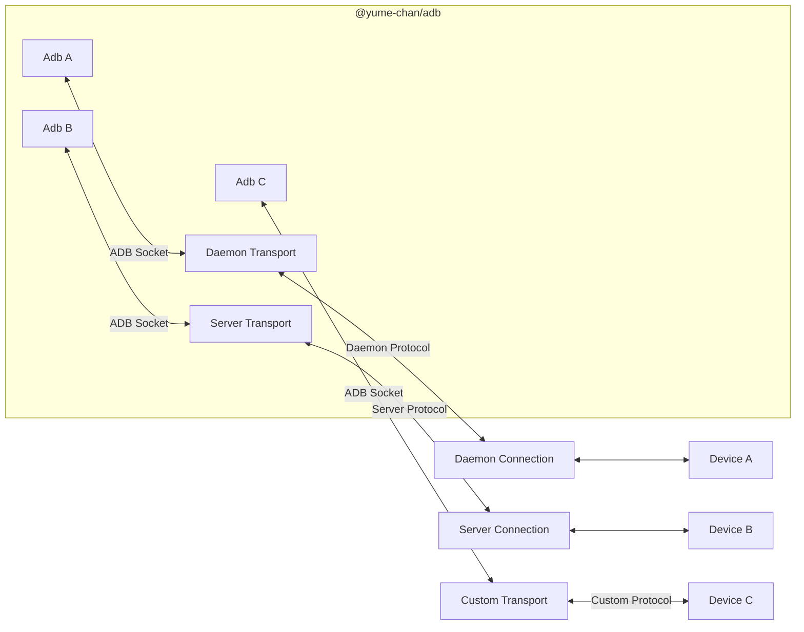

# Custom Transport

ADB is a stream multiplexing protocol. Invoking an command opens a new logical stream, also called an ADB Socket. `Adb` class relies on an `AdbTransport` implementation to open and manage those ADB Sockets.

While there might not be any other transports that can create ADB Sockets directly, it's still useful to allow custom transports for other purposes. For example, a mock transport that returns fixed data can be used in tests, and a WebSocket transport can wrap a built-in transport and allow multiple clients to access the device over the Internet.

:::info

The difference between a custom transport and a custom [Daemon Transport connection](../daemon/custom-connection.mdx) or [Server Transport connector](../server/client.mdx#create-connector) is that, the former handles raw request and response data for ADB commands, while the latter always has those data in an encoded format.

For example, to write a unit test for an ADB command, a custom transport only needs to return the expected response data, but a Daemon Transport connection must encode that response using Daemon protocol, which then gets decoded by Daemon Transport.

:::

## Implementation

To implement a custom transport, you need to create two class:

* An `AdbSocket` implementation that sends and receives raw data.
* An `AdbTransport` implementation that creates new `AdbSocket`s when requested.
