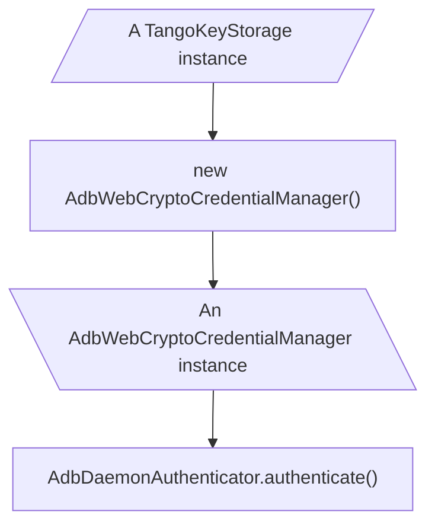

import Tabs from "@theme/Tabs";
import TabItem from "@theme/TabItem";
import CanIUse from "../../../can-i-use";

# Credential manager

Directly connecting to the ADB Daemon on device requires authentication. The authentication process uses [RSA algorithm](<https://en.wikipedia.org/wiki/RSA_(cryptosystem)>), except it uses a custom public key format.

ADB protocol has two authentication methods:

1. Public key: The client sends its public key to the device. The device displays a dialog asking its user to confirm the connection. If the user confirms, the connection will be established. If the user also checks "Always allow from this computer", the device will save the public key and use signature authentication next time.
2. Signature: The device generates a random challenge and sends it to the client. The client signs the challenge with its private key and sends the signature back to the device. The device verifies if the signature is produced by one of its trusted public keys.

:::info

Even if the user checked "Always allow from this computer", the public key may be untrusted due to various reasons:

1. On Android 11 and above, the device will automatically revoke the trust if the key is not used in last 7 days. This feature can be disabled by users in the developer settings.
2. On Android 11 and above, the user can manually untrust individual keys in "Settings -> Developer options -> Wireless debugging -> Paired devices".
3. On Android 10 and below, the user can manually untrust all keys in "Settings -> Developer options -> Revoke USB debugging authorizations".

:::

Tango supports both authentication methods, and can use varies credential managers to support different runtimes.

## `AdbWebCryptoCredentialManager`

[Web Crypto API](https://developer.mozilla.org/en-US/docs/Web/API/Web_Crypto_API) is a standard API for performing cryptographic operations including key generation, encryption, decryption, and digital signatures.

:::info

ADB doesn't use standard RSA signature scheme, thus signing the challenge is implemented by Tango, instead of using Web Crypto API's `sign` method directly.

:::

<CanIUse feature="cryptography" />

Both Web browsers and Node.js support Web Crypto API, so we provide the `AdbWebCryptoCredentialManager` class that uses Web Crypto API to generate ADB private keys.

However, Web browsers and Node.js don't share a common API to store data. Thus, the `AdbWebCryptoCredentialManager` class requires a `TangoKeyStorage` instance to store the generated keys.



### Definition

```ts
import type {
  AdbCredentialStore,
  AdbPrivateKey,
  MaybeError,
} from "@yume-chan/adb";
import type { TangoKeyStorage } from "@yume-chan/adb-credential-web";

export declare class AdbWebCryptoCredentialManager
  implements AdbCredentialStore
{
  constructor(storage: TangoKeyStorage, name?: string);

  generateKey(): Promise<AdbPrivateKey>;
  iterateKeys(): AsyncGenerator<MaybeError<AdbPrivateKey>, void, void>;
}
```

### Constructor parameters

#### `storage`

A `TangoKeyStorage` instance to store the generated keys.

#### `name`

An optional name for the keys. On Android 11 and above, it will appear in "Settings -> Developer options -> Wireless debugging -> Paired devices".

If not provided, Android will display it as `nouser@nohostname`.

### `TangoKeyStorage`

`TangoKeyStorage` is a simple interface for storing data with a name. For unencrypted storages the `privateKey` is the raw private key in [PKCS#8](https://en.wikipedia.org/wiki/PKCS_8) format, for encrypted storages it's the encrypted data.

```ts
import type { MaybeError } from "@yume-chan/adb";
import type { MaybePromiseLike } from "@yume-chan/async";

export interface TangoKey {
  privateKey: Uint8Array;
  name: string | undefined;
}

export interface TangoKeyStorage {
  save(
    privateKey: Uint8Array,
    name: string | undefined
  ): MaybePromiseLike<undefined>;

  load(): Iterable<MaybeError<TangoKey>> | AsyncIterable<MaybeError<TangoKey>>;
}
```

#### `save`

Save a private key to storage.

Parameters:

- `privateKey`: The data to be saved
- `name`: The name of the key

Returns:

Either `undefined` or a `Promise` that resolves to `undefined`.

#### `load`

Load all private keys from storage.

Returns:

An sync or async iterable. Each item is either a `TangoKey` or an `Error`.

### Error tolerance

If `TangoKeyStorage.prototype.load()` or `AdbWebCryptoCredentialManager.prototype.iterateKeys()` can't load a key, it yields an `Error` through the iterator, instead of throwing it. This allows Tango to report the error to users, then continue to try other keys.

## Web

`@yume-chan/adb-credential-web` package provides the `AdbWebCryptoCredentialManager` class, along with various `TangoKeyStorage` implementations for Web browsers.

```sh npm2yarn
npm i @yume-chan/adb-credential-web
```

Two unencrypted and two encrypted storages are provided:

### `TangoLocalStorage`

Stores the key in `localStorage`.

| Characteristic | Description |
| -------------- | ----------- |
| Number of keys | 1           |
| Encrypted      | No          |
| Web Worker     | No          |

The constructor accepts a key name to store the key (`localStorage.getItem(name)`). If you want, you can create multiple `TangoLocalStorage` instances with different names to store multiple keys.

```ts transpile
import {
  AdbWebCryptoCredentialManager,
  TangoLocalStorage,
} from "@yume-chan/adb-credential-web";

const storage = new TangoLocalStorage("key");
const manager = new AdbWebCryptoCredentialManager(storage);
```

### `TangoIndexedDbStorage`

Stores keys using IndexedDB API. It will create a database named `"Tango"` and a store (table) named `"Authentication"` in it.

| Characteristic | Description |
| -------------- | ----------- |
| Number of keys | Unlimited   |
| Encrypted      | No          |
| Web Worker     | Yes         |

```ts transpile
import {
  AdbWebCryptoCredentialManager,
  TangoIndexedDbStorage,
} from "@yume-chan/adb-credential-web";

const storage = new TangoIndexedDbStorage();
const manager = new AdbWebCryptoCredentialManager(storage);
```

### `TangoPasswordProtectedStorage`

Encrypts the ADB key using a password. It requires another `TangoKeyStorage` instance to store the encrypted data.

| Characteristic | Description                                                  |
| -------------- | ------------------------------------------------------------ |
| Number of keys | Depends on the inner `TangoKeyStorage`                       |
| Encrypted      | Yes                                                          |
| Web Worker     | Depends on the inner `TangoKeyStorage` and password callback |

```ts
export namespace TangoPasswordProtectedStorage {
  export type RequestPassword = (
    reason: "save" | "load",
    name: string | undefined
  ) => MaybePromiseLike<string>;

  declare class PasswordIncorrectError extends Error {
    get keyName(): string | undefined;
    constructor(keyName: string | undefined);
  }
}

export declare class TangoPasswordProtectedStorage implements TangoKeyStorage {
  constructor(
    storage: TangoKeyStorage,
    requestPassword: TangoPasswordProtectedStorage.RequestPassword
  );
}
```

#### Constructor parameters

##### `storage`

The inner `TangoKeyStorage` instance to store the encrypted data.

##### `requestPassword`

A callback function to get the password.

Parameters:

- `reason`: `"save"` when saving (encrypting) the key, `"load"` when loading (decrypting) the key.
- `name`: The name of the key. When saving, it's the `AdbWebCryptoCredentialManager`'s `name` parameter. When loading, it's the name of the loaded key from its inner `TangoKeyStorage`.

#### Example

```ts transpile
import {
  AdbWebCryptoCredentialManager,
  TangoPasswordProtectedStorage,
  TangoIndexedDbStorage,
} from "@yume-chan/adb-credential-web";

const innerStorage = new TangoIndexedDbStorage();
const storage = new TangoPasswordProtectedStorage(
  innerStorage,
  (reason, name) =>
    prompt(
      `Password for ${reason === "save" ? "encrypting" : "decrypting"} ${name}:`
    )
);
const manager = new AdbWebCryptoCredentialManager(storage);
```

#### Error

If the password is incorrect when loading (decrypting) the key, a `TangoPasswordProtectedStorage.PasswordIncorrectError` will be thrown.

The `keyName` property contains the name of the key that failed to decrypt.

### `TangoPrfStorage`

Encrypts the ADB key using a PRF (pseudo-random function) derived key. It requires another `TangoKeyStorage` instance to store the encrypted data.

| Characteristic | Description                            |
| -------------- | -------------------------------------- |
| Number of keys | Depends on the inner `TangoKeyStorage` |
| Encrypted      | Yes                                    |
| Web Worker     | No                                     |

See [its dedicated page](./prf.mdx) for more details.

```ts transpile
import {
  AdbWebCryptoCredentialManager,
  TangoPrfStorage,
  TangoIndexedDbStorage,
  TangoWebAuthnPrfSource,
} from "@yume-chan/adb-credential-web";

const innerStorage = new TangoIndexedDbStorage();
const prfSource = new TangoWebAuthnPrfSource("Tango", "ADB Key");
const storage = new TangoPrfStorage(innerStorage, prfSource);
const manager = new AdbWebCryptoCredentialManager(storage);
```

## Node.js

The `@yume-chan/adb-credential-nodejs` package re-exports `AdbWebCryptoCredentialManager` from `@yume-chan/adb-credential-web`, and provides a `TangoKeyStorage` for Node.js:

```sh npm2yarn
npm i @yume-chan/adb-credential-nodejs
```

### `TangoNodeStorage`

| Characteristic   | Description                         |
| ---------------- | ----------------------------------- |
| Number of keys   | Unlimited for loading, 1 for saving |
| Encrypted        | No                                  |
| `worker_threads` | Yes                                 |

This storage uses a file to store the ADB key.

It follows the same convention as [Google ADB](../../../internal/key.mdx), plus it will read the public key for key name (and fallback to the default name if not found).

To interop with Google ADB, don't chain `TangoNodeStorage` with any other encrypted storages.

```ts transpile
import {
  AdbWebCryptoCredentialManager,
  TangoNodeStorage,
} from "@yume-chan/adb-credential-nodejs";

const storage = new TangoNodeStorage();
const manager = new AdbWebCryptoCredentialManager(storage);
```

## Custom credential manager

:::danger

This part of the documentation is out of date. To be updated.

:::

In Tango, each private key is a plain object with the following fields:

- `buffer`: A [`Uint8Array`](https://developer.mozilla.org/en-US/docs/Web/JavaScript/Reference/Global_Objects/Uint8Array) (or Node.js [`Buffer`](https://nodejs.org/api/buffer.html)) containing the private key in [PKCS#8](https://en.wikipedia.org/wiki/PKCS_8) format.
- `name`: A `string`, the name of the key. On Android 11 and above, it will appear in "Settings -> Developer options -> Wireless debugging -> Paired devices". The default value is `nouser@nohostname`.

To create a custom credential store implementation, you need to provide two methods:

- `generateKey`: Generate a new RSA private key with a modulus length of 2048 bits, a public exponent of 65537, and use SHA-1 as the hash algorithm. It can either synchronously or asynchronously return a private key in the above format. It should store the generated key somewhere so that it can be retrieved later.
- `iterateKeys`: Iterate through all stored private keys. It can return either a synchronous or an asynchronous iterator. Each item in the iterator must be a private key in the above format. The iterator can have either zero, one, or multiple items.

:::info

You can choose to not saving the private key and generate a new one every time. However, this will cause the device to display a dialog asking the user to confirm the connection every time.

:::

:::danger

You must not use a fixed private key for all users. Everyone can see the private key and use it to connect to other people's devices.

:::

The authentication process is as follows:

1. Tango calls `iterateKeys`
   1. For each key, Tango uses it in signature authentication. If the authentication succeeds, no further steps will be taken.
2. Tango calls `iterateKeys` again
   1. If it returns at least one key, Tango uses the first key in public key authentication. No matter the authentication succeeds or not, no further steps will be taken.
3. `generateKey` is called, and the generated key is used in public key authentication.
