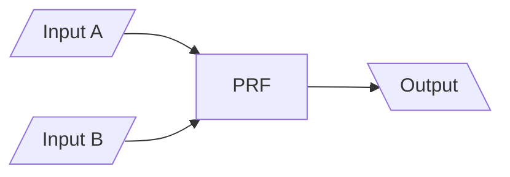
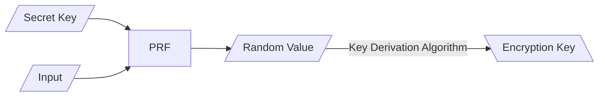
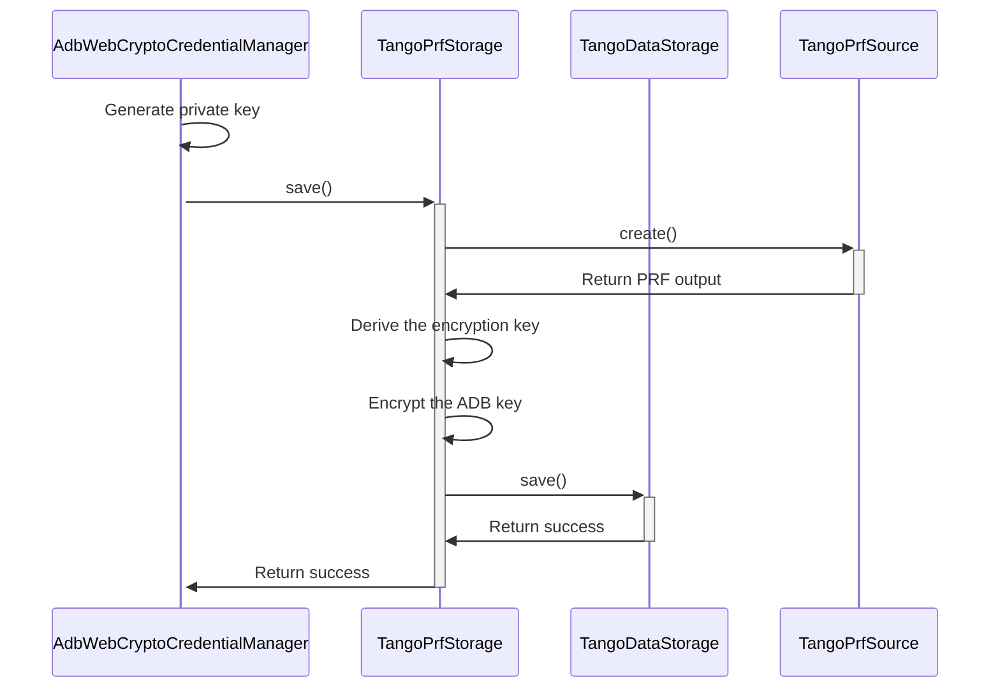
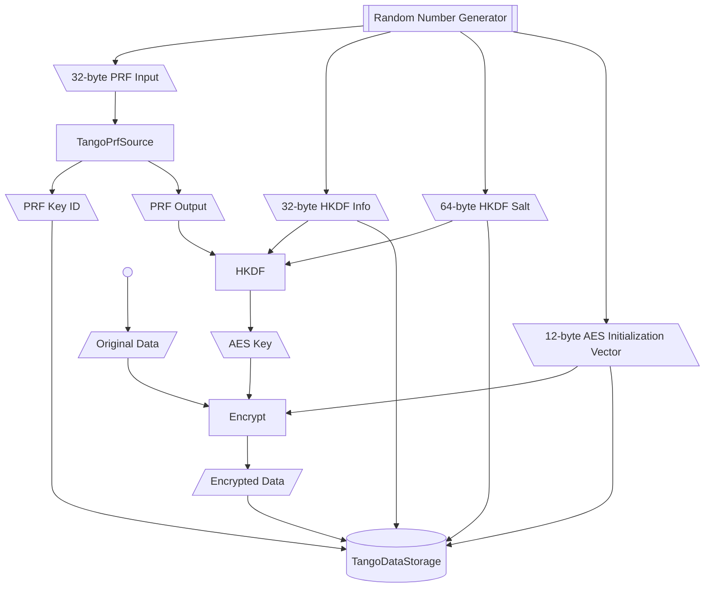
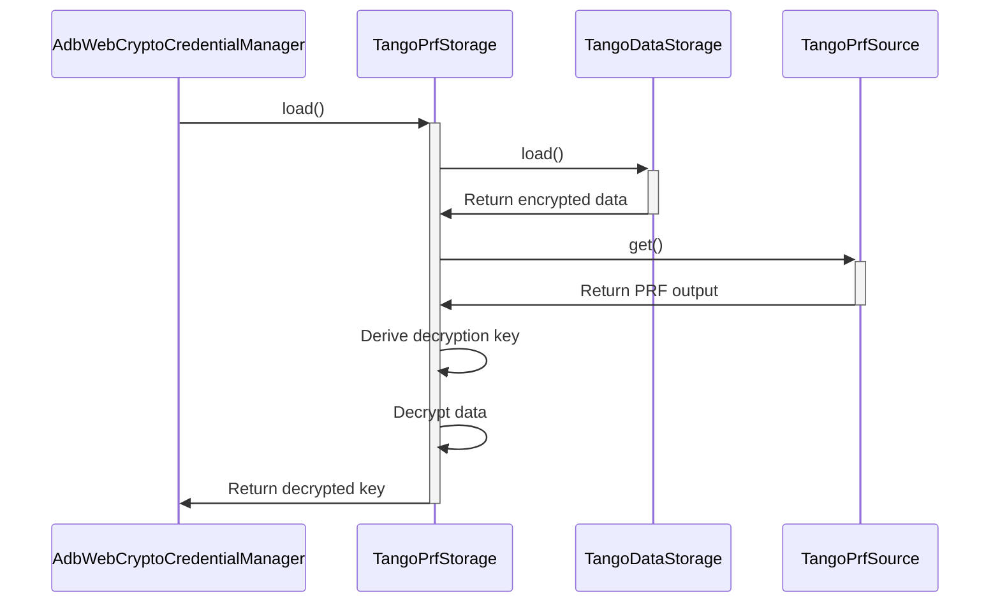
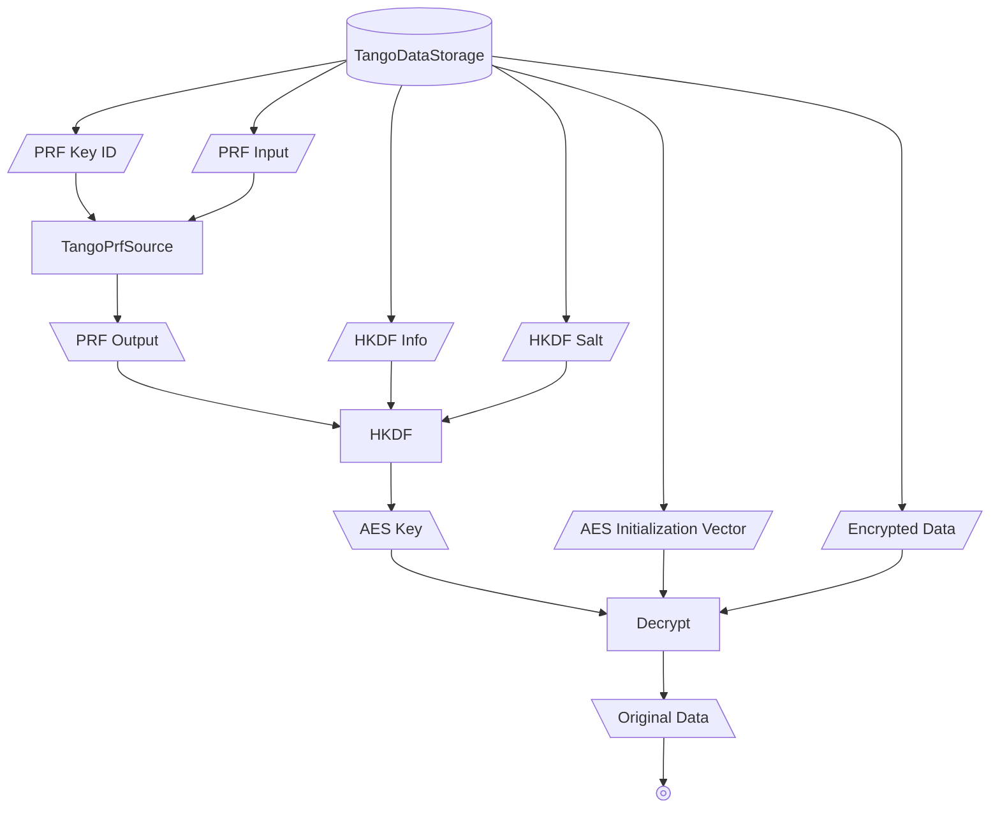

# PRF encrypted storage

import CanIUse from "../../../can-i-use";

PRF (pseudo-random function) is a deterministic function that generates a random value from two input values.



When implemented in security solutions like [FIDO2 HMAC secret ("hmac-secret" extension)](https://docs.yubico.com/yesdk/users-manual/application-fido2/hmac-secret.html) and [Web Authentication API's PRF extension](https://w3c.github.io/webauthn/#prf), it can generate a random but deterministic value from the hidden secret key and a developer-specified input.

The output value can then be used in various key derivation function (KDF), such as [HKDF](https://en.wikipedia.org/wiki/HKDF), to create a symmetric key to encrypt or decrypt data.



Because the hidden secret key is not extractable, generating the PRF output can only be performed within the security solution. Doing so would usually also require user interaction (pressing a button, biometric authentication, entering a password, etc.). This enables softwares to securely store sensitive data in untrusted environments.

## Architecture

The `TangoPrfStorage` class uses PRF to encrypt the ADB key. It encrypts the whole input (usually a PKCS#8 RSA private key), and doesn't use encrypted PKCS#8 format.

It takes another `TangoDataStorage` to actually store the encrypted data, and a `TangoPrfSource` for runtime-specified PRF API.

The key derivation step uses HKDF to derive an AES-256 key from the PRF output.

All random number generations, key derivations and encryptions are performed using Web Crypto API.

### Create a new key



#### Data flow



PRF key ID, HKDF info and salt, AES initialization vector, and the encrypted data are all stored in the underlying `TangoDataStorage` for the decryption process.

### Enumerate existing keys



The stored information is used to produce the same PRF output, the same AES key, and the same cleartext data.

#### Data flow



## PRF source

To support different runtime environments, `TangoPrfStorage` uses a `TangoPrfSource` to create and get the PRF output:

```ts
import type { MaybePromiseLike } from "@yume-chan/async";

interface TangoPrfCreationResult {
  /**
   * The generated PRF output (random number)
   */
  output: BufferSource;

  /**
   * ID of the created secret key
   */
  id: Uint8Array<ArrayBuffer>;
}

export interface TangoPrfSource {
  /**
   * Create a new secret key and generate PRF output using the key and input data.
   *
   * @param input The input data
   */
  create(
    input: Uint8Array<ArrayBuffer>
  ): MaybePromiseLike<TangoPrfCreationResult>;

  /**
   * Generate PRF output using the secret key and input data.
   *
   * @param id ID of the secret key
   * @param input The input data
   */
  get(
    id: BufferSource,
    input: Uint8Array<ArrayBuffer>
  ): MaybePromiseLike<BufferSource>;
}
```

## WebAuthn PRF extension

An implementation of `TangoPrfSource` is provided for WebAuthn PRF extension.

### Support

To use the PRF extension, both the runtime (browser) and the authenticator (the hardware, software or cloud service that actually stores the credentials) must both support it.

#### Runtime

<CanIUse feature="mdn-api_CredentialsContainer_create_publicKey_option_extensions_prf" />

#### Authenticators

| Authenticator           | Support                                |
| ----------------------- | -------------------------------------- |
| Windows Hello           | Requires Windows 11 insider preview    |
| iCloud Keychain         | Requires macOS 15.0 or iOS/iPadOS 18.3 |
| Google Password Manager | Yes                                    |
| FIDO2 security keys     | Yes                                    |

### Definition

```ts
export declare class TangoWebAuthnPrfSource implements TangoPrfSource {
  /**
   * Checks if the runtime supports WebAuthn PRF extension.
   *
   * Note that using the extension also requires a supported authenticator.
   * Whether an authenticator supports the extension can only be checked
   * during the `create` process.
   * @returns `true` if the runtime supports WebAuthn PRF extension
   */
  static isSupported(): Promise<boolean>;

  /**
   * Create a new instance of `TangoWebAuthnPrfSource`
   *
   * @param appName Name of your website shows in Passkey manager
   * @param userName Display name of the credential shows in Passkey manager
   */
  constructor(appName: string, userName: string);

  create(input: Uint8Array<ArrayBuffer>): Promise<{
    output: BufferSource;
    id: Uint8Array<ArrayBuffer>;
  }>;

  get(id: BufferSource, input: Uint8Array<ArrayBuffer>): Promise<BufferSource>;
}

export declare namespace TangoWebAuthnPrfSource {
  declare class NotSupportedError extends Error {
    constructor();
  }

  declare class AssertionFailedError extends Error {
    constructor();
  }
}
```

### Errors

#### `NotSupportedError`

During the `create` process, if no authenticator supporting PRF extension is found, a `TangoWebAuthnPrfSource.NotSupportedError` will be thrown.

#### `AssertionFailedError`

During the `get` process, if the assertion operation fails (for example, user cancels the operation), a `TangoWebAuthnPrfSource.AssertionFailedError` will be thrown.

## Basic Usage

The most basic usage is with a [LocalStorage storage](./web-crypto.mdx#tangolocalstorage) and a WebAuthn PRF source.

```ts transpile
import {
  AdbWebCryptoCredentialManager,
  TangoPrfStorage,
  TangoLocalStorage,
  TangoWebAuthnPrfSource,
} from "@yume-chan/adb-credential-web";

const innerStorage = new TangoLocalStorage("key");
const prfSource = new TangoWebAuthnPrfSource("Tango", "ADB Key");
const storage = new TangoPrfStorage(innerStorage, prfSource);
const manager = new AdbWebCryptoCredentialManager(storage);
```

Or, an [IndexedDB storage](./web-crypto.mdx#tangoindexeddbstorage) can also be used. Note that since `TangoWebAuthnPrfSource` can't run in Web Workers, so using it doesn't have any big benefits.

```ts transpile
import {
  AdbWebCryptoCredentialManager,
  TangoPrfStorage,
  TangoIndexedDbStorage,
  TangoWebAuthnPrfSource,
} from "@yume-chan/adb-credential-web";

const innerStorage = new TangoIndexedDbStorage();
const prfSource = new TangoWebAuthnPrfSource("Tango", "ADB Key");
const storage = new TangoPrfStorage(innerStorage, prfSource);
const manager = new AdbWebCryptoCredentialManager(storage);
```

## Two-factor authentication

For a more secure authentication, you can chain the password storage and the PRF store to get two-factor authentication.

```ts transpile
import {
  TangoPrfStorage,
  TangoLocalStorage,
  TangoPasswordProtectedStorage,
  TangoWebAuthnPrfSource,
} from "@yume-chan/adb-credential-web";

const storage = new TangoPrfStorage(
  new TangoPasswordProtectedStorage(
    new TangoLocalStorage("key"),
    () => "password"
  ),
  new TangoWebAuthnPrfSource("Tango", "ADB Key")
);
```

This will first ask for a password (here we just return `"password"`), then ask for WebAuthn user authentication.
