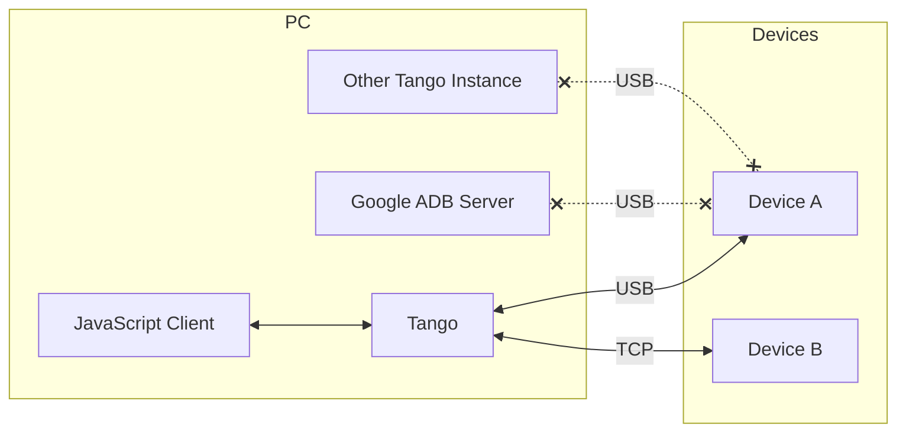
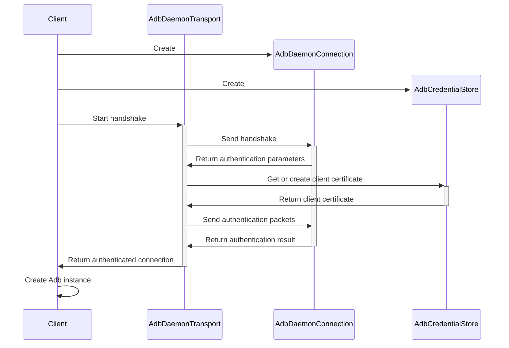

# Direct Connection

In Direct Connection Mode, Tango connects to the ADB daemon running on Android devices directly. This is the lowest-level connection mode, Tango controls all the steps, including authentication, message encoding and decoding, and connection management.

The `AdbDaemonTransport` class from `@yume-chan/adb` implements this mode.

To support different runtime and connection method, `AdbDaemonTransport` accepts an `AdbDaemonConnection` object for communicating with the device, and an `AdbCredentialStore` object for managing client certificates.

Here are the overall steps to create a direct connection:

There are two built-in `AdbDaemonConnection` implementations, and you can also create other custom connections to meet your requirements.

## USB Connection

USB connection is the most common way to connect to Android devices.

[`@yume-chan/adb-daemon-webusb`](https://www.npmjs.com/package/@yume-chan/adb-daemon-webusb) package provides an `AdbDaemonConnection` using [WebUSB API](https://developer.mozilla.org/en-US/docs/Web/API/WebUSB_API). It can use varies WebUSB compatible implementations, including the native implementation in Web browsers, and the [`usb`](https://www.npmjs.com/package/usb) package in Node.js.

:::note[Next Step]

[Create USB connection](./usb/device-manager.mdx)

:::

## TCP Connection

ADB over Wi-Fi (a.k.a TCP/IP mode) allows you to connect to Android devices without a USB cable. It can also connect to Google Android Emulators running on the same machine.

There is no Web API for TCP connection, so it's not available in Web browsers. In Node.js, it can be implemented using the built-in `net` module.

:::note[Next Step]

[Create TCP connection](./tcp/enable.mdx)

:::

## Custom Connection

In addition to the built-in connection methods, Tango also accepts custom connection implementations. For example, a WebSocket connection can forward TCP connections from a Node.js server to a Web browser.

:::note[Next Step]

[Create custom connection](./custom-connection.mdx)

:::
