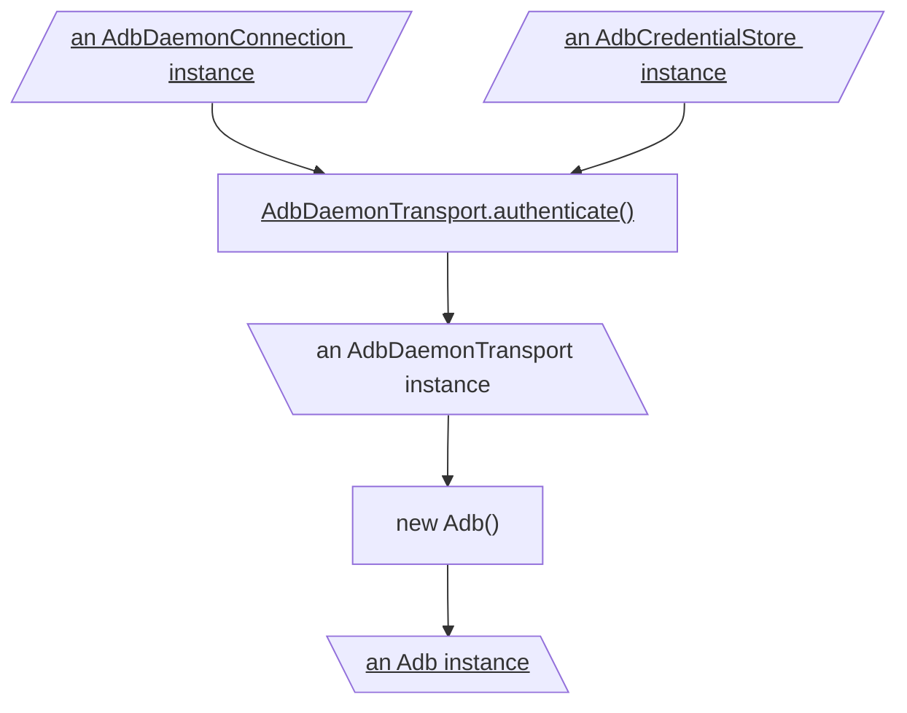
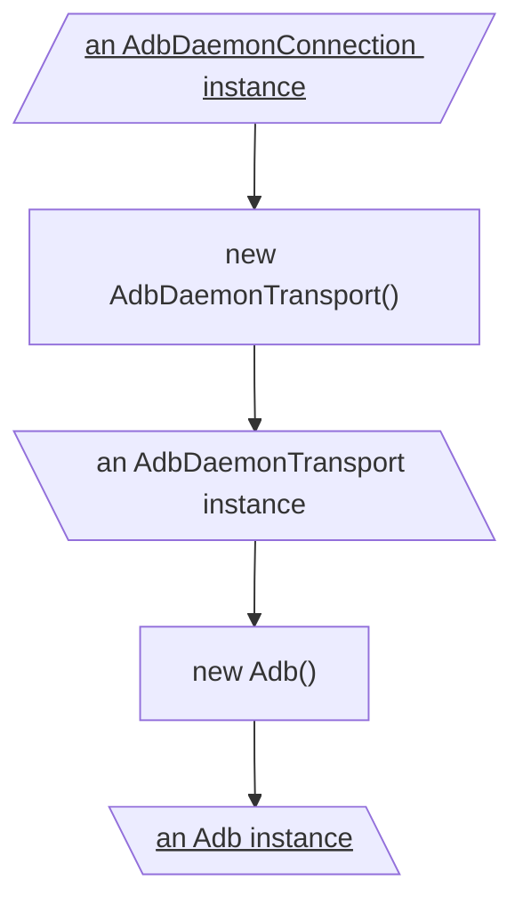
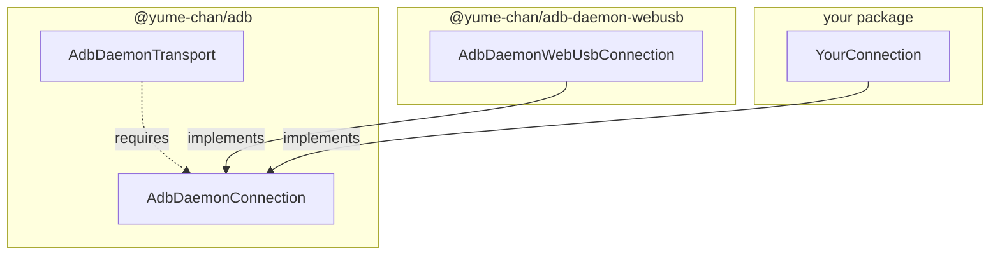
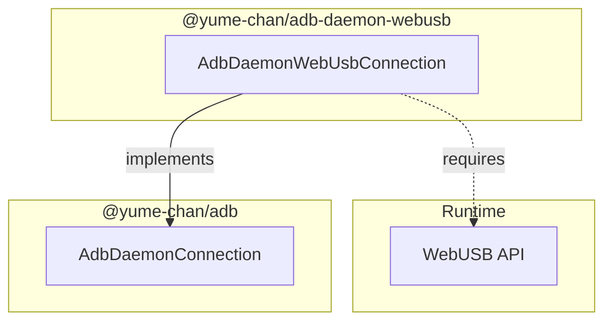

# Daemon transport

**AdbDaemonTransport** connects to ADB Daemons directly. This means it can run on devices without Google ADB (for example, on Web platforms where connecting to Google ADB Server is not supported, or on mobile devices where Google ADB is not available).

This is the lowest-level transport, it controls all the steps, including authentication, message encoding and decoding, and connection management.


## Installation

This class is included in the core package:

```sh npm2yarn
npm i @yume-chan/adb
```

## Overview

To support different runtime and connection method, `AdbDaemonTransport` class itself only defines how to serialize and deserialize Daemon Protocol packets.

The most common usage is to use `AdbDaemonTransport.authenticate()` static method to create an authenticated transport instance. It handles the handshake and authentication process automatically using an `AdbDaemonConnection` implementation to send and receive packets and an `AdbCredentialStore` implementation to manage client certificates.



:::note

Click underlined nodes to open their relevant documentations.

:::

Alternatively, if your connection doesn't require authentication or you handle it yourself, you can directly create an `AdbDaemonTransport` instance using its constructor.



:::note

Click underlined nodes to open their relevant documentations.

:::

## Connections

Daemon Transport has three connection methods:

- **USB**: Uses USB API to communicate with devices connected via USB.
- **ADB over Wi-Fi** a.k.a TCP/IP Mode: Uses TCP sockets to communicate with devices over the network.
- **Wireless Debugging**: Added in Android 11. Uses TLS over TCP sockets and a new authentication process.

:::info

The Wireless Debugging connection is not implemented yet, as it needs a full TLS implementation.

We expect it to be a separate package if it uses third-party libraries, but we haven't found a suitable library yet. Any help is appreciated!

:::

Due to runtime API limitations, not all connections are supported on all environments:

| Connection         | Web                                               | Node.js   |
| ------------------ | ------------------------------------------------- | --------- |
| **USB**            | Supported on Chromium-based browsers <sup>1</sup> | Supported |
| **ADB over Wi-Fi** | Not supported                                     | Supported |

<sup>1</sup> Chrome for Android is supported, but Chrome for iOS is based on
Safari and not supported.

`AdbDaemonTransport` also accepts custom connection implementations. For example, with a Node.js WebSocket server that forwards packets to devices, a WebSocket connection can connect to that server and enable unsupported connections on Web platforms.



### USB Connection

USB connection is the oldest and most common way to connect to Android devices.

Because USB connections are exclusive, Daemon Transport can't access a USB device at the same time with Google ADB or other ADB clients. To do that, use the [Server Transport](../server/index.mdx).

[`@yume-chan/adb-daemon-webusb`](https://www.npmjs.com/package/@yume-chan/adb-daemon-webusb) package provides an `AdbDaemonConnection` implementation based on [WebUSB API](https://developer.mozilla.org/en-US/docs/Web/API/WebUSB_API):

* Chromium-based browsers support WebUSB natively. Chrome for Android is supported, but Chrome for iOS is based on Safari and not supported.
* Node.js can use the WebUSB implementation in the [`usb`](https://www.npmjs.com/package/usb) package.



:::note[Next Step]

[Create USB connection](./usb/index.mdx)

:::

### TCP Connection

ADB over Wi-Fi (a.k.a TCP/IP mode) uses TCP sockets to communicate with devices over the network. Google Android Emulators are also supported. The data protocol is completely same as USB connection, just on a different transport layer.

Currently, there is no built-in TCP connection for Web platforms, as TCP sockets are not supported there. This documentation provides a reference implementation for Node.js.

:::note[Next Step]

[Create TCP connection](./tcp/enable.mdx)

:::

### Custom Connection

In addition to the built-in connection methods, Tango also accepts custom connection implementations. For example, with a Node.js WebSocket server that forwards packets to devices, a WebSocket connection can connect to that server and enable unsupported connections on Web platforms.


:::note[Next Step]

[Create custom connection](./custom-connection.mdx)

:::
