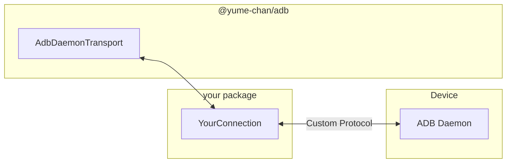

# Daemon Transport

**AdbDaemonTransport** connects to [ADB Daemons](../index.mdx#adb-daemon) directly. This is the lowest-level transport, it controls all the steps, including authentication, message encoding and decoding, and connection management.


This class is included in the core package:

```sh npm2yarn
npm i @yume-chan/adb
```

To support different runtime and connection method, `AdbDaemonTransport` class itself only defines how to serialize and deserialize Daemon Protocol packets. An `AdbDaemonConnection` implementation is required to send and receive those packets, and an `AdbCredentialStore` implementation is required to manage client certificates.


## Overview

Here are the steps to create an `Adb` instance with `AdbDaemonTransport`:

1. User creates an `AdbDaemonConnection` for the desired connection method.
2. User creates an `AdbCredentialStore` that works on the target platform.
3. User creates an `AdbDaemonTransport` instance with the connection and credential store.
    1. The transport instance uses the connection to send and receive handshake packets.
    2. The transport instance uses the credential store to authenticate with the device.
4. If authentication is successful, user creates an `Adb` instance with the transport.

## Connections

Tango provides two built-in `AdbDaemonConnection` implementations, and you can also create other custom connections to fulfill your requirements.

### USB Connection

USB connection is the oldest and most common way to connect to Android devices.

[`@yume-chan/adb-daemon-webusb`](https://www.npmjs.com/package/@yume-chan/adb-daemon-webusb) package provides an `AdbDaemonConnection` implementation based on [WebUSB API](https://developer.mozilla.org/en-US/docs/Web/API/WebUSB_API):

* Chromium-based browsers support WebUSB natively. Chrome for Android is supported, but Chrome for iOS is based on Safari and not supported.
* Node.js can use the WebUSB implementation in the [`usb`](https://www.npmjs.com/package/usb) package.


:::note[Next Step]

[Create USB connection](./usb/index.mdx)

:::

### TCP Connection

ADB over Wi-Fi (a.k.a TCP/IP mode) uses TCP sockets to communicate with devices over the network. Google Android Emulators are also supported. The data protocol is completely same as USB connection, just on a different transport layer.

Currently, there is no built-in TCP connection for Web platforms, as TCP sockets are not supported there. This documentation provides a reference implementation for Node.js.

:::note[Next Step]

[Create TCP connection](./tcp/enable.mdx)

:::

### Custom Connection

In addition to the built-in connection methods, Tango also accepts custom connection implementations. For example, with a Node.js WebSocket server that forwards packets to devices, a WebSocket connection can connect to that server and enable unsupported connections on Web platforms.



:::note[Next Step]

[Create custom connection](./custom-connection.mdx)

:::
