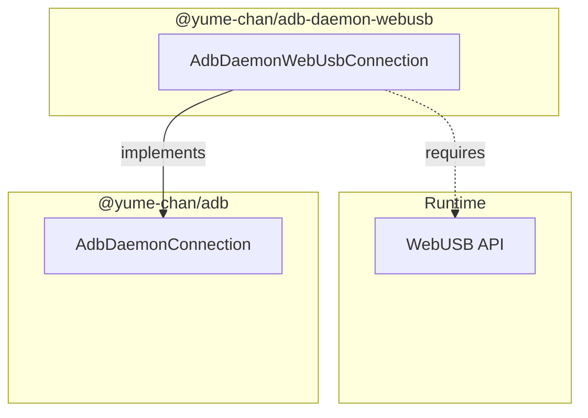

# USB Connection

[`@yume-chan/adb-daemon-webusb`](https://www.npmjs.com/package/@yume-chan/adb-daemon-webusb) package provides an `AdbDaemonConnection` using [WebUSB API](https://developer.mozilla.org/en-US/docs/Web/API/WebUSB_API). It can use varies WebUSB compatible implementations.

* Chromium-based browsers support WebUSB natively. Chrome for Android is supported, but Chrome for iOS is based on Safari and not supported.
* Node.js can use the WebUSB implementation in the [`usb`](https://www.npmjs.com/package/usb) package.



## Installation

Install this package along with the core package:

```sh npm2yarn
npm i @yume-chan/adb @yume-chan/adb-daemon-webusb
```

## Exclusivity

USB devices can have multiple interfaces, each for a different function. For example, an Android device can have an ADB interface (when USB debugging is enabled), an MTP interface (when file transferring is enabled), and an [AoA](https://source.android.com/docs/core/interaction/accessories/protocol) interface (when accessory mode is enabled).

To use an interface, it needs to be claimed to gain exclusive access. This means:

* If Google ADB has already claimed the ADB interface, WebUSB API in Chrome can't claim it again.
* If one WebUSB [`USBDevice`](https://developer.mozilla.org/en-US/docs/Web/API/USBDevice) instance has already claimed an interface, other `USBDevice` instances can't claim it again.

:::info

1. USB devices with multiple interfaces are called **composite devices**. If a USB device only has one interface, it's not a composite device, but that interface still needs to be exclusively claimed to be used.
1. Multiple programs can each claim a different interface on the same device. For example, Google ADB can claim the ADB interface, while Windows Explorer claims the MTP interface.
2. On Windows, only interfaces with WinUSB drivers can be claimed by user-mode programs. ADB interface on most Android devices uses WinUSB drivers by default, but some old devices may require manual driver installation.
3. On Unix systems, it's technically possible for multiple programs to claim the same interface. But it's simply bad. Packets from different programs will be mixed up, and the device will be confused.

:::

Google ADB solves this problem by using a server program that forwards ADB commands to devices for multiple clients. Tango supports the [Server Transport](../../server/index.mdx) to connect to the server and access devices, but it's not supported on Web platforms.
