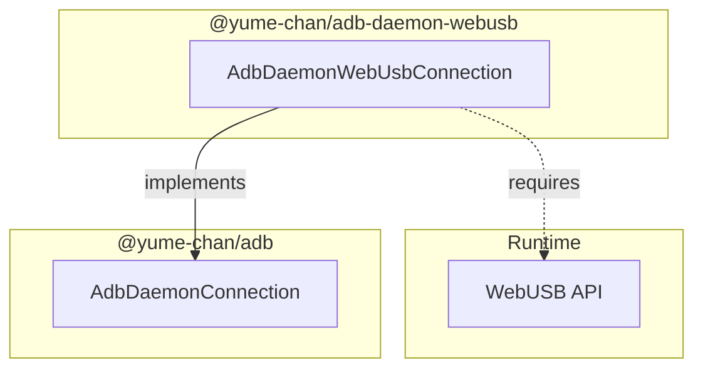
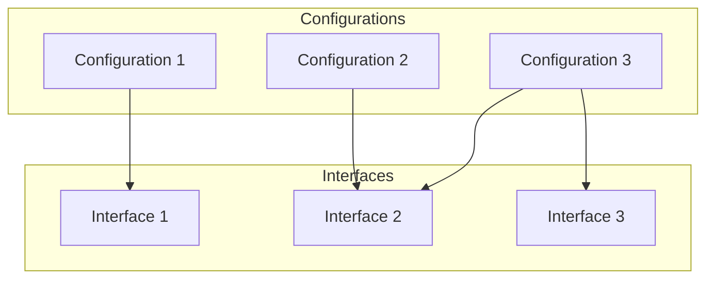
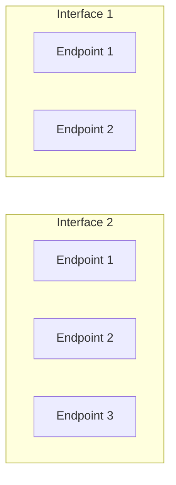
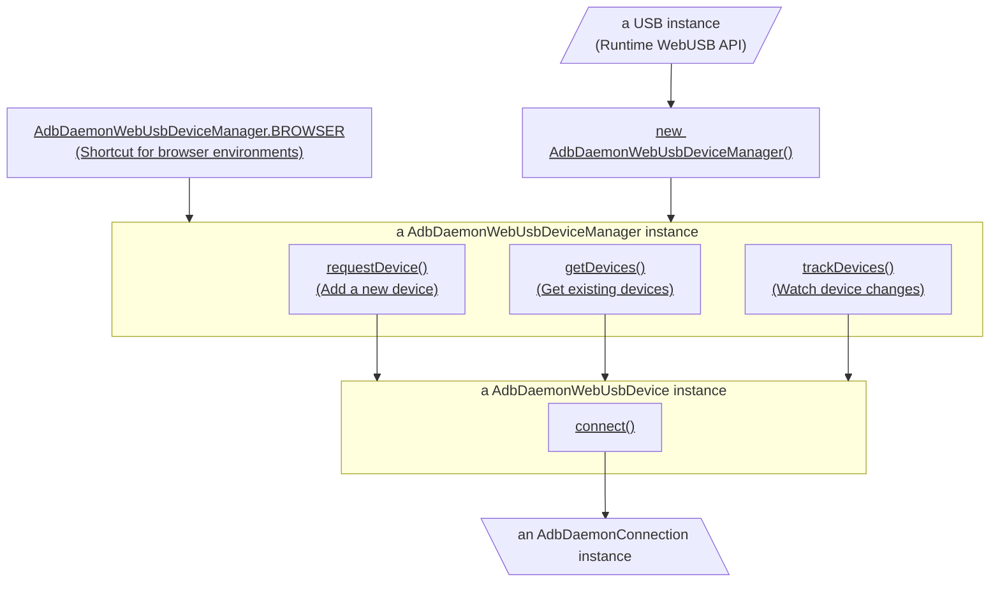

# USB connection

[`@yume-chan/adb-daemon-webusb`](https://www.npmjs.com/package/@yume-chan/adb-daemon-webusb) package provides an `AdbDaemonConnection` using [WebUSB API](https://developer.mozilla.org/en-US/docs/Web/API/WebUSB_API). It can use varies WebUSB compatible implementations.

- Chromium-based browsers support WebUSB natively. Chrome for Android is supported, but Chrome for iOS is based on Safari and not supported.
- Node.js can use the WebUSB implementation in the [`usb`](https://www.npmjs.com/package/usb) package.



## Installation

Install this package along with the core package:

```sh npm2yarn
npm install @yume-chan/adb @yume-chan/adb-daemon-webusb
```

If you are using PNPM and TypeScript, also install the typing for WebUSB API:

```sh title="shell"
pnpm add --save-dev @types/w3c-web-usb
```

## USB Basics

### Configuration

A **configuration** is a set of interfaces that are enabled together.

A device can have multiple configurations, but only one configuration can be active at a time. Most devices have only one configuration.

The USB host can request the device to switch to another configuration at any time, but the device itself can't change its active configuration.



For example, Apple mobile devices (iPods, iPhones and iPads) have two configurations:

- The default configuration, with only one interface for transferring files using MTP.
- Configuration 2 with one interface for MTP and another one for syncing with iTunes.

:::info

Windows requires a custom driver to switch configurations. For example, iTunes for Windows installs a special driver to switch Apple devices to configuration 2.

:::

### Interface

An **interface** is a self-contained function of a device. For example, a USB headset can have one interface for audio input and another for audio output.

Each interface has a class, subclass, and protocol codes that describe its function. Generally, the ADB interface is found by its fixed class, subclass, and protocol code. The class, subclass, and protocol codes for interfaces can also be used to find devices with known features.

A device can have multiple interfaces, and all of them can be used at the same time. Devices with multiple interfaces are called **composite devices**.

:::info

Different interfaces on one device can be used by different programs. For example, Google ADB can use the ADB interface, while Windows Explorer uses the MTP interface.

:::

### Endpoint

An **endpoint** is a stream of bytes that can be either read from or written to.

Each interface can have multiple endpoints carrying different data, and all of them can be read or write at the same time.



:::info

Those two "Endpoint 1"s are different endpoints, because they are in different interfaces. They can be read or written at the same time.

:::

ADB interface defines one endpoint for sending data and another for receiving data.

## Exclusivity

USB interfaces are generally not designed to be shared by multiple programs at the same time.

On Unix systems, it's technically possible for multiple programs to claim the same interface. But data sent by different programs will be mixed up, and the device will be confused. For example, for ADB interface, sending another handshake packet resets the connection, closing all streams (and child processes) started by previous program.

Windows doesn't allow opening multiple handles to the same interface at all, this means:

- If Google ADB has already claimed the ADB interface, WebUSB API in Chrome or `usb` package can't claim it again.
- If one WebUSB [`USBDevice`](https://developer.mozilla.org/en-US/docs/Web/API/USBDevice) instance has already claimed an interface, other `USBDevice` instances can't claim it again.

Google ADB solves this problem by using a server program (also called "host") that forwards ADB commands to devices for multiple clients. Tango supports the [Server Transport](../../server/index.mdx) to connect to the server and to have shared access to the device.

## Overview



:::note

Click underlined nodes to open their relevant documentations.

:::
