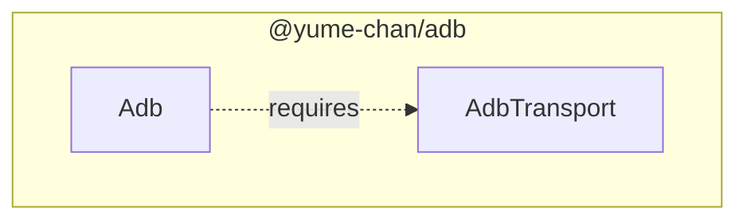
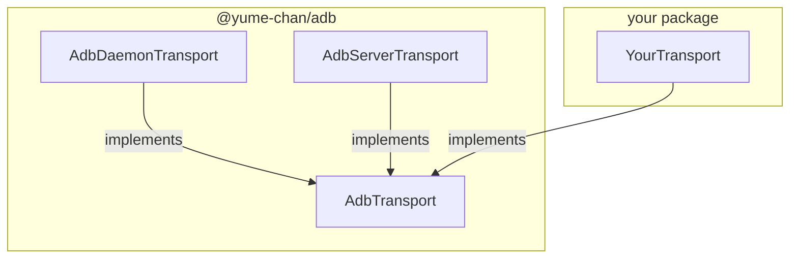
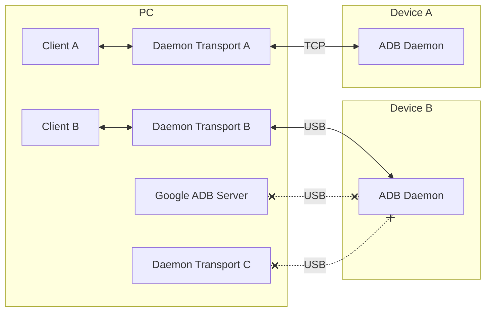
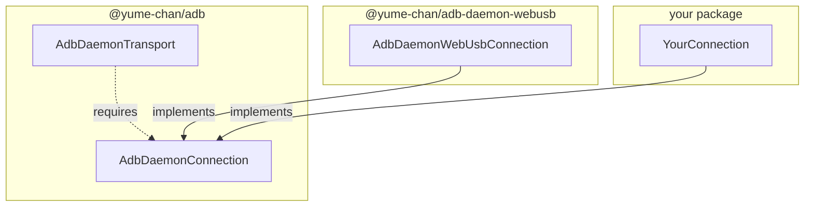
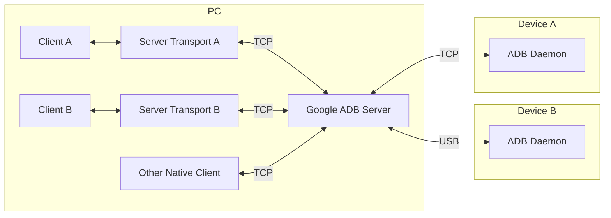
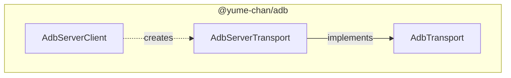
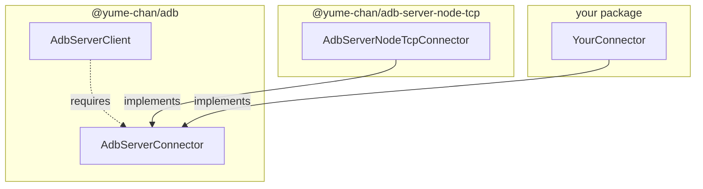
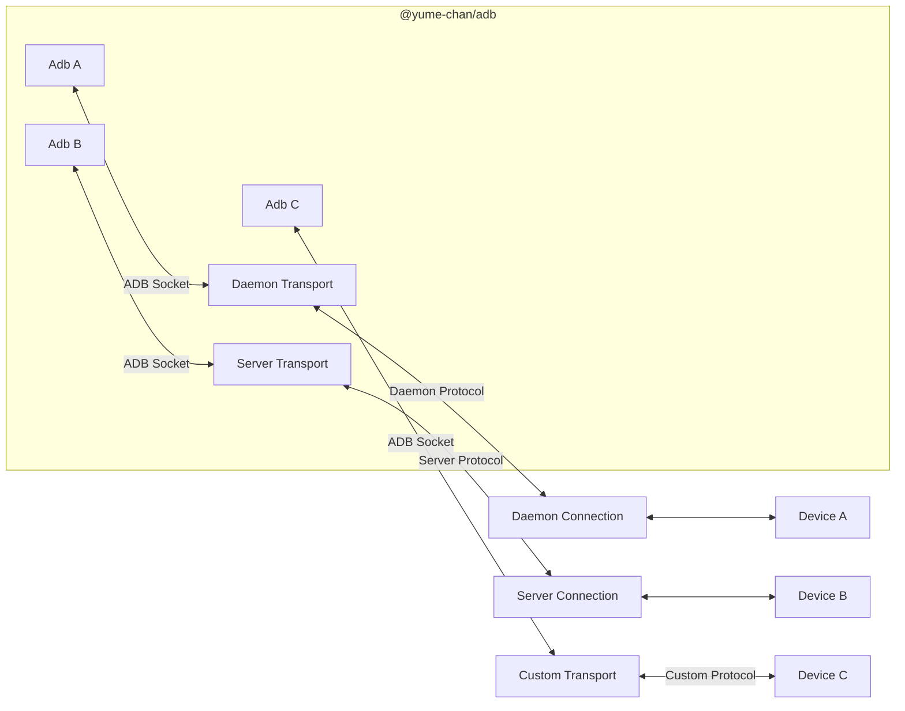

import Tabs from "@theme/Tabs";
import TabItem from "@theme/TabItem";

# Quick Start

:::info[Welcome]

Welcome to Tango ADB's developer documentation! :tada:

Tango is a TypeScript re-implementation of ADB ([Android Debug Bridge](https://developer.android.com/studio/command-line/adb)) client for Web browsers and Node.js.

If you are looking for our Tango Web application where you can control your Android devices, please click [here](https://app.tangoapp.dev).

:::

## Features

- **Zero dependencies**: Don't use any third-party libraries to provide a lightweight and secure solution.
- **Cross platform**: Runs on all recent versions of Node.js and Web browsers (supported connection methods vary).
- **Independent**: Doesn't require Google ADB server to connect to devices (but can also work with it).
- **Extensible**: Supports custom connection methods and ADB commands.

:::note

The public API is not stable. Check [GitHub Releases](https://www.github.com/yume-chan/ya-webadb/releases) page for changes.

If you have any questions, feel free to open a discussion on [GitHub](https://www.github.com/yume-chan/ya-webadb/discussions) :heart:

:::

## Installation

Tango is split into multiple packages to support different runtime environments. First, install the two core packages:

1. [`@yume-chan/adb`](https://www.npmjs.com/package/@yume-chan/adb): The platform-independent ADB client implementation
2. [`@yume-chan/stream-extra`](https://www.npmjs.com/package/@yume-chan/stream-extra): Type definitions and utilities for [Web Streams API](https://developer.mozilla.org/en-US/docs/Web/API/Streams_API).

```sh npm2yarn
npm i @yume-chan/adb @yume-chan/stream-extra
```

The end goal is to create an `Adb` instance that provides high-level APIs for built-in ADB commands, and allows custom commands to be extended. The `Adb` class requires an `AdbTransport` implementation to communicate with devices.



Read the following sections to learn more about ADB Transports and how to create one.

## ADB Daemon

ADB Daemon is a program running on Android devices (when USB Debugging or Wireless Debugging options are enabled) that handles incoming ADB connections and commands.

## Transports

The **AdbTransport** interface defines how to communicate with [ADB Daemons](#adb-daemon). Tango provides two built-in transports: [**Daemon Transport**](#daemon-transport) and [**Server Transport**](#server-transport), and also accepts [custom transport implementations](#custom-transport).



### Daemon Transport

**AdbDaemonTransport** connects to ADB Daemons directly. This means it can run on devices without Google ADB (for example, on Web platforms where connecting to Google ADB Server is not supported, or on mobile devices where Google ADB is not available).

Because USB connections are exclusive, Daemon Transport can't access a USB device at the same time with Google ADB or other ADB clients. To do that, use the [Server Transport](#server-transport).



Daemon Transport has three connection methods:

- **USB**: Uses USB API to communicate with devices connected via USB.
- **ADB over Wi-Fi** a.k.a TCP/IP Mode: Uses TCP sockets to communicate with devices over the network.
- **Wireless Debugging**: Added in Android 11. Uses TLS over TCP sockets and a new authentication process.

:::info

The Wireless Debugging connection is not implemented yet, as it needs a full TLS implementation.

We expect it to be a separate package if it uses third-party libraries, but we haven't found a suitable library yet. Any help is appreciated!

:::

Due to runtime API limitations, not all connections are supported on all environments:

| Connection             | Web                                               | Node.js         |
| ---------------------- | ------------------------------------------------- | --------------- |
| **USB**                | Supported on Chromium-based browsers <sup>1</sup> | Supported       |
| **ADB over Wi-Fi**     | Not supported                                     | Supported       |

<sup>1</sup> Chrome for Android is supported, but Chrome for iOS is based on Safari
and not supported.

`AdbDaemonTransport` also accepts custom connection implementations. For example, with a Node.js WebSocket server that forwards packets to devices, a WebSocket connection can connect to that server and enable unsupported connections on Web platforms.



:::note[Next Step]

[Create Daemon Transport](./daemon/index.mdx)

:::

### Server Transport

As mentioned above, USB connections don't allow multiple clients to access one device. Google ADB solves this problem by using a server program  (also called "host") that forwards ADB commands to devices for multiple clients.



The protocol between ADB Client and Server is different from the protocol between ADB Server and Daemon. `AdbServerClient` class is a TypeScript re-implementation of Google ADB Client. It connects to Google ADB Server using TCP sockets, and can create `AdbServerTransport`s for each device.



To support different runtime environments, `AdbServerClient` uses an `AdbServerConnector` implementation to create those TCP sockets. Currently, there is no built-in connector for Web platforms, as TCP sockets are not supported there. Tango provides a Node.js implementation using its `net` module, and also accepts custom connector implementations for other runtime environments.



:::note[Next Step]

[Create Server Connector](./server/index.mdx)

:::

### Custom Transport

Tango also accepts custom transport implementations. For example, a mock transport that returns fixed data can be used in unit tests, and a WebSocket transport can wrap a built-in transport and allow multiple clients to access the device over the Internet.

ADB is a stream multiplexing protocol. Invoking an command opens a new logical stream, also called an ADB Socket. `Adb` class relies on an `AdbTransport` implementation to open and manage those ADB Sockets. It doesn't care that Daemon Transport and Server Transport actually use completely different data protocols and connection methods to achieve that.

:::info

The difference between a custom transport and a custom [Daemon Transport connection](./daemon/custom-connection.mdx) or [Server Transport connector](./server/client.mdx#create-connector) is that, the former handles raw request and response data for ADB commands, while the latter always has those data in an encoded format.

For example, to write a unit test for an ADB command, a custom transport only needs to return the expected response data, but a Daemon Transport connection must encode that response using Daemon protocol, which then gets decoded by Daemon Transport.

:::



:::note[Next Step]

[Create custom transport](./custom-transport/index.mdx)

:::
