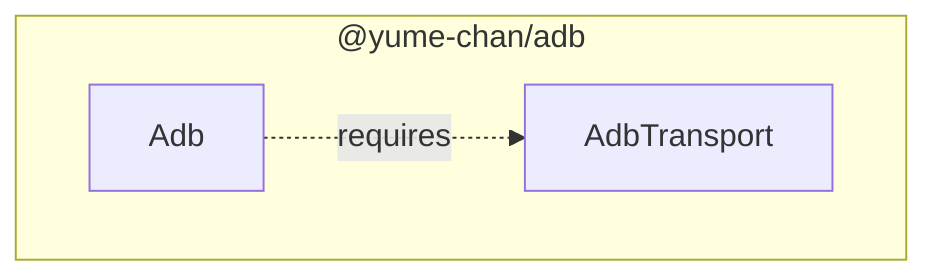
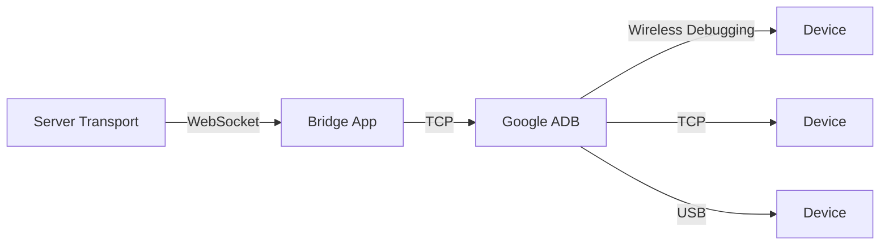
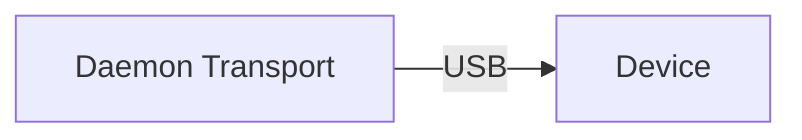
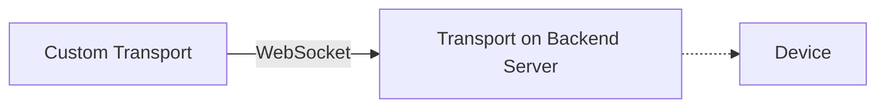
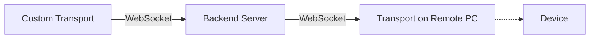
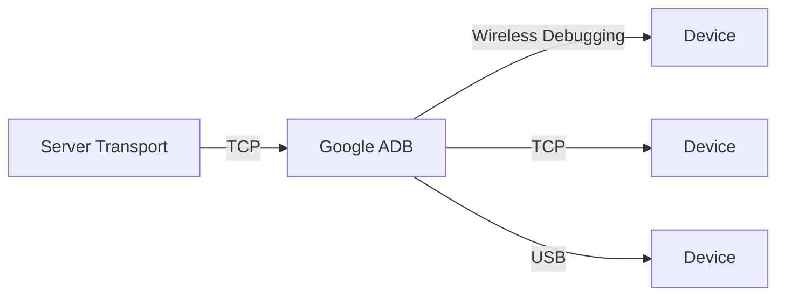
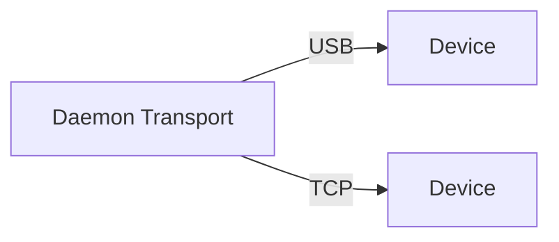

import Tabs from "@theme/Tabs";
import TabItem from "@theme/TabItem";

import { Question, Answer } from "./select-transport";

# Quick start

:::info[Welcome]

Welcome to Tango ADB's developer documentation! :tada:

Tango is a TypeScript re-implementation of ADB ([Android Debug Bridge](https://developer.android.com/studio/command-line/adb)) client for Web browsers and Node.js.

If you are looking for our Tango Web application where you can control your Android devices, please click [here](https://app.tangoapp.dev).

:::

## Features

- **Zero dependencies**: Don't use any third-party libraries to provide a lightweight and secure solution.
- **Cross platform**: Runs on all recent versions of Node.js and Web browsers (supported connection methods vary).
- **Independent**: Doesn't require Google ADB server to connect to devices (but can also work with it).
- **Extensible**: Supports custom connection methods and ADB commands.

:::note

The public API is not stable. Check [GitHub Releases](https://www.github.com/yume-chan/ya-webadb/releases) page for changes.

If you have any questions, feel free to open a discussion on [GitHub](https://www.github.com/yume-chan/ya-webadb/discussions) :heart:

:::

## Installation

Tango is split into multiple packages to support different runtime environments. First, install the two core packages:

1. [`@yume-chan/adb`](https://www.npmjs.com/package/@yume-chan/adb): The platform-independent ADB client implementation
2. [`@yume-chan/stream-extra`](https://www.npmjs.com/package/@yume-chan/stream-extra): Type definitions and utilities for [Web Streams API](https://developer.mozilla.org/en-US/docs/Web/API/Streams_API).

```sh npm2yarn
npm i @yume-chan/adb @yume-chan/stream-extra
```

## First Step

Tango provides an `Adb` class, which contains high-level APIs for ADB commands, and also allows custom commands to be added.

The end goal is to create an `Adb` instance, but first, an `AdbTransport` object is required.



The **AdbTransport** interface defines how to communicate with ADB Daemons (basically, your devices). ADB Daemon is the program on Android devices (when USB Debugging or Wireless Debugging options are enabled) that handles incoming ADB connections and commands.

Tango provides two built-in transports: [**Daemon Transport**](./daemon/index.mdx) and [**Server Transport**](./server/index.mdx), and also accepts [custom transport implementations](./custom-transport/index.mdx).

Answer several questions to determine which transport you need:

<Question content="Where does you app run?">
    <Answer content="Web browser">
        <Question content="Where are the devices?">
            <Answer content="Connected to the same PC where your application runs">
                <Question content="Do you want to support wireless connections?">
                    <Answer content="Yes">

Wireless connection is not supported on Web platform.

[Server Transport](./server/index.mdx) can connect to Google ADB and provides connections to devices. It supports all three connection methods, including USB, ADB over Wi-Fi, and Wireless Debugging mode.

However, because Server Transport uses TCP sockets, which are not supported on Web platform, a native "bridge" app is required to convert TCP sockets to WebSocket.



You can bundle Google ADB with your bridge app, in case of Google ADB is not installed on client PC.

We recommend implementing both Server Transport and [Daemon Transport](./daemon/index.mdx), so when Google ADB is not running, Daemon Transport can connect to Android devices over USB directly, without any plugin or download.



                    </Answer>

                    <Answer content="No">
                        <Question content="Do you mind if it conflicts with Google ADB?">
                            <Answer content="Yes">

ADB Daemon only allows one client connection, if Google ADB has already connected to the device, we can only connect to the device through Google ADB.

[Server Transport](./server/index.mdx) can connect to Google ADB and provides connections to devices. It supports all three connection methods, including USB, ADB over Wi-Fi, and Wireless Debugging mode.

However, because Server Transport uses TCP sockets, which are not supported on Web platform, a native "bridge" app is required to convert TCP sockets to WebSocket.


You can bundle Google ADB with your bridge app, in case of Google ADB is not installed on client PC.

We recommend implementing both Server Transport and [Daemon Transport](./daemon/index.mdx), so when Google ADB is not running, Daemon Transport can connect to Android devices over USB directly, without any plugin or download.


                            </Answer>

                            <Answer content="No">

[Daemon Transport](./daemon/index.mdx) is available in WebUSB-supported browsers including Google Chrome and Microsoft Edge to connect to Android devices directly, without any plugin or download.


                            </Answer>
                        </Question>
                    </Answer>
                </Question>
            </Answer>

            <Answer content="Connected to your Node.js backend server">

You can either create your own API to expose individual features (so Tango is only used on server side), or use a [Custom Transport](#custom-transport) over WebSocket to remotely connect to the device.



Select "Node.js" in Question 1 to find out which transport you need on the backend server.

            </Answer>

            <Answer content="Connected to another user's PC (with your application running)">

You need some connection between the two PCs, for example with WebSocket or WebRTC. Exactly how to do it is out-of-scope for this documentation.

You can either create your own API to expose individual features (so Tango is only used on remote PC), or use a [Custom Transport](#custom-transport) over that connection to remotely connect to the device.



Select your runtime on remote PC in Question 1 and "Connected to the same PC where your application runs" in Question 2 to find out which transport you need on the remote side.

            </Answer>
        </Question>
    </Answer>

    <Answer content="Node.js">
        <Question content="Where are the devices?">
            <Answer content="Connected to the same PC where your application runs">
                <Question content="Do you want to support the Wireless Debugging mode added in Android 11?">
                    <Answer content="Yes">

Because Wireless Debugging mode is not yet supported by [Daemon Transport](./daemon/index.mdx), we can only connect devices over Wireless Debugging mode through Google ADB.

[Server Transport](./server/index.mdx) can connect to Google ADB and provides connections to devices. It supports all three connection methods, including USB, ADB over Wi-Fi, and Wireless Debugging mode.



We recommend bundling Google ADB with your app, in case of Google ADB is not installed on client PC.

                    </Answer>
                    <Answer content="No">
                        <Question content="Do you mind if it conflicts with Google ADB?">
                            <Answer content="Yes">

ADB Daemon only allows one client connection, if Google ADB has already connected to the device, we can only connect to the device through Google ADB.

[Server Transport](./server/index.mdx) can connect to Google ADB and provides connections to devices. It supports all three connection methods, including USB, ADB over Wi-Fi, and Wireless Debugging mode.


We recommend bundling Google ADB with your app, in case of Google ADB is not installed on client PC.

                            </Answer>
                            <Answer content="No">

[Daemon Transport](./daemon/index.mdx) is available in Node.js to connect to Android devices directly.

Daemon Transport on Node.js supports both USB and ADB over Wi-Fi, but the Wireless Debugging mode is not yet supported.



                            </Answer>
                        </Question>
                    </Answer>
                </Question>
            </Answer>

            <Answer content="Connected to your Node.js backend server">

You can either create your own API to expose individual features (so Tango is only used on server side), or use a [Custom Transport](./custom-transport/index.mdx) over TCP or WebSocket to remotely connect to the device.


Select "Connected to the same PC where your application runs" in Question 2 to find out which transport you need on the server side

            </Answer>

            <Answer content="Connected to another user's PC (with your application running)">

You need some connection between the two PCs, for example with TCP, WebSocket or WebRTC. Exactly how to do it is out-of-scope for this documentation.

You can either create your own API to expose individual features (so Tango is only used on remote PC), or use a [Custom Transport](./custom-transport/index.mdx) over that connection to remotely connect to the device.


Select your runtime on remote PC in Question 1 and "Connected to the same PC where your application runs" in Question 2 to find out which transport you need on the remote side.

            </Answer>
        </Question>
    </Answer>
</Question>
