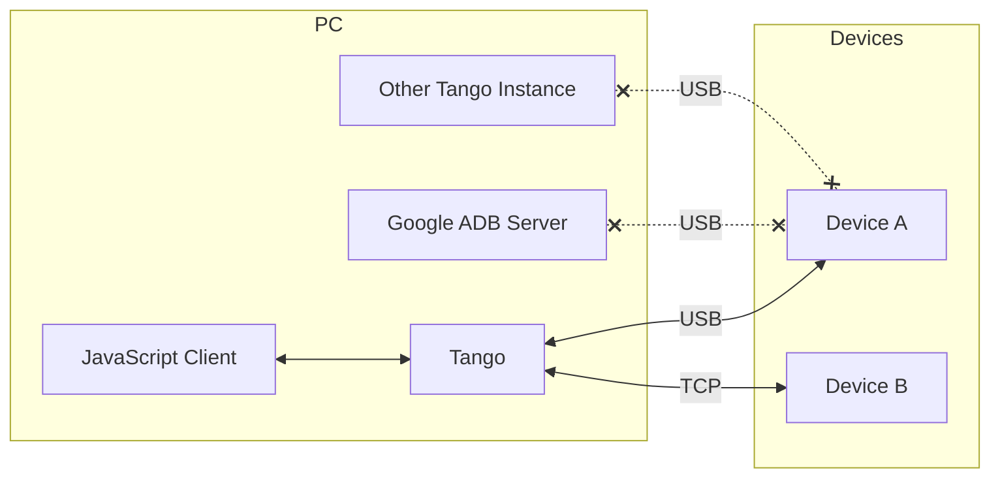
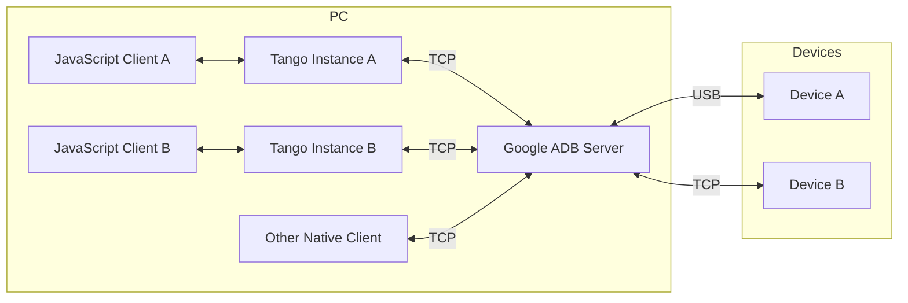

import Tabs from "@theme/Tabs";
import TabItem from "@theme/TabItem";

# Quick Start

Tango is a TypeScript re-implementation of ADB ([Android Debug Bridge](https://developer.android.com/studio/command-line/adb)) client.

:::note

The public API is not stable. Check [GitHub Releases](https://www.github.com/yume-chan/ya-webadb/releases) page for changes.

If you have any questions, feel free to open a discussion on [GitHub](https://www.github.com/yume-chan/ya-webadb/discussions) :heart:

:::

## Features

* **Cross-platform**: Runs on both Node.js and Web browsers (supported connection methods vary).
* **Independent**: Doesn't require Google ADB server to connect to devices.
* **Extensible**: Supports custom connect methods and ADB commands.

## Pre-requisites

The runtime must support the following features:

* [Web Streams API](https://developer.mozilla.org/en-US/docs/Web/API/Streams_API). `ReadableStream`, `WritableStream` and `TransformStream` must be available on `globalThis`. If not, a polyfill like [`web-streams-polyfill`](https://www.npmjs.com/package/web-streams-polyfill) can be used.
* BigInt. This can't be polyfilled.
* Promise

Recent versions of Node.js and Web browsers should have all these features.

## Installation

Tango is split into multiple packages to handle different runtimes. First, install the two core packages:

1. [`@yume-chan/adb`](https://www.npmjs.com/package/@yume-chan/adb): The platform-independent ADB client implementation
2. [`@yume-chan/stream-extra`](https://www.npmjs.com/package/@yume-chan/stream-extra): Type definitions and utilities for [Web Streams API](https://developer.mozilla.org/en-US/docs/Web/API/Streams_API).

```sh npm2yarn
npm i @yume-chan/adb @yume-chan/stream-extra
```

The end goal is to create an `Adb` instance that provides many built-in commands, and allows custom commands to be added. The `Adb` constructor requires a transport implementation.

## Transports

ADB Daemon is a program running on Android devices (when USB Debugging or Wireless Debugging options are enabled) that handles incoming ADB connections and commands.

A **Transport** is an interface that provides a way to communicate with ADB daemon. Tango has the same two built-in transports as Google ADB, but also supports custom transports.

### Daemon Transport

**Daemon Transport** connects to ADB daemons directly. This means it can run on devices without Google ADB (for example, in Web platforms where connecting to Google ADB Server is not supported, or on mobile devices where Google ADB is not available).

However, as the following diagram shows, it can't work together with Google ADB server or other ADB clients. To do that, use the [Server Transport](#server-transport) instead.



To support different runtime and connection method, this transport itself only defines how to serialize and deserialize ADB packets. A connection implementation is required to send and receive those packets. Tango provides two built-in connection implementations:

* **USB connection**: requires a Web browser with WebUSB support (currently, only Chromium-based ones), or Node.js with `usb` package. Note that only one program (or Tango instance) can connect to a device at a time, so it's not compatible with Google ADB server.
* **ADB over Wi-Fi**: uses TCP sockets, thus not natively supported on Web platforms. In Node.js, it can be implemented using the built-in `net` module. Note that this refers to the old `adb tcpip` mode, not the new Wireless Debugging/`adb pair` mode added in Android 11.
* **Wireless Debugging**: The new Wireless Debugging feature added in Android 11 is not supported yet. It uses TLS on TCP sockets and a different authentication method.

In addition, it also accepts custom connection implementations. For example, a WebSocket connection can forward TCP connections from a Node.js server to a Web browser.

:::note[Next Step]

[Create Daemon Transport](./daemon/index.mdx)

:::

### Server Transport



Google ADB Server is a program running on PC that manages connected devices and allows sharing a device with multiple clients.

**Server Transport** reimplemented Google ADB Client in TypeScript. It connects to Google ADB server using TCP sockets.

Google ADB Server is traditionally the only way to connect to ADB Daemons, so this transport allows shared access to devices with other programs that use ADB, such as Android Studio.

To support different runtime and connection method, this transport itself only defines how to serialize and deserialize ADB Server-Client packets. A connector implementation is required to connect to Google ADB Server. Tango provides a built-in connector implementation that uses Node.js built-in `net` module.

Because Google ADB Server uses TCP sockets, it's not natively supported on Web platforms. A bridge program that converts TCP sockets to Web-compatible transports is required.

:::note[Next Step]

[Connect to Server](./server/index.mdx)

:::

### Custom Transport

ADB protocol is a stream multiplexing protocol, where each ADB command is a logical stream, called ADB socket. The goal of both **Daemon Transport** and **Server Transport** is to create and manage ADB sockets.

Tango also supports custom transports that works directly on ADB socket level. For example, a mock transport can be used in tests, or a WebSocket transport to access devices on a server over the Internet.

:::note[Next Step]

[Create custom transport](./custom-transport.mdx)

:::
