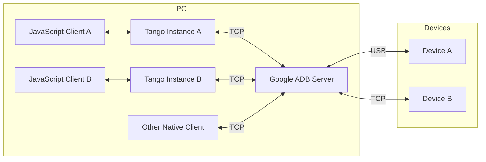
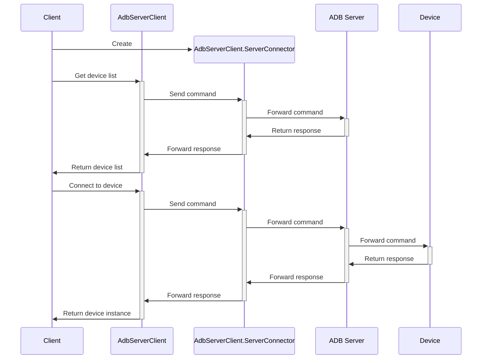

# Create connection



As mentioned in [Create USB connection](../daemon/usb/create-connection.mdx), a USB device can only be exclusively accessed by one process at a time. This means if multiple ADB clients are trying to connect to the same device, only one of them will succeed.

Google ADB solves this problem by starting a server (also called "host") to manage the USB devices, and all ADB clients connect to the server instead of the device directly. The server will forward the packets from clients to the device, and forward the packets from the device to the clients.

The protocol between ADB client and server is different from the protocol between ADB server and device (daemon). Tango provides a client implementation for the client-server protocol, but since the server usually listens on a TCP port, Tango requires a server connector object to handle the data communication.

Here are the overall steps to create a server connection:



<Tabs className="runtime-tabs" groupId="runtime">
<TabItem value="web" label="Web">

Currently there is no Web API that allows TCP connection. Looking forward to the [Direct Socket API](https://github.com/WICG/direct-sockets).

</TabItem>
<TabItem value="node" label="Node.js">

The [@yume-chan/adb-server-node-tcp](https://www.npmjs.com/package/@yume-chan/adb-server-node-tcp) package provides a server connector based on Node.js built-in `net` module.

```sh npm2yarn
npm i @yume-chan/adb-server-node-tcp
```

Example:

```ts transpile
import { Adb, AdbServerClient, AdbServerDevice } from "@yume-chan/adb";
import { AdbServerNodeTcpConnector } from "@yume-chan/adb-server-node-tcp";

const connector: AdbServerNodeTcpConnector = new AdbServerNodeTcpConnector({
  host: "localhost",
  port: 5037,
});
```

Because each command creates a new connection, this step only saves the connection information, but does not actually connect to the server.

</TabItem>
</Tabs>
