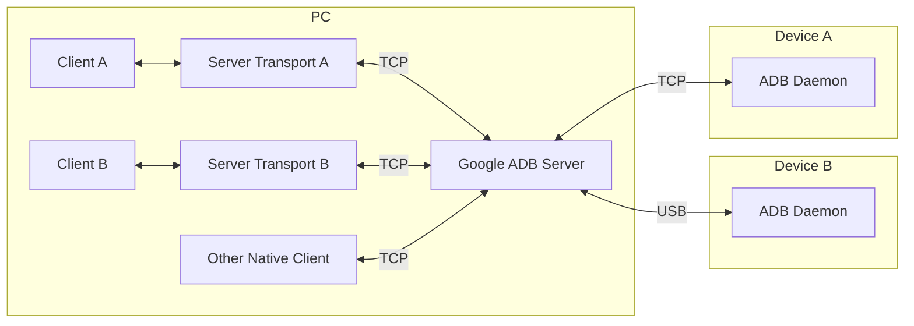
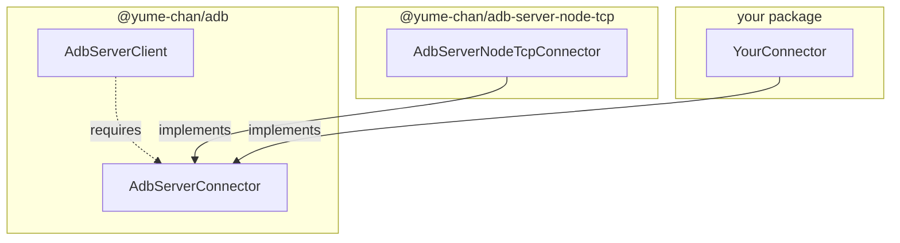

# Server transport

As mentioned in [USB Connection](../daemon/usb/index.mdx#exclusivity), a USB device can only be exclusively accessed by one program at a time. This means if multiple ADB clients want to access the same device, only one of them can succeed.

Google ADB solves this problem by starting a server (also called "host") to manage the USB devices, and all ADB clients connect to the server, instead of the device directly. The server forwards ADB commands to devices for those clients.



The protocol between ADB Client and Server is different from the protocol between ADB Server and Daemon. `AdbServerClient` class is a TypeScript re-implementation of Google ADB Client. It connects to Google ADB Server using TCP sockets, and can create `AdbServerTransport`s for each device.

## Preparation

To use the server transport, Google ADB server must already be running on the PC.

The latest version of Google ADB for Windows, Linux and macOS can be downloaded at https://developer.android.com/tools/releases/platform-tools. For Windows, only `adb.exe`, `AdbWinApi.dll` and `AdbWinUsbApi.dll` are required. For other platforms, only `adb` executable is needed.

To start ADB in server mode, run `adb server nodaemon`.

## Installation

This class is included in the core package:

```sh npm2yarn
npm i @yume-chan/adb
```

To support different runtime environments, `AdbServerClient` uses an `AdbServerConnector` implementation to create those TCP sockets. Currently, there is no built-in connector for Web platforms, as TCP sockets are not supported there. Tango provides a Node.js implementation using its `net` module, and also accepts custom connector implementations for other runtime environments.



## Overview

Here are the overall steps to create an `Adb` instance from `AdbServerClient`:

1. Creates an `AdbServerClient.ServerConnector` that works on the target runtime environment.
2. Creates an `AdbServerClient` instance with the connector.
3. Queries the device list and selects an already authenticated device.
4. Creates an `AdbServerTransport` instance for the selected device.
5. Creates an `Adb` instance with the transport object.
