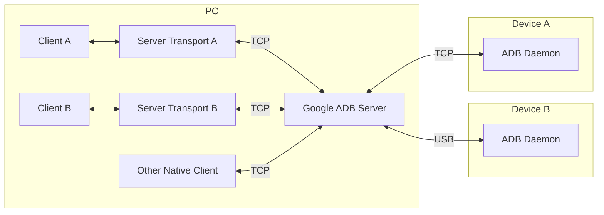

# Server Transport

As mentioned in [USB Connection](../daemon/usb/index.mdx#exclusivity), a USB device can only be exclusively accessed by one program at a time. This means if multiple ADB clients want to access the same device, only one of them can succeed.

Google ADB solves this problem by starting a server (also called "host") to manage the USB devices, and all ADB clients connect to the server, instead of the device directly. The server forwards ADB commands to devices for those clients.

The protocol between ADB Client and Server is different from the protocol between ADB Server and Daemon. `AdbServerClient` class is a TypeScript re-implementation of Google ADB Client. It connects to Google ADB Server using TCP sockets, and can create `AdbServerTransport`s for each device.

## Overview

Here are the overall steps to create an `Adb` instance from `AdbServerClient`:

1. User creates an `AdbServerClient.ServerConnector` that works on the target runtime environment.
2. User creates an `AdbServerClient` instance with the connector.
3. User queries the device list and selects an already authenticated device.
4. User creates an `AdbServerTransport` instance for the selected device.
5. User creates an `Adb` instance with the transport object.
