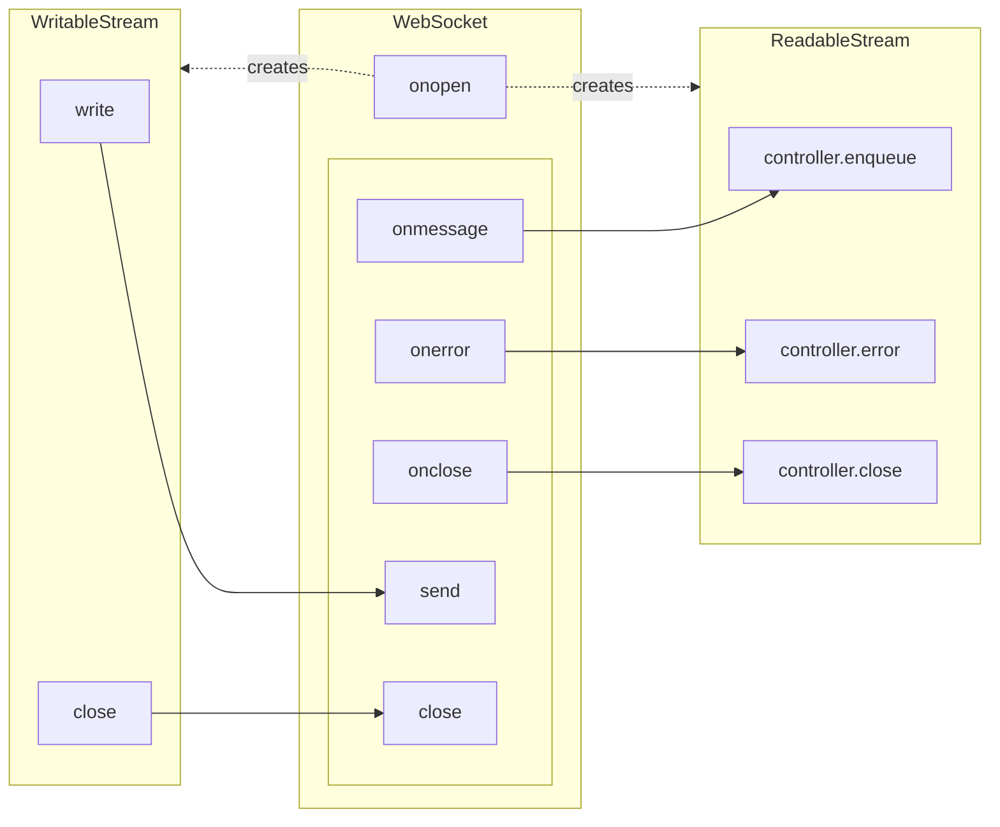

# WebSocketStream

A very common requirement when implementing [custom daemon connection](../daemon/custom-connection.mdx), [custom server connector](../server/client.mdx) or [custom transport](../custom-transport/index.mdx) is to convert WebSocket connections to Web Streams, more specifically, a pair of `ReadableStream<Uint8Array>` and `WritableStream<Uint8Array>`.

## Clarifying "WebSocket"

The word "WebSocket" can actually mean two things:

- The WebSocket protocol defined in [RFC 6455](https://tools.ietf.org/html/rfc6455): Clients and servers can send bi-directional messages using this protocol, on top of an HTTP connection. It can be implemented using any language and API.
- The WebSocket DOM API defined in [HTML Living Standard](https://websockets.spec.whatwg.org/): It provides classes and methods for JavaScript code to create and control WebSocket connections.

We can't implement the WebSocket protocol ourself, because we can't send raw HTTP requests ourself in a browser. However, to use WebSocket with Tango (which uses Web Streams extensively), we need to convert the WebSocket API to Web Streams.

In fact, as Web Streams API gains traction, there is already a [`WebSocketStream` API](https://developer.mozilla.org/en-US/docs/Web/API/WebSocketStream). It not only modernize the WebSocket API with Web Streams API, but also supports [backpressure](https://developer.mozilla.org/en-US/docs/Web/API/Streams_API/Concepts#backpressure) out of the box.

## Benefits of Web Streams

`ReadableStream` has two main benefits over event-based APIs:

### Backpressure Support

Suppose the server is sending a large file, if the client can't consume data fast enough, the `ReadableStream` on client side will tell the server to pause the sending.

On the other side, if the server is producing data faster than its network bandwidth, the `WritableStream` will also asynchronously block until the buffered data has been sent.

In old `WebSocket` API, if one end is sending data too fastly, the browser will close the connection without any warning.

### Clearer Ownership

One `ReadableStream` can only be locked by one `reader`, and because of backpressure support, no data will flow when there is no readers. This pushes the developer to attach a `reader` to handle the data, so no data will be lost.

## Architecture

The `WebSocketStream` API is only supported in Chrome 124+, so before it becomes widely available, to use WebSocket with Tango, we need to manually convert the old `WebSocket` API to Web Streams.

In this guide, we will use the same API as `WebSocketStream`, effectively creating a polyfill for it.

Here is `WebSocketStream`'s type definition:

```ts
export interface WebSocketStreamOptions {
  signal?: AbortSignal | undefined;
}

export interface WebSocketStreamOpenEvent {
  extensions: string;
  protocol: string;
  readable: ReadableStream<Uint8Array | string>;
  writable: WritableStream<ArrayBuffer | ArrayBufferView | string>;
}

export interface WebSocketStreamCloseEvent {
  closeCode: number;
  reason: string;
}

export interface WebSocketStreamCloseOptions {
  closeCode: number;
  reason: string;
}

export declare class WebSocketStream {
  constructor(url: string, options?: WebSocketStreamOptions);

  url: string;
  opened: Promise<WebSocketStreamOpenEvent>;
  closed: Promise<WebSocketStreamCloseEvent>;

  close(options?: WebSocketStreamCloseOptions): void;
}
```

You can use the constructor to create a `WebSocketStream` instance. The constructor will return synchronously without waiting for the connection to be established.

You need to `await` the `opened` promise to get the `ReadableStream` and `WritableStream`:

```ts
const socket = new WebSocketStream("ws://localhost:8080");
const { readable, writable } = await socket.opened;
```

## Implementation

To convert `WebSocket` to `WebSocketStream`, we need to hook the events and methods:



Here is full implementation:

```ts transpile
import { PromiseResolver, delay } from "@yume-chan/async";
import { ReadableStream, WritableStream } from "@yume-chan/stream-extra";

export interface WebSocketStreamOptions {
  protocols?: string;
  signal?: AbortSignal | undefined;
}

export interface WebSocketStreamOpenEvent {
  extensions: string;
  protocol: string;
  readable: ReadableStream<Uint8Array | string>;
  writable: WritableStream<ArrayBuffer | ArrayBufferView | string>;
}

export interface WebSocketStreamCloseEvent {
  closeCode: number;
  reason: string;
}

export interface WebSocketStreamCloseOptions {
  closeCode: number;
  reason: string;
}

export class WebSocketStream {
  #socket: WebSocket;
  #opened = new PromiseResolver<WebSocketStreamOpenEvent>();
  #closed = new PromiseResolver<WebSocketStreamCloseEvent>();

  constructor(url: string, options?: WebSocketStreamOptions) {
    this.url = url;
    this.#socket = new WebSocket(url, options?.protocols);
    this.#socket.binaryType = "arraybuffer";

    let opened = false;

    this.#socket.onopen = () => {
      opened = true;

      this.#opened.resolve({
        extensions: this.#socket.extensions,
        protocol: this.#socket.protocol,
        readable: new ReadableStream({
          start: (controller) => {
            this.#socket.onmessage = (event) => {
              if (typeof event.data === "string") {
                controller.enqueue(event.data);
              } else {
                controller.enqueue(new Uint8Array(event.data));
              }
            };

            this.#socket.onerror = () => {
              controller.error(new Error("websocket error"));
            };

            this.#socket.onclose = (e) => {
              try {
                controller.close();
              } catch {
                // ignore
              }

              this.#closed.resolve({
                closeCode: e.code,
                reason: e.reason,
              });
            };
          },
        }),
        writable: new WritableStream({
          write: async (chunk) => {
            while (this.#socket.bufferedAmount > 8 * 1024 * 1024) {
              await delay(10);
            }

            this.#socket.send(chunk);
          },
        }),
      });
    };

    this.#socket.onerror = () => {
      if (opened) {
        return;
      }

      this.#opened.reject(new Error("websocket error"));
    };
  }

  url: string;
  get opened(): Promise<WebSocketStreamOpenEvent> {
    return this.#opened.promise;
  }
  get closed(): Promise<WebSocketStreamCloseEvent> {
    return this.#closed.promise;
  }

  close(options?: WebSocketStreamCloseOptions) {
    this.#socket.close(options?.closeCode, options?.reason);
  }
}
```

In the `WritableStream`, we check `bufferedAmount` in a loop to avoid sending too much data at once. The "high water mark" is hard-coded as 8MB, it's under browser's buffer size and allows sending data as fast as possible.

## Usage

After you get the `ReadableStream` and `WritableStream` from `WebSocketStream`, you can [pipe them through `TransformStream`s](./index.mdx#transformstream) to convert them to streams of other types.

For example, to convert to a custom daemon connection, see [convert between raw bytes](../daemon/custom-connection.mdx#convert-between-raw-bytes)

## Use `MaybeConsumable`

[custom daemon connection](../daemon/custom-connection.mdx) and [custom transport](../custom-transport/index.mdx) both requires `WritableStream<MaybeConsumable<T>>` instead of plain `WritableStream<T>`. Since it's unsafe to unwrap a `MaybeConsumable<T>`, you need to replace the `WritableStream` above with [`MaybeConsumable.WritableStream`](../consumable.mdx#writablestream).
