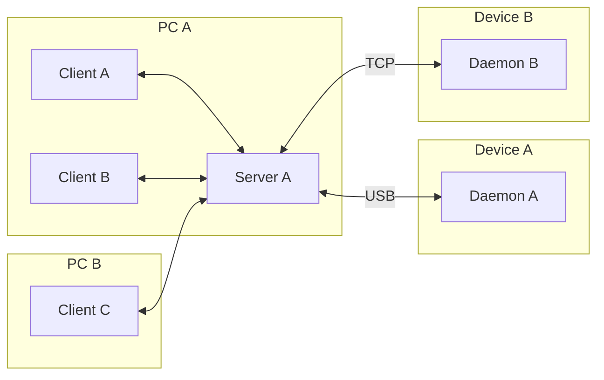

# Architecture

{/*
cspell: ignore libusb
cspell: ignore nodaemon
*/}

Google ADB has three components: Client, Server, and Daemon.

### Client

**Client** receives command line inputs, generates request packets, sends them to **server** over TCP.

Because there can be multiple devices connected to the computer, **clients** add a "host prefix" to specify the device.

### Server

**Server** is in the same binary as **client**, but runs in a separate process with different command line arguments. Usually **servers** are spawned by **clients** when they cannot find one on localhost. To manually spawn a **server**, use `adb server nodaemon`. By default, it binds to `localhost:5037`.

It is also possible to use SSH tunnel to let **clients** connect to a **server** running on a remote machine.

**Servers** are responsible for discovering and connecting to devices. They also handle packets from **clients**.

Some packets should be processed by **server** itself (for example `adb devices`), it generates response packets and sends them to **client**.

Others need to be forwarded to **daemons** (for example `adb shell`). It finds the specified **daemon** using the "host prefix", rewrites the packet to remove "host prefix", and finally sends it to the **daemon** over USB (libusb/WinUSB) or TCP.

Because USB APIs only allow one connection to a device simultaneously, to use multiple CLI applications with one device, the **server** is required to multiplex the packets.

### Daemon

**Daemon** runs on Android devices and emulators, it receives packets, handles them, and generates responses.

Historically, because most device only has one USB port, **daemons** can only handle one connection. But even after ADB over Wi-Fi has been added, one **daemon** can still handle one TCP connection.

### Protocol

All packets between **client-server** and **server-daemon** are in the ADB packet format, but as mentioned before, **client-server** packets contain an extra "host prefix". ADB packet format will be described in [packet](./packet.md) chapter, while "host prefix" will be described in [stream](./stream.md) chapter.
