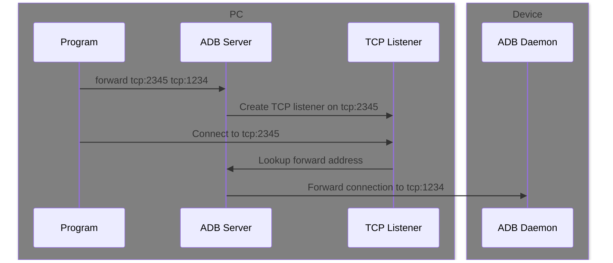

# Socket

:::note

This page describes how to use an ADB socket. See [this page](/tango/custom-transport/socket.mdx) for how to implement it in a custom transport.

:::

ADB is a multiplexing protocol, each logical stream is called a socket. A socket is a duplex stream that can be read from and written to.

Each socket also has a service name, which is similar to the hostname and port number in a TCP socket, or the URL in an HTTP request

In Tango, a socket is represented by an `AdbSocket` object, while each transport may extend it with additional properties.

```ts
interface AdbSocket {
  readonly readable: ReadableStream<Uint8Array>;
  readonly writable: WritableStream<MaybeConsumable<Uint8Array>>;
  readonly service: string;
  readonly closed: Promise<void>;
  close(): Promise<void>;
}
```

## Create socket

The `Adb` class provides a `createSocket` method to create a socket. It calls the `connect` method on the transport to establish a connection.

```ts
declare class Adb {
  createSocket(address: string): Promise<AdbSocket>;
}
```

Most commands create a socket by calling this method internally, so you don't need to call it directly in most cases.

## Read from socket

The `readable` property on the socket is a `ReadableStream` that emits `Uint8Array` chunks. It contains the data received from the device. Since ADB socket is a stream protocol, chunks might be split or combined arbitrarily.

One common way to read from the stream is to pipe it to a `WritableStream`.

```ts
import { WritableStream } from "@yume-chan/stream-extra";

const socket = await adb.createSocket("tcp:1234");

await socket.readable.pipeTo(
  new WritableStream({
    write(chunk) {
      console.log(chunk);
    },
  })
);
```

`pipeTo` returns a promise that resolves when the stream is closed. If the stream is closed due to an error, the promise will be rejected.

You can also use the `getReader` method on the stream to read from it manually.

```ts
const reader = socket.readable.getReader();
try {
  while (true) {
    const { done, value } = await reader.read();
    if (done) {
      break;
    }
    console.log(value);
  }
} finally {
  reader.releaseLock();
}
```

It gives more control over the reading process, but it's more verbose.

### Backpressure

The `readable` stream implements backpressure, meaning that not reading from the stream will block the other end from producing more data. Because ADB is a multiplexing protocol, blocking one stream will also block all other streams.

If the remaining data is not needed, `stream.cancel()` (or `stream.getReader().cancel()` if using a reader) can be called to discard them.

## Write to socket

The `writable` property on the socket is a `WritableStream` that accepts both `Uint8Array` and `Consumable<Uint8Array>` chunks.

See the [Consumable pattern](/tango/consumable.mdx) page for more information about `Consumable`.

To write to the stream, usually you will get a writer from it and call the `write` method.

```ts
const writer = socket.writable.getWriter();
await writer.write(new Uint8Array([0x01, 0x02, 0x03]));
await writer.write(new Uint8Array([0x04, 0x05, 0x06]));
writer.releaseLock();
```

There can only be one `writer` at a time, so it must be shared between multiple producers, or call `writer.releaseLock()` to release the lock so another writer can be created.

If there is already a `ReadableStream`, it can be piped into the `WritableStream`:

```ts
import { ReadableStream } from "@yume-chan/stream-extra";

await new ReadableStream({
  start(controller) {
    controller.enqueue(new Uint8Array([0x01, 0x02, 0x03]));
    controller.enqueue(new Uint8Array([0x04, 0x05, 0x06]));
    controller.close();
  },
}).pipeTo(socket.writable);
```

Piping a `ReadableStream` into a `WritableStream` will also lock the `WritableStream`, so `getWriter` cannot be called on it.

The `close` method on `writable` or `writable.getWriter()` only closes the writable stream, not the whole socket, so it can be omitted. Use the `close` method on the socket to close the whole socket.

## Close socket

Call the `close` method on the socket to close it.

If there are still unread data in the `readable` stream, the data can still and must be read. Not reading them will cause all sockets to be stalled. Also, the `closed` promise will not be resolved until all data has been read.

The `closed` promise will be resolved after the device has acknowledged the close.

:::info

Not closing a socket will cause a small memory leak, and depends on the other end of the socket, it may not work correctly.

:::

## Forward tunnel

Forward tunnel allows you to connect to a socket address on the device from Tango.

While the service name usually points to a service on the ADB daemon, it can also be a socket address on the device.

### Device Address

The device address is in the format of `<type>:<address>`. ADB Daemon can forward the connection to various types of addresses:

- `tcp:<port>`: TCP `localhost:<port>` on device
- `local:<path>`: Unix local domain socket on device
- `localabstract:<name>`: Unix abstract namespace socket on device
- `localfilesystem:<path>`: Unix filesystem namespace socket on device
- `vsock:<CID>:<port>`: vsock on the given CID and port

### Example

```ts transpile
import { WritableStream } from "@yume-chan/stream-extra";

const socket = await adb.createSocket("tcp:1234");

await socket.readable.pipeTo(
  new WritableStream({
    write(chunk) {
      console.log(chunk);
    },
  })
);

await socket.close();
```

:::info[Equivalent ADB command]

It doesn't work in the same way, but you can use the following command to register a forward tunnel and connect to it:

```sh
adb forward tcp:1234 tcp:1234
nc 127.0.0.1 1234
```

:::

### There is no `adb forward` command

In Google ADB, forward tunnels must be associated with a local socket address, and the client needs connect to that address to have the connection forwarded to the device.



In Tango, only the last step is needed. `createSocket` method uses low-level ADB protocol to create forward tunnel directly.

#### Daemon Transport

`adb forward` series of commands are implemented by Google ADB Server. When using [Daemon Transport](/tango/daemon/index.mdx), there is no Google ADB Server, so no support for those commands.

If your target runtime environment supports listening on a TCP port, you can simulate the behavior of `adb forward` by listening on a TCP port, and call `connectSocket` for each incoming connection.

#### Server Transport

It's possible to add `adb forward` series of commands to [`AdbServerClient`](../index.mdx#adbserverclient-from-yume-chanadb) class, it just has not been done. Contributions are welcomed!
