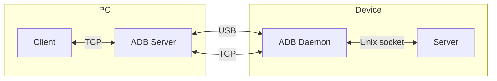

# Quick start

:::info[Welcome]

Welcome to Tango ADB's developer documentation! :tada:

Tango includes a TypeScript re-implementation of Scrcpy client for Web browsers and Node.js.

If you are looking for the Scrcpy application where you can mirror and control your Android devices, [here](https://github.com/Genymobile/scrcpy) is the official repository.

:::

[Scrcpy](https://github.com/Genymobile/scrcpy) is an open-source tool to mirror Android screen to desktop, and control it from desktop. It has two parts:

* A client written in C: Uses SDL for cross-platform display and input, and FFmpeg for video decoding. It spawns Google ADB client to set up a reverse tunnel, start server on device, and connect to it.
* A server written in Java: Runs on Android devices (but it's not an Android app), uses Android system APIs to capture screen/audio, send them to client, and inject input events. The server is started by client using ADB, thus having much more privileges than regular apps.



Tango's Scrcpy client implementation is fully compatible with the original Scrcpy server, so latest features and bug fixes are available immediately. It doesn't provide any UI components, so you need to create your own UI.

## Standalone Usage

The core package `@yume-chan/scrcpy` provides low-level APIs to serialize and deserialize Scrcpy messages.

It only handles data. It's up to the user to send and receive those data with Scrcpy server.

```mermaid
flowchart LR
    subgraph PC
        A[@yume-chan/scrcpy] <-->|Parse/serialize data| B[Your Code]
    end
    subgraph Device
        B <-->|Your own transport| C[Scrcpy server]
    end
```

It doesn't use any Web or Node.js APIs, so it can be used in any JavaScript environment.

```sh npm2yarn
npm install @yume-chan/scrcpy
```

It can be used standalone if you can communicate with Scrcpy server using other means.

:::note[Next Step]

[Prepare Server](./prepare-server.mdx)

:::

## Use with Tango

The `@yume-chan/adb-scrcpy` package provides a complete Scrcpy client. It can push the server file to device, start the server, setup and establish the connection, and communicate with the server.

It uses [`@yume-chan/adb`](../tango/index.mdx) package to control the device, and `@yume-chan/scrcpy` package to parse and serialize Scrcpy messages.

```mermaid
flowchart LR
    subgraph PC
        A[@yume-chan/scrcpy] <--> B[@yume-chan/adb-scrcpy]
        B <--> C[@yume-chan/adb]
    end
    subgraph Device
        C <--> D[ADB daemon]
        D <--> S[Scrcpy server]
    end
```

However, it doesn't provide any UI components. You need to create your own UI to display the screen and handle input events.

It also doesn't use any Web or Node.js APIs.

```sh npm2yarn
npm install @yume-chan/scrcpy @yume-chan/adb-scrcpy
```

## Overview

Here are the steps to use Scrcpy:

1. [**Prepare server**](./prepare-server.mdx): Include prebuilt Scrcpy server binary in your project.
2. [**Push server to device**](./push-server.mdx): Send the server binary to device.
3. [**Prepare reverse tunnel**](./connect-server.mdx#reverse-tunnel) (when using reverse tunnel): Reverse tunnels need to be setup before starting the server.
4. [**Start server on device**](./start-server.mdx).
5. [**Connect to server**](./connect-server.mdx): Create connections to transmit video, audio and control messages.
6. [**Decode and render video**](./video/index.mdx), [**record video to files**](./video/record.mdx), **decode and play audio**, [**control the device**](./control/index.mdx).

:::note[Next Step]

[Prepare Server](./prepare-server.mdx)

:::
