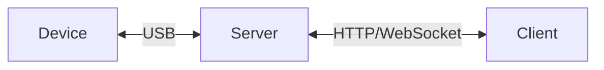

# Server-client transport

This guide shows how to create a custom transport with a server-client architecture.

The complete project can be found at https://github.com/tango-adb/example-server-client.



## Server

The server is a Node.js program that:

- Keeps tracking the list of connected devices
- Sends device list changes to connected clients through WebSocket
- Establishes ADB connection to devices when clients request via HTTP
- Forwards ADB sockets between clients and devices through WebSocket

It uses [Daemon Transport over USB connections](../../daemon/usb/index.mdx), but other transports and connection methods can also be used, by referring to the corresponding documentation pages.

A Node.js HTTP `Server` is created to handle HTTP requests, and a `WebSocketServer` from [`ws`](https://npmjs.com/package/ws) package is created, sharing the HTTP `Server`, to handle WebSocket requests:

```ts transpile
import { createServer } from "node:http";
import { WebSocketServer } from "ws";

const httpServer = createServer(async (request, response) => {
  // TODO: Handle HTTP requests
  response.writeHead(404, { "Access-Control-Allow-Origin": "*" }).end();
});

const wsServer = new WebSocketServer({
  server: httpServer,
});

wsServer.addListener("connection", async (client, request) => {
  const url = new URL(request.url!, "http://localhost");
  const segments = url.pathname.substring(1).split("/");

  switch (segments[0]) {
    // TODO: handle WebSocket request
    default:
      client.close();
  }
});

httpServer.listen(
  {
    host: "0.0.0.0",
    port: 8080,
  },
  () => {
    console.log("Server listening on http://localhost:8080");
  }
);
```

## Client

The client is a Web app that:

- Connects to the server to get device list
- Requests the server to establish ADB connection when a device is selected
- Runs ADB commands by sending them to the server through WebSocket

The client only contains basic UI using vanilla JavaScript. You can use any UI library/framework to create your own UI.

There are two HTML pages:

* `index.html`: Displays the device list and links to the device page
* `device.html`: Displays the output from `logcat` command to demonstrate the use of ADB commands

## Build and run

This project uses PNPM workspaces. Make sure you have [pnpm](https://pnpm.io) installed.

1. Clone the project

   ```sh
   git clone https://github.com/tango-adb/example-server-client.git
   cd example-server-client
   ```

2. Install dependencies

   ```sh
   pnpm install
   ```

The server uses [tsx](https://www.npmjs.com/package/tsx) to run TypeScript code in Node.js directly, and the client uses [@babel/standalone](https://www.npmjs.com/package/@babel/standalone) to run TypeScript in Web browsers, so no compilation step is needed.

To run the server:

```sh
cd server
npm start
```

To run the client:

```sh
cd client
npm start
```
